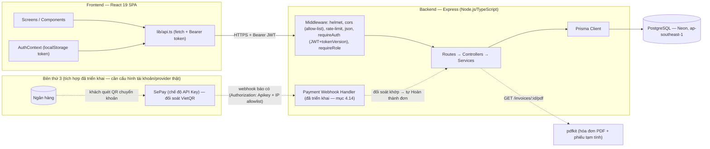
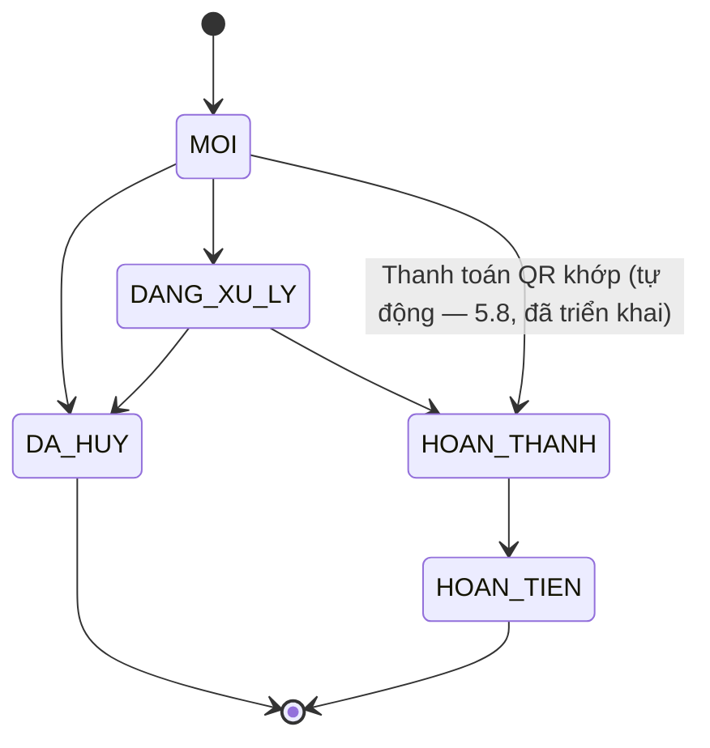
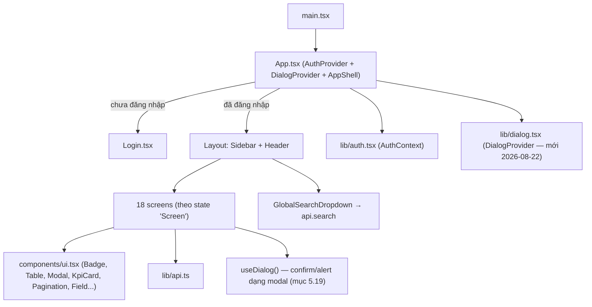
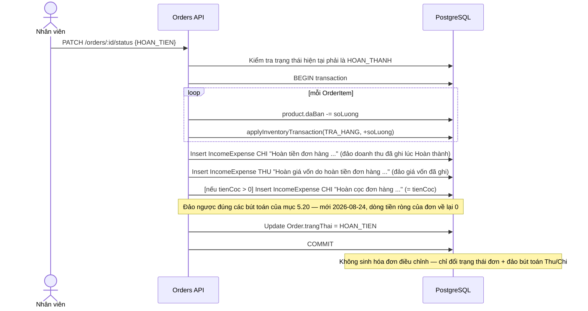
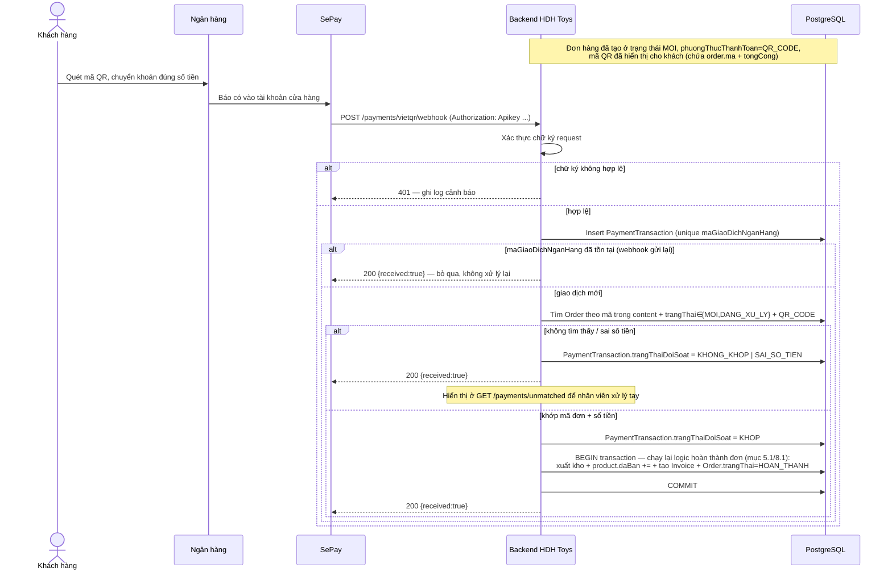
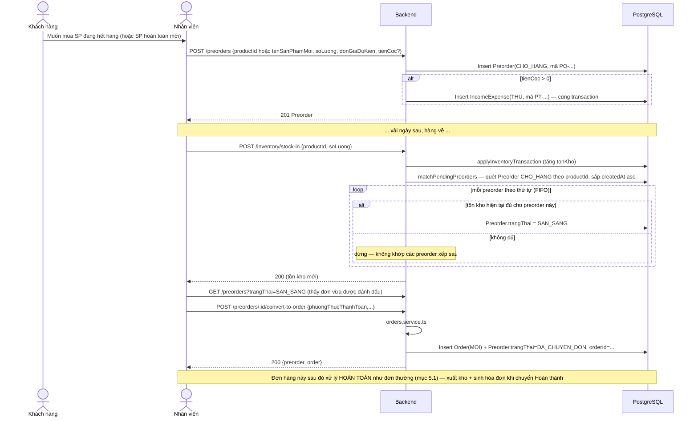

# HDH Toys — Software Design Specification (SDS)

**Phiên bản**: 1.2 (tài liệu hóa hiện trạng hệ thống — reverse-engineered từ mã nguồn; cập nhật đồng bộ với SRS mục 3.23–3.30 — bảo mật nâng cao/SePay, bỏ VAT, sổ Thu/Chi ghi đủ doanh thu, sửa cọc/phí ship sau khi tạo đơn, phiếu tạm tính, lợi nhuận giữ lại độc lập, hóa đơn PDF thiết kế lại, báo cáo doanh thu mở rộng, bộ kiểm thử tự động)
**Ngày**: 2026-08-24
**Tài liệu liên quan**: [SRS.md](./SRS.md) — yêu cầu chức năng/phi chức năng.

---

## 1. Giới thiệu

Tài liệu này mô tả thiết kế kỹ thuật hiện có của hệ thống HDH Toys: kiến trúc tổng thể, mô hình dữ liệu, thiết kế API, logic nghiệp vụ lõi, thiết kế bảo mật, cấu trúc frontend, và các luồng xử lý chính. Nội dung được trích xuất trực tiếp từ mã nguồn `backend/` và `frontend/`.

---

## 2. Kiến trúc hệ thống

### 2.1 Kiến trúc tổng thể



### 2.2 Ngăn xếp công nghệ

| Lớp | Công nghệ |
|---|---|
| Backend runtime | Node.js + TypeScript, Express, `express-async-errors` |
| ORM / DB | Prisma Client, PostgreSQL — Neon, khu vực `ap-southeast-1` (Singapore) (`DATABASE_URL` + `DIRECT_URL`) |
| Xác thực | `jsonwebtoken` (HS256, payload có `tokenVersion` để thu hồi trước hạn — mục 6), `bcryptjs` (cost 10) |
| Bảo mật tầng HTTP *(mới 2026-08-23)* | `helmet` (CSP tắt, `crossOriginResourcePolicy: cross-origin`), `express-rate-limit` (giới hạn chung + riêng cho login), `cors` (allow-list qua `CORS_ORIGINS`) |
| Validation | `zod` (schema validate ở tầng controller) |
| Xác thực nội dung file | `file-type` *(mới 2026-08-23)* — kiểm tra magic-byte thật của ảnh sản phẩm, không tin MIME type client khai báo |
| Sinh PDF | `pdfkit` + font Unicode (`dejavu-fonts-ttf`, fallback OS font) — hóa đơn chính thức và phiếu tạm tính (mục 3.26) |
| Kiểm thử *(mới 2026-08-24)* | `vitest` — unit test (backend + frontend) và integration test tự dọn dẹp chạy trên DB dev thật (mục 10) |
| Frontend | React 19, Vite 8, TypeScript 5.7, Tailwind CSS v4 |
| State/Router | State nội bộ (`useState` trong `App.tsx`) — không dùng React Router |
| Triển khai | Render.com (Web Service `hdhtoys-backend-sg`, khu vực Singapore — mục 2.4), build: `npm install && npx prisma migrate deploy && npm run build` |

### 2.3 Cấu trúc thư mục

```
backend/src/
  routes/        # định nghĩa endpoint + middleware theo resource
  controllers/    # parse & validate request (zod), gọi service, format response
  services/       # business logic + truy vấn Prisma
  lib/             # helper: auth, dateRange, mã tự sinh, PDF, trạng thái suy ra
  middleware/      # requireAuth, requireRole, errorHandler
  errors/          # HttpError (400/401/403/404/409/500/503 chuẩn hóa)

frontend/src/
  screens/         # 18 màn hình nghiệp vụ (1 file / màn hình)
  components/       # Layout (Sidebar/Header/Search), ui.tsx (UI kit dùng chung)
  lib/               # api.ts (client), auth.tsx (AuthContext), labels.ts (nhãn VN), responsive.ts
```

### 2.4 Triển khai (`render.yaml`)

Một service **`hdhtoys-backend-sg`** (Node, `rootDir: backend`, **`region: singapore`** — mới 2026-08-24), build chạy `prisma migrate deploy` trước khi build TypeScript — đảm bảo schema DB luôn đồng bộ trước khi start. Biến môi trường bắt buộc (không sync, phải cấu hình tay trên Render): `DATABASE_URL`, `DIRECT_URL`, `JWT_SECRET`, `CORS_ORIGINS`, `VIETQR_WEBHOOK_SECRET` (và `VIETQR_WEBHOOK_ALLOWED_IPS` tùy chọn). Frontend không có trong `render.yaml` — được deploy/host riêng (Vercel).

**Vì sao đổi tên service + thêm region** *(mới 2026-08-24)*: Render mặc định deploy ở Oregon (Mỹ) nếu không khai báo `region`; DB (Neon) đặt tại `ap-southeast-1` (Singapore), nên mọi truy vấn phải đi vòng qua Thái Bình Dương 2 lượt, cộng thêm ~1-2s độ trễ mỗi request. Render **không cho đổi region của một service đã tồn tại** — phải tạo service mới hoàn toàn cùng chung `render.yaml` (đổi tên `hdhtoys-backend` → `hdhtoys-backend-sg`) để buộc Render tạo service mới thay vì cố (và thất bại) đổi region tại chỗ; service cũ được giữ chạy song song cho tới khi xác nhận service mới ổn định rồi mới xóa thủ công. Đã đo thực tế: `/api/health` giảm từ ~0.6–1.5s (Oregon) xuống ~0.2–0.5s (Singapore).

---

## 3. Mô hình dữ liệu (Data Model)

### 3.1 ERD

```mermaid
erDiagram
    Staff ||--o{ Order : "xu_ly"
    Staff ||--o{ InventoryTransaction : "thuc_hien"
    Staff ||--o{ Invoice : "tao"
    Staff ||--o{ IncomeExpense : "tao"
    Customer ||--o{ Order : "dat_hang"
    Customer ||--o{ CustomerNote : "co"
    Order ||--|{ OrderItem : "gom"
    Order ||--o| Invoice : "sinh_ra"
    Order ||--o{ PaymentTransaction : "nhan_qr"
    Product ||--o{ OrderItem : "ban"
    Product ||--o{ InventoryTransaction : "bien_dong"
    Product ||--o| ProductImage : "co_anh"
    Customer ||--o{ Preorder : "dat_truoc"
    Product ||--o{ Preorder : "het_hang"
    Order ||--o| Preorder : "duoc_tao_tu"

    Staff {
        string id PK
        string hoTen
        string email UK
        string matKhauHash
        enum vaiTro
        enum trangThai
        int tokenVersion "moi 2026-08-23 — tang len khi khoa/reset mat khau, de thu hoi token JWT truoc han"
    }
    Product {
        string id PK
        string sku UK
        string ten
        string barcode
        string danhMuc
        string nhaCungCap
        int giaVon "phai > 0 (sua 2026-08-22)"
        int phiVanChuyen "moi — cong vao gia von thuc"
        int giaBan "phai > 0 (sua 2026-08-22)"
        int tonKho
        int tonKhoToiThieu
        int daBan
        enum trangThai
        enum loaiSanPham "moi — CO_SAN | PRE_ORDER"
        datetime ngayDuKienVe "moi — bat buoc neu PRE_ORDER"
        bool nhacHang "moi — mac dinh false"
    }
    ProductImage {
        string productId PK_FK "1-1 voi Product, onDelete Cascade"
        bytes data
        string mimeType
    }
    Customer {
        string id PK
        string hoTen
        string sdt UK
        string email
        date ngaySinh
        string diaChi "moi"
        string luuY "moi"
        string linkFacebook "moi"
        enum nguonKhachHang "moi — SalesChannel, bat buoc khi tao (sua 2026-08-22)"
        enum hangKhachHang
        int diemTichLuy
    }
    CustomerNote {
        string id PK
        string customerId FK
        string noiDung
        string nguoiTaoId
    }
    Order {
        string id PK
        int soThuTu UK
        string ma UK
        string khachHangId FK
        string nhanVienId FK
        enum kenhBan
        enum phuongThucThanhToan
        enum trangThai
        bool daThanhToan "moi — doc lap voi trangThai"
        enum phuongThucNhanHang "moi — KHACH_TOI_LAY | SHIP"
        enum donViVanChuyen "moi — bat buoc neu SHIP"
        string maVanDon "moi — chi SHIP"
        int phiShip "moi 2026-08-23 — thay the hoan toan truong vat da bi xoa; chi SHIP; sua duoc den khi Hoan thanh"
        int tamTinh
        int giamGia
        int tongCong
        int tienCoc "sua duoc den khi Hoan thanh — chenh lech tu ghi vao so Thu/Chi"
    }
    OrderItem {
        string id PK
        string orderId FK
        string productId FK
        int soLuong
        int donGia
        int giaVon "snapshot"
        int giamGia
        int thanhTien
    }
    Invoice {
        string id PK
        int soThuTu UK
        string soHoaDon UK
        string orderId FK "unique"
        string nguoiTaoId FK
    }
    InventoryTransaction {
        string id PK
        int soThuTu UK
        string maGiaoDich UK
        string productId FK "onDelete Cascade tu Product (moi 2026-08-22)"
        enum loai
        int soLuongThayDoi
        int tonTruoc
        int tonSau
        string nguoiThucHienId FK
        string thamChieu
    }
    IncomeExpense {
        string id PK
        int soThuTu UK
        string maPhieu UK
        enum loai
        enum danhMuc
        string noiDung
        int soTien
        string nguoiTaoId FK
    }
    Debt {
        string id PK
        string doiTuong
        enum loai
        date ngayPhatSinh
        date ngayDenHan
        int soTien
        int daThanhToan
    }
    AccountingBalance {
        string id PK "singleton"
        int tienMat
        int tienNganHang
        int vonChuSoHuu
        int taiSanKhac
        int chiPhiChuaThanhToan
        int khoanPhaiTraKhac
    }
    PaymentTransaction {
        string id PK
        string orderId FK "nullable — null nếu không đối soát được"
        string maGiaoDichNganHang UK "mã tham chiếu từ ngân hàng/dịch vụ trung gian — dùng cho idempotency"
        int soTienNhan
        string noiDungChuyenKhoan
        enum trangThaiDoiSoat "KHOP | KHONG_KHOP | SAI_SO_TIEN"
        datetime thoiGianNhan
    }
    Preorder {
        string id PK
        string ma UK "PO-nam-5so"
        string khachHangId FK
        string productId FK "nullable — null nếu SP hoàn toàn mới"
        string tenSanPhamMoi "nullable — dùng khi productId null"
        int soLuong
        int donGiaDuKien
        int tienCoc "0 = không đặt cọc"
        enum trangThai "CHO_HANG | SAN_SANG | DA_CHUYEN_DON | DA_HUY"
        datetime ngayDuKienCo "nullable"
        string orderId FK "nullable — set khi đã chuyển thành Order"
    }
```

### 3.2 Enum nghiệp vụ

| Enum | Giá trị |
|---|---|
| `StaffRole` | `ADMIN`, `MANAGER`, `ACCOUNTANT`, `INVENTORY_STAFF` |
| `StaffStatus` | `ACTIVE`, `LOCKED` |
| `ProductStatus` | `CON_HANG`, `SAP_HET`, `HET_HANG`, `NGUNG_KINH_DOANH` |
| `LoaiSanPham` (mới — mục 5.13) | `CO_SAN`, `PRE_ORDER` |
| `CustomerTier` | `NEW`, `MEMBER`, `VIP` |
| `OrderStatus` | `MOI`, `DANG_XU_LY`, `HOAN_THANH`, `DA_HUY`, `HOAN_TIEN` |
| `PaymentMethod` | `TIEN_MAT`, `CHUYEN_KHOAN`, `THE`, `QR_CODE` |
| `SalesChannel` | `TAI_CUA_HANG`, `DIEN_THOAI`, `FACEBOOK`, `ZALO`, `TIKTOK`, `KHAC` (mở rộng 2026-08-22 — dùng chung cho `Order.kenhBan` VÀ `Customer.nguonKhachHang`) |
| `PhuongThucNhanHang` (mới) | `KHACH_TOI_LAY`, `SHIP` |
| `DonViVanChuyen` (mới) | `SPX`, `GRAB`, `KHAC` |
| `InventoryTransactionType` | `NHAP`, `XUAT`, `DIEU_CHINH`, `TRA_HANG` |
| `TransactionKind` | `THU`, `CHI` |
| `IncomeExpenseCategory` | `BAN_HANG`, `NHAP_HANG`, `VAN_CHUYEN`, `LUONG`, `DIEN_NUOC`, `MARKETING`, `KHAC` |
| `DebtType` | `PHAI_THU`, `PHAI_TRA` |
| `DebtStatus` (suy ra, không lưu) | `CHUA_DEN_HAN`, `SAP_DEN_HAN`, `QUA_HAN`, `DA_THANH_TOAN` |
| `PaymentReconciliationStatus` (mục 4.14) | `KHOP`, `KHONG_KHOP`, `SAI_SO_TIEN` |
| `PreorderStatus` (mục 5.9) | `CHO_HANG`, `SAN_SANG`, `DA_CHUYEN_DON`, `DA_HUY` |

### 3.3 Quy tắc sinh mã tự động

Áp dụng chung một mẫu: tạo dòng với mã tạm `TEMP-{timestamp}-{random}` trong `$transaction` để lấy được `soThuTu` (autoincrement) do DB cấp, sau đó `update` mã cuối cùng dựa trên `soThuTu` đó — đảm bảo mã không trùng và tuần tự dù có nhiều request đồng thời.

| Đối tượng | Định dạng | Ví dụ |
|---|---|---|
| Order | `HDH-{năm}-{soThuTu 5 chữ số}` | `HDH-2026-00042` |
| Invoice | `HDH-INV-{năm}-{soThuTu 5 chữ số}` | `HDH-INV-2026-00042` |
| InventoryTransaction | `{PREFIX}-{soThuTu 5 chữ số}` — PREFIX: `NK`=Nhập, `XK`=Xuất, `DC`=Điều chỉnh, `TH`=Trả hàng | `XK-00107` |
| IncomeExpense | `{PREFIX}-{soThuTu 5 chữ số}` — PREFIX: `PT`=Thu, `PC`=Chi | `PT-00031` |
| Preorder | `PO-{năm}-{soThuTu 5 chữ số}` | `PO-2026-00001` |

---

## 4. Thiết kế API

Base path: `/api`. Tất cả endpoint (trừ `/health`, `/auth/login`) yêu cầu header `Authorization: Bearer <JWT>` (middleware `requireAuth`). Cột **Role** ghi vai trò bổ sung bắt buộc qua `requireRole(...)`; "—" nghĩa là chỉ cần đăng nhập.

### 4.1 Auth

| Method & Path | Role | Request | Response |
|---|---|---|---|
| `POST /auth/login` | (public) | `{email, matKhau}` | `{token, staff:{id,hoTen,email,vaiTro}}` |
| `GET /auth/me` | — | | `{id,hoTen,email,vaiTro,trangThai}` |

### 4.2 Staff — `requireRole("ADMIN")` cho toàn bộ

| Method & Path | Request | Response |
|---|---|---|
| `GET /staff` | | `Staff[]` (không có `matKhauHash`) |
| `POST /staff` | `{hoTen,email,matKhau≥6,vaiTro}` | `201 Staff` (409 nếu email trùng) |
| `PATCH /staff/:id` | `Partial<{hoTen,vaiTro,trangThai}>` | `Staff` — đổi `trangThai="LOCKED"` tự tăng `tokenVersion` (mới 2026-08-23, mục 6) |
| `POST /staff/:id/reset-password` | `{matKhauMoi≥6}` | `{ok:true}` — tự tăng `tokenVersion` (mới 2026-08-23, mục 6) |

### 4.3 Products — mutation `requireRole("ADMIN","MANAGER","INVENTORY_STAFF")`; discontinue/reactivate `requireRole("ADMIN","MANAGER")`

| Method & Path | Request | Response |
|---|---|---|
| `GET /products` | `q?,danhMuc?,nhaCungCap?,trangThai?,loaiSanPham?,page,pageSize≤100` | `{items,total,page,pageSize}` |
| `GET /products/:id` | | `Product` (404 nếu không có) |
| `POST /products` | `sku,ten,barcode?,danhMuc,nhaCungCap,anhUrl?,giaVon≥1,phiVanChuyen≥0,giaBan≥1,tonKho≥0,tonKhoToiThieu≥0,loaiSanPham?("CO_SAN"\|"PRE_ORDER", default CO_SAN),ngayDuKienVe?(bắt buộc nếu PRE_ORDER),nhacHang?` | `201 Product` (409 SKU trùng; 400 nếu `giaVon`/`giaBan` = 0 hoặc PRE_ORDER thiếu `ngayDuKienVe`) |
| `PATCH /products/:id` | `Partial<{ten,barcode,danhMuc,nhaCungCap,anhUrl,giaVon≥1,phiVanChuyen,giaBan≥1,tonKhoToiThieu,loaiSanPham,ngayDuKienVe,nhacHang}>` | `Product` — `tonKho` **không** sửa ở đây; đổi `loaiSanPham→CO_SAN` tự xóa `ngayDuKienVe`/`nhacHang` |
| `POST /products/:id/discontinue` | | set `trangThai=NGUNG_KINH_DOANH` |
| `POST /products/:id/reactivate` | | suy lại `trangThai` từ tồn kho hiện tại |
| `GET /products/:id/image` | | `image/{jpeg\|png\|webp\|gif}` (404 nếu chưa có ảnh) |
| `POST /products/:id/image` | `multipart/form-data`, field `image` (≤3MB, jpeg/png/webp/gif) | `201 {ok:true}` |
| `DELETE /products/:id/image` | | `204` |
| `DELETE /products/:id` | | `204`; `400` nếu còn OrderItem/Preorder tham chiếu (mục 4.16) — lịch sử kho tự xóa theo (cascade) |

### 4.4 Customers — chỉ cần đăng nhập

| Method & Path | Request | Response |
|---|---|---|
| `GET /customers` | `q?,hangKhachHang?,nguonKhachHang?,page,pageSize` | `{items,total,page,pageSize}` |
| `GET /customers/:id` | | `Customer` |
| `POST /customers` | `hoTen,sdt,nguonKhachHang(bắt buộc — SalesChannel),email?,ngaySinh?,diaChi?,luuY?,linkFacebook?,hangKhachHang?(default NEW)` | `201` (409 SĐT trùng; 400 nếu thiếu `nguonKhachHang`) |
| `PATCH /customers/:id` | `Partial<{hoTen,email,ngaySinh,diaChi,luuY,linkFacebook,nguonKhachHang,hangKhachHang,diemTichLuy}>` — *(sửa 2026-08-24)* `email/ngaySinh/diaChi/luuY/linkFacebook` PHẢI nhận được `null` để xóa giá trị đã lưu (khác với bỏ hẳn field trong body = giữ nguyên); xem mục 5.23 | `Customer` |
| `DELETE /customers/:id/notes/:noteId` | | `204` |
| `GET /customers/:id/overview` | | `{customer,kpi,danhMucThuongMua,sanPhamMuaNhieuNhat,lanMuaGanNhat,donDangXuLyHienTai}` |
| `GET /customers/:id/orders` | `trangThai?("active"\|enum),page,pageSize` | `{items,total,page,pageSize}` |
| `GET /customers/:id/products` | | `{items:[{productId,ten,sku,tongSoLuong,soLanMua,lanMuaGanNhat,tongChiTieu}],total}` |
| `GET /customers/:id/invoices` | | `{items,total}` |
| `GET /customers/:id/notes` | | `CustomerNote[]` |
| `POST /customers/:id/notes` | `{noiDung}` | `201 CustomerNote` |

### 4.5 Orders — chỉ cần đăng nhập

| Method & Path | Request | Response |
|---|---|---|
| `GET /orders` | `q?,trangThai?,khachHangId?,nhanVienId?,phuongThucThanhToan?,daThanhToan?,phuongThucNhanHang?,coMaVanDon?,tuNgay?,denNgay?,sortBy?("createdAt"\|"tongCong", default createdAt),sortOrder?("asc"\|"desc", default desc),page,pageSize` | paginated, kèm `khachHang,nhanVien,items+product(+loaiSanPham),invoice{id,soHoaDon}\|null` *(mới 2026-08-24 — trước đây phải gọi thêm `GET /invoices?q=...` riêng để biết đơn đã có hóa đơn chưa)* |
| `GET /orders/top-customers` | `limit?(default 5,≤50)` | `{items:[{khachHang:{id,hoTen,sdt},tongChiTieu,soDonHoanThanh}]}` — chỉ tính đơn `HOAN_THANH`, `groupBy khachHangId` sắp theo tổng giảm dần |
| `GET /orders/:id` | | `Order` chi tiết (kèm `qrCode`, `invoice`) |
| `GET /orders/:id/preview-pdf` | *(mới 2026-08-24)* | `application/pdf` — **phiếu tạm tính** (mục 5.22), không sinh Invoice, không giới hạn `trangThai` ở tầng API (xem SRS 6.17) |
| `POST /orders` | `khachHangId,nhanVienId?,kenhBan?,phuongThucThanhToan,phuongThucNhanHang?(default KHACH_TOI_LAY),donViVanChuyen?(bắt buộc nếu SHIP),phiShip?(≥0, chỉ SHIP)(sửa 2026-08-23 — thay `vat` đã xóa),tienCoc?(≥0,≤tongCong),ghiChu?,items:[{productId,soLuong,giaOverride?,giamGia?}]` | `201 Order` — **trừ tồn kho ngay trong transaction tạo đơn** (mục 5.12); `400` nếu tồn kho không đủ |
| `PATCH /orders/:id/status` | `{trangThai}` | `Order` — xem máy trạng thái mục 5.1; chuyển `DA_HUY` tự hoàn tồn kho (mục 5.12); chuyển `HOAN_THANH`/`HOAN_TIEN` tự ghi/đảo bút toán Thu-Chi (mục 5.4/5.20) |
| `PATCH /orders/:id/payment-status` | `{daThanhToan:boolean}` | `Order` |
| `PATCH /orders/:id/delivery` | `{phuongThucNhanHang,donViVanChuyen?}` | `Order` — validate như lúc tạo |
| `PATCH /orders/:id/tracking-code` | `{maVanDon?}` | `Order` — `400` nếu đơn không phải SHIP; truyền rỗng/`undefined` để xóa mã |
| `PATCH /orders/:id/shipping-fee` | `{phiShip≥0}` *(mới 2026-08-24)* | `Order` — chỉ SHIP; chỉ khi `trangThai∈{MOI,DANG_XU_LY}`; `400` nếu làm `tongCong` mới < `tienCoc` đã nhận (mục 5.21) |
| `PATCH /orders/:id/deposit` | `{tienCoc≥0}` *(mới 2026-08-24)* | `Order` — chỉ khi `trangThai∈{MOI,DANG_XU_LY}`; `400` nếu vượt `tongCong`; chênh lệch tự ghi Thu/Chi (mục 5.21) |
| `DELETE /orders/:id` | | `204`; hoàn tồn kho nếu đơn đang Mới/Đang xử lý trước khi xóa (mục 4.16/5.12) |

### 4.6 Inventory — mutation `requireRole("ADMIN","MANAGER","INVENTORY_STAFF")`; đọc chỉ cần đăng nhập

| Method & Path | Request | Response |
|---|---|---|
| `GET /inventory/summary` | | `{tongSku,tongSoLuongTon,giaTriTonKho,sanPhamSapHet,sanPhamHetHang}` |
| `GET /inventory` | như `/products` | mỗi item thêm `coTheBan,giaTriTon` |
| `POST /inventory/stock-in` | `{productId,soLuong≥1,thamChieu?,ghiChu?}` | `InventoryTransaction` (loai NHAP) |
| `POST /inventory/stock-out` | như trên | loai XUAT — *(sửa 2026-08-23)* nếu sản phẩm là `PRE_ORDER`, tự tăng `product.daBan` (giao hàng thủ công không qua Order — mục 5.14 điểm 5); sản phẩm `CO_SAN` không tăng `daBan` ở đây (coi là hư hỏng/thất thoát, không phải bán) |
| `POST /inventory/adjust` | `{productId,tonKhoMoi≥0,ghiChu?}` | loai DIEU_CHINH |
| `GET /inventory/history` | `productId?,loai?,nguoiThucHienId?,tuNgay?,denNgay?,page,pageSize` | paginated |

### 4.7 Invoices — chỉ cần đăng nhập (read-only, không có POST tạo trực tiếp)

| Method & Path | Request | Response |
|---|---|---|
| `GET /invoices` | `q?,khachHangId?,phuongThucThanhToan?,nguoiTaoId?,tuNgay?,denNgay?,page,pageSize` | paginated; `order` kèm `phuongThucNhanHang/donViVanChuyen/maVanDon/preorder{ma,tienCoc}` |
| `GET /invoices/:id` | | `Invoice` chi tiết (đầy đủ như trên) |
| `GET /invoices/:id/pdf` | | `application/pdf` (inline) — nội dung xem mục 5.6 (đã thiết kế lại 2026-08-23/24: logo bo tròn, badge Pre-order theo dòng, dòng cọc/còn lại luôn hiển thị; **không còn** khối thông tin thanh toán/giao hàng, không hiển thị địa chỉ khách hàng) |
| `DELETE /invoices/:id` | `ADMIN` | `204`; đơn hàng gốc giữ nguyên |

### 4.8 Search — chỉ cần đăng nhập

| Method & Path | Request | Response |
|---|---|---|
| `GET /search` | `q` | `{khachHang[],donHang[],hoaDon[],sanPham[]}` — mỗi nhóm ≤5, `q<2` ký tự → rỗng ngay |

### 4.9 Revenue — chỉ cần đăng nhập

Tất cả nhận `range` (default `7_ngay`) + `tuNgay?/denNgay?` (chỉ dùng khi `range=tuy_chinh`). Chỉ tính từ đơn `HOAN_THANH` trừ khi ghi chú khác.

| Method & Path | Response |
|---|---|
| `GET /revenue/summary` | `{tongDoanhThu,tongSoDon,giaTriDonTrungBinh,loiNhuanGop,tongGiamGia,tongHoanTien}` |
| `GET /revenue/by-time` | `[{ngay,doanhThu,soDon}]` (theo ngày, giờ VN) |
| `GET /revenue/by-category` | `[{danhMuc,doanhThu,giaVon,loiNhuan}]` *(sửa 2026-08-24 — thêm `giaVon`/`loiNhuan`)* |
| `GET /revenue/by-product` | `[{ten,sku,soLuong,doanhThu,giaVon,loiNhuan}]` *(sửa 2026-08-24 — thêm `giaVon`/`loiNhuan`)* |
| `GET /revenue/by-staff` | `[{hoTen,doanhThu,soDon}]` |
| `GET /revenue/by-payment-method` | `[{phuongThuc,doanhThu,soDon}]` |
| `GET /revenue/inventory-turnover` | *(mới 2026-08-24)* `{items:[{productId,sku,ten,tonKho,soLuongBan,vongQuay}]}` — `vongQuay = soLuongBan/tonKho` (làm tròn 2 chữ số), `null` nếu `tonKho=0`; sắp tăng dần (bán chậm nhất trước). Ước tính đơn giản dựa trên tồn kho hiện tại, không phải công thức kế toán chuẩn (tồn kho bình quân theo thời gian) |
| `GET /revenue/repeat-customers` | *(mới 2026-08-24)* `{tongKhachHang,khachMuaLai,tyLeMuaLai,items:[{hoTen,sdt,soDon,tongChiTieu}]}` — `khachMuaLai` = số khách có `soDon≥2` đơn `HOAN_THANH` trong kỳ |
| `GET /revenue/detail` | `+page,pageSize` → `[{ngay,soDon,doanhThu,giamGia,hoanTien,giaVon,loiNhuanGop}]` |
| `GET /revenue/export` | CSV (`text/csv`, UTF-8 BOM), cột `Ngay,So don,Doanh thu,Giam gia,Gia von,Loi nhuan gop` |

### 4.10 Income/Expense — chỉ cần đăng nhập

| Method & Path | Request | Response |
|---|---|---|
| `GET /income-expense` | `loai?,danhMuc?,nguoiTaoId?,range?,tuNgay?,denNgay?,page,pageSize` | paginated |
| `GET /income-expense/summary` | cùng filter | `{tongThu,tongChi,dongTienRong}` |
| `POST /income-expense` | `{loai,danhMuc,noiDung,soTien≥1}` | `201` |
| `PATCH /income-expense/:id` | `Partial<{danhMuc,noiDung,soTien}>` | |

### 4.11 Debts — chỉ cần đăng nhập

| Method & Path | Request | Response |
|---|---|---|
| `GET /debts` | `loai?,trangThai?(suy ra),q?,page,pageSize` | paginated, kèm `conLai,trangThai` tính động |
| `GET /debts/summary` | | `{tongPhaiThu,quaHanPhaiThu,tongPhaiTra,quaHanPhaiTra}` |
| `GET /debts/:id` | | |
| `POST /debts` | `{doiTuong,loai,ngayPhatSinh,ngayDenHan,soTien≥1,daThanhToan≥0}` | 400 nếu `daThanhToan>soTien` |
| `PATCH /debts/:id` | `Partial<{doiTuong,ngayDenHan,soTien}>` | |
| `PATCH /debts/:id/payment` | `{soTien≥1}` | 400 nếu vượt số còn lại |

### 4.12 Accounting — `PATCH /balance` yêu cầu `requireRole("ADMIN","ACCOUNTANT")`

| Method & Path | Request | Response |
|---|---|---|
| `GET /accounting/overview` | | `{tienMat,tienNganHang,congNoPhaiThu,congNoPhaiTra,giaTriTonKho,loiNhuanThang,tinhHinhTaiChinh[]}` |
| `GET /accounting/balance` | | `AccountingBalance` (tự tạo nếu chưa có) |
| `PATCH /accounting/balance` | `Partial<{tienMat,tienNganHang,vonChuSoHuu,taiSanKhac,chiPhiChuaThanhToan,khoanPhaiTraKhac}>` (int≥0) | |
| `GET /accounting/balance-sheet` | | xem cấu trúc mục 5.5 (đã sửa 2026-08-24 — `loiNhuanGiuLai` độc lập, trả thêm `chenhLech`) |

### 4.13 Health

| Method & Path | Response |
|---|---|
| `GET /health` | `{status:"ok",db:"connected"}` (503 nếu Prisma lỗi kết nối `P1001`/`P1002`) |

### 4.14 Payment Webhook — Đối soát thanh toán QR ngân hàng (**Đã triển khai**)

> Xem yêu cầu tương ứng tại **SRS.md mục 3.16 (FR-PAY.1–10)**. Endpoint dưới đây **không** dùng `requireAuth` (JWT nội bộ) vì bên gọi là hệ thống thứ 3 (**SePay**, chế độ "API Key"), mà xác thực bằng header `Authorization: Apikey <secret>` + allowlist IP tùy chọn. Mã nguồn: `routes/payments.ts`, `controllers/payments.controller.ts`, `services/payments.service.ts`, `lib/webhookAuth.ts`, `lib/paymentConfig.ts`. Đã kiểm thử qua HTTP thực tế (sai secret → 401; khớp mã đơn + số tiền → tự hoàn thành đơn, xuất kho, sinh hóa đơn; gửi lại cùng `referenceCode` → idempotent; sai số tiền/không tìm thấy đơn → lưu vết, không đổi trạng thái đơn).

| Method & Path | Role | Request | Response |
|---|---|---|---|
| `POST /payments/vietqr/webhook` | Header `Authorization: Apikey <VIETQR_WEBHOOK_SECRET>` (KHÔNG dùng Bearer JWT) — *(mới 2026-08-23)* nếu `VIETQR_WEBHOOK_ALLOWED_IPS` được cấu hình, `req.ip` PHẢI khớp đúng một IP trong danh sách (so khớp chuỗi tuyệt đối, không hỗ trợ CIDR — xem SRS 6.15), nếu không → `401` cùng thông báo như sai secret | `{referenceCode, transferAmount, content, gateway?, transactionDate?, accountNumber?, description?}` (đúng format SePay chế độ API Key) | `200 {received:true}` ngay sau khi lưu bản ghi thô (để tránh bên gọi retry do timeout) — xử lý đối soát có thể chạy đồng bộ hoặc hàng đợi ngay sau đó |
| `GET /payments/unmatched` (hỗ trợ FR-PAY.5) | requireAuth (nhân viên) | `page,pageSize` | Danh sách `PaymentTransaction` có `trangThaiDoiSoat != KHOP`, để nhân viên xử lý thủ công |

**Thiết kế endpoint webhook**:
1. Trích API key từ header `Authorization` bằng regex `/^Apikey\s+(.+)$/i`, so sánh với `VIETQR_WEBHOOK_SECRET` bằng `timingSafeEqual` — sai → `401 "Webhook secret không hợp lệ."`, **không** xử lý tiếp.
2. *(Mới 2026-08-23)* Nếu `VIETQR_WEBHOOK_ALLOWED_IPS` không rỗng, kiểm tra `req.ip` có trong danh sách — sai → cùng lỗi `401` như bước 1 (không để lộ nguyên nhân cụ thể cho kẻ tấn công dò).
3. Lưu ngay một dòng `PaymentTransaction` thô với `maGiaoDichNganHang` = `referenceCode` (unique constraint) — nếu đã tồn tại (`referenceCode` trùng) → coi là webhook gửi lại, trả `200` ngay, **không** xử lý lần 2 (đảm bảo NFR-10 idempotent).
4. Trích mã đơn hàng từ `content` (regex khớp định dạng `HDH-{năm}-{5 số}`), tìm `Order` có `ma` tương ứng và `trangThai ∈ {MOI, DANG_XU_LY}` và `phuongThucThanhToan = QR_CODE`.
5. So khớp `transferAmount === order.tongCong`: khớp → set `trangThaiDoiSoat = KHOP`, gọi lại logic hoàn thành đơn hàng dùng chung với `PATCH /orders/:id/status` (mục 5.1); không tìm thấy đơn → `KHONG_KHOP`; tìm thấy đơn nhưng sai số tiền → `SAI_SO_TIEN`.
6. Trả `200` cho dịch vụ trung gian trong mọi trường hợp đã nhận được request hợp lệ header/IP (để tránh bị retry vô hạn); lỗi nghiệp vụ (không khớp) không phải lỗi HTTP.

### 4.15 Preorders — Đặt trước (**Đã triển khai**)

Xem yêu cầu tương ứng tại **SRS.md mục 3.17 (FR-PRE.1–10)**. Mã nguồn: `routes/preorders.ts`, `controllers/preorders.controller.ts`, `services/preorders.service.ts`. Chỉ cần đăng nhập (không role riêng, giống Orders/Customers).

| Method & Path | Request | Response |
|---|---|---|
| `GET /preorders` | `q?,trangThai?,khachHangId?,productId?,page,pageSize` | paginated, kèm `khachHang,nhanVien,product` |
| `GET /preorders/summary` | | `{dangChoHang,sanSangGiao,tongTienCocDangGiu}` |
| `GET /preorders/:id` | | chi tiết |
| `POST /preorders` | `{khachHangId,productId? XOR tenSanPhamMoi,soLuong,donGiaDuKien,tienCoc?,ngayDuKienCo?,ghiChu?}` | `201` — nếu `tienCoc>0` tự tạo kèm 1 `IncomeExpense` (THU) trong cùng transaction |
| `PATCH /preorders/:id` | `Partial<{soLuong,donGiaDuKien,tienCoc,ngayDuKienCo,ghiChu}>` | chỉ khi còn `CHO_HANG`/`SAN_SANG` |
| `POST /preorders/:id/cancel` | | → `DA_HUY`, chỉ khi chưa `DA_CHUYEN_DON`/`DA_HUY` |
| `POST /preorders/:id/convert-to-order` | `{productId?(bắt buộc nếu preorder chưa gắn sản phẩm),phuongThucThanhToan,kenhBan?}` *(sửa 2026-08-23 — bỏ `vat`)* | tạo 1 `Order` thật (gọi lại `orders.service.ts#create`) + set `DA_CHUYEN_DON` + `orderId` |

### 4.16 Xóa dữ liệu (Delete) — **Đã triển khai**

Xem yêu cầu tại **SRS.md mục 3.18 (FR-DEL.1–9)**. Đây là thay đổi chính sách có chủ đích so với các mục mô tả "sổ ghi bất biến" ở trên — chấp nhận đánh đổi để sửa được lỗi nhập liệu, giới hạn rủi ro bằng: (a) kiểm tra ràng buộc dữ liệu trước khi xóa ở tầng service (không chỉ dựa vào FK constraint của Postgres), và (b) giới hạn `requireRole("ADMIN")` cho các bảng có ảnh hưởng tới số liệu kế toán/tồn kho.

| Method & Path | Role | Điều kiện chặn |
|---|---|---|
| `DELETE /customers/:id` | — | Có Order hoặc Preorder tham chiếu |
| `DELETE /customers/:id/notes/:noteId` | — | Không có |
| `DELETE /products/:id` | `ADMIN,MANAGER,INVENTORY_STAFF` | *(Sửa 2026-08-22)* Có OrderItem hoặc Preorder **còn tồn tại** tham chiếu — InventoryTransaction **không còn chặn**, tự xóa theo (cascade, mục 5.13) |
| `DELETE /income-expense/:id` | — | Không có |
| `DELETE /debts/:id` | — | Không có |
| `DELETE /preorders/:id` | — | *(Sửa 2026-08-22 — nới lỏng)* Không có điều kiện chặn nào nữa — xóa được ở mọi `trangThai`, kể cả `DA_CHUYEN_DON` |
| `DELETE /orders/:id` | `ADMIN` | Có Invoice, PaymentTransaction, hoặc Preorder tham chiếu. *(Mới 2026-08-22)* Nếu `trangThai ∈ {MOI, DANG_XU_LY}`, hoàn tồn kho đã giữ trước khi xóa (mục 5.12) |
| `DELETE /invoices/:id` | `ADMIN` | Không có (order gốc giữ nguyên) |
| `DELETE /inventory/history/:id` | `ADMIN` | Không phải giao dịch **gần nhất** của sản phẩm đó (theo `soThuTu`) |
| `DELETE /staff/:id` | `ADMIN` | Tự xóa chính mình; là tài khoản hệ thống (`system@hdhtoys.internal`); hoặc có Order/Invoice/InventoryTransaction/IncomeExpense/Preorder tham chiếu |

Tất cả trả `204 No Content` khi thành công, `400` kèm thông báo tiếng Việt cụ thể khi bị chặn.

### 4.17 Chuẩn hóa lỗi

Toàn bộ lỗi trả JSON `{error: "<thông báo tiếng Việt>"}` qua `errorHandler`: `400` badRequest, `401` unauthorized, `403` forbidden, `404` notFound, `409` conflict; lỗi không xác định → `500 "Đã xảy ra lỗi hệ thống."`; lỗi kết nối DB → `503`.

---

## 5. Thiết kế logic nghiệp vụ

### 5.1 Máy trạng thái đơn hàng (Order Status State Machine)



- Cạnh `MOI/DANG_XU_LY --> HOAN_THANH` gắn nhãn "tự động" (mục 5.8, `orders.service.ts#completeOrderViaPayment`) do hệ thống kích hoạt khi đối soát thanh toán QR khớp, không phải nhân viên chuyển tay; đây là ngoại lệ có chủ đích so với 4 cạnh còn lại (do nhân viên điều khiển qua `PATCH /orders/:id/status`).
- Chuyển sai cạnh → `400 "Không thể chuyển trạng thái từ X sang Y."`.
- **Side-effect khi → `HOAN_THANH`** (trong 1 `$transaction`): *(Sửa 2026-08-22 — xem mục 5.12 để biết lý do đổi thiết kế)* với mỗi `OrderItem` → chỉ tăng `product.daBan`; tự tạo `Invoice` mới (mã `HDH-INV-...`, `nguoiTaoId` = người thực hiện chuyển trạng thái). **Không còn gọi `applyInventoryTransaction(XUAT, ...)` ở bước này** — tồn kho đã bị trừ từ lúc `POST /orders` tạo đơn (mục 5.12), tránh trừ hai lần.
- **Side-effect khi `HOAN_THANH → HOAN_TIEN`**: với mỗi `OrderItem` → giảm `product.daBan`, gọi `applyInventoryTransaction(TRA_HANG, +soLuong, ghiChu="Hoàn kho do hoàn tiền đơn hàng")` — hoàn tồn kho; **không** sinh hóa đơn điều chỉnh/credit-note.
- **Side-effect khi → `DA_HUY`** (từ `MOI`/`DANG_XU_LY`): *(Sửa 2026-08-22 — trước đây "không có side-effect kho", nay ngược lại)* với mỗi `OrderItem` → gọi `applyInventoryTransaction(TRA_HANG, +soLuong, ghiChu="Hoàn tồn kho do hủy đơn hàng")` — hoàn lại đúng phần tồn kho đã giữ từ lúc tạo đơn (mục 5.12).

### 5.2 Cỗ máy giao dịch kho (`applyInventoryTransaction`)

Hàm lõi dùng chung bởi Inventory API (nhập/xuất/điều chỉnh thủ công) **và** Orders service (xuất/hoàn kho tự động):

1. `tonSau = tonKho hiện tại + soLuongThayDoi` (delta có thể âm/dương).
2. Nếu `tonSau < 0` → `400 "Tồn kho không đủ cho sản phẩm {ten} (hiện có X, cần Y)."` — hủy toàn bộ transaction cha.
3. Ghi `InventoryTransaction` (mã tạm → cập nhật mã cuối trong transaction) lưu `tonTruoc/tonSau/nguoiThucHien/thamChieu/ghiChu`.
4. Update `product.tonKho = tonSau` và `product.trangThai = resolveStockStatus(tonSau, tonKhoToiThieu, trangThaiHienTai)`.

**`resolveStockStatus(tonKho, tonKhoToiThieu, currentStatus)`**:
- Nếu `currentStatus === NGUNG_KINH_DOANH` → giữ nguyên (sản phẩm ngừng KD không tự "sống lại" qua biến động kho).
- Else nếu `tonKho ≤ 0` → `HET_HANG`; else nếu `tonKho ≤ tonKhoToiThieu` → `SAP_HET`; else → `CON_HANG`.

### 5.3 Suy ra trạng thái công nợ (`resolveDebtStatus`)

```
conLai = soTien - daThanhToan
nếu conLai ≤ 0            → DA_THANH_TOAN
ngayConLai = ceil((ngayDenHan - hiện tại) / 86 400 000 ms)
nếu ngayConLai < 0         → QUA_HAN
nếu ngayConLai ≤ 7         → SAP_DEN_HAN
ngược lại                  → CHUA_DEN_HAN
```
Trạng thái này **không lưu DB**, luôn tính lại tại thời điểm truy vấn — do đó `GET /debts` với filter `trangThai` phải tải toàn bộ bản ghi khớp `loai`/`q`, tính trạng thái từng dòng, rồi mới lọc + phân trang **trong bộ nhớ** (không phải ở tầng SQL) — cần lưu ý về hiệu năng nếu số lượng công nợ lớn.

### 5.4 Công thức doanh thu & lợi nhuận

- *(Sửa 2026-08-23 — bỏ VAT, xem mục 3.23 SRS)* `tamTinh = Σ(soLuong × donGia)`; `giamGia (đơn) = Σ(giamGia từng dòng)`; **`tongCong = tamTinh − giamGia + phiShip`** — `phiShip` là số tiền cố định do nhân viên nhập cho đơn Ship (0 với đơn Khách tới lấy), **không** phải phần trăm/thuế. Hệ thống không còn khái niệm VAT ở bất kỳ đâu.
- Lợi nhuận gộp mỗi dòng = `thanhTien − soLuong × giaVon`, dùng `giaVon` **snapshot trên `OrderItem` tại thời điểm tạo đơn** (không phải giá vốn hiện tại của sản phẩm) → số liệu lợi nhuận lịch sử ổn định dù giá vốn sản phẩm thay đổi sau đó.
- Mọi báo cáo doanh thu (`/revenue/*`) chỉ tính trên đơn `trangThai = HOAN_THANH`; `tongHoanTien` lấy từ đơn `HOAN_TIEN` trong cùng khoảng ngày, báo cáo **riêng**, không trừ vào `tongDoanhThu`. *(Mới 2026-08-24)* `by-category`/`by-product` bổ sung `giaVon`/`loiNhuan = doanhThu − giaVon`, tổng hợp từ `OrderItem` của các đơn `HOAN_THANH` trong kỳ.
- *(Mới 2026-08-24)* **Vòng quay tồn kho** (`GET /revenue/inventory-turnover`) = `soLuongBan (kỳ) / tonKho (hiện tại)`, làm tròn 2 chữ số; là ước tính đơn giản để so sánh tương đối sản phẩm bán nhanh/chậm, **không** phải công thức kế toán chuẩn (vốn dùng tồn kho bình quân theo thời gian, không phải tồn kho tại một thời điểm).
- *(Mới 2026-08-24)* **Khách mua lại** (`GET /revenue/repeat-customers`) = khách có `soDon ≥ 2` đơn `HOAN_THANH` trong kỳ, group theo `khachHangId`; `tyLeMuaLai = khachMuaLai / tongKhachHang`.

### 5.5 Bảng cân đối kế toán (Balance Sheet)

```
Tài sản ngắn hạn (tongTaiSan) =
    tienMat + tienGuiNganHang                     (từ AccountingBalance, nhập tay)
  + congNoPhaiThu                                  (Σ conLai của Debt loại PHAI_THU)
  + hangTonKho                                     (Σ tonKho × giaVon toàn bộ sản phẩm)
  + taiSanKhac                                     (từ AccountingBalance, nhập tay)

Nợ phải trả (tongNoPhaiTra) =
    congNoNhaCungCap                               (Σ conLai của Debt loại PHAI_TRA)
  + chiPhiChuaThanhToan + khoanPhaiTraKhac          (từ AccountingBalance, nhập tay)

Vốn chủ sở hữu: (SỬA 2026-08-24 — không còn là số dư cân bằng ép buộc)
    loiNhuanGiuLai = getAllTimeNetIncome()          ⟵ Σ THU − Σ CHI TOÀN THỜI GIAN từ IncomeExpense, tính ĐỘC LẬP
    tongVonChuSoHuu = vonChuSoHuu + loiNhuanGiuLai

tongNguonVon = tongNoPhaiTra + tongVonChuSoHuu
chenhLech = tongTaiSan − tongNguonVon              ⟵ MỚI — có thể khác 0 nếu số liệu nhập tay sai
canDoi = (chenhLech === 0)                          ⟵ nay là kiểm tra thật, có thể ra false
```

> **Ghi chú thiết kế** (thay thế hoàn toàn ghi chú cũ khớp với SRS mục 6.5 bản 1.1 — nay đã lỗi thời): `loiNhuanGiuLai` không còn suy ngược từ các trường còn lại để ép bảng luôn cân. `getAllTimeNetIncome()` (`accounting.service.ts`) cộng dồn **toàn bộ** `IncomeExpense.soTien` theo `loai` (THU trừ CHI, không lọc theo ngày) — con số này giờ phản ánh đúng lợi nhuận lũy kế thật của cửa hàng từ khi vận hành, độc lập với các trường nhập tay ở `AccountingBalance`. Hệ quả: `chenhLech`/`canDoi` giờ là một **kiểm tra đối chiếu thật** — nếu nhân viên kế toán nhập sai/thiếu tiền mặt/ngân hàng/tài sản khác, `canDoi` sẽ ra `false` và `chenhLech` cho biết đúng số tiền lệch, thay vì luôn báo cân bằng như thiết kế cũ (xem SRS FR-ACC.4/6.5 đã sửa).

### 5.6 Sinh PDF hóa đơn có dấu tiếng Việt (**thiết kế lại 2026-08-23/24**)

`invoicePdf.ts` (hàm `renderInvoicePdf`) dùng `pdfkit`, khổ **A4**, margin **40pt** *(sửa 2026-08-24 — bản mô tả A5/36pt trước đó đã lỗi thời)*. Font Unicode nạp theo thứ tự ưu tiên: biến môi trường `INVOICE_FONT_PATH` → font `DejaVuSans.ttf` đóng gói sẵn trong package `dejavu-fonts-ttf` → font hệ điều hành (`arial.ttf`/`segoeui.ttf` trên Windows, `DejaVuSans.ttf` trên Linux) → fallback Helvetica (mất dấu nếu không có font nào). Cùng một hàm phục vụ **cả 2 loại tài liệu** qua tham số `provisional?: boolean` (mục 5.22).

**Nội dung hiện tại** (theo đúng thứ tự vẽ):
1. **Header**: logo cửa hàng bo tròn (clip path hình tròn, `doc.circle(...).clip()`, viền mỏng sau khi vẽ xong) nếu đã cấu hình; tên/tagline/hotline/website cửa hàng bên trái; tiêu đề bên phải — **"HÓA ĐƠN ĐIỆN TỬ"** (màu xanh `#2563eb`) hoặc **"PHIẾU TẠM TÍNH"** (màu cam `#b45309`, mục 5.22) — kèm mã đơn + ngày giờ lập; đường kẻ ngang cùng màu tiêu đề.
2. **Hai khối thông tin** cạnh nhau, cùng chiều cao:
   - **"THÔNG TIN CỬA HÀNG"**: tên/địa chỉ/điện thoại/website cửa hàng (chỉ hiện nếu đã cấu hình env tương ứng), và dòng **"Nhân viên: {tên nhân viên xử lý đơn}"** *(sửa 2026-08-24 — trước đây ghi "Thu ngân")*.
   - **"THÔNG TIN KHÁCH HÀNG"**: họ tên, điện thoại, email nếu có. *(Sửa 2026-08-24)* **Không còn hiển thị địa chỉ khách hàng.**
3. **Bảng sản phẩm**: STT / Sản phẩm (kèm SKU + badge "Pre-order" nếu `loaiSanPham=PRE_ORDER`) / SL / Đơn giá / Thành tiền.
4. **GHI CHÚ** (trái) — `order.ghiChu` nếu có, else một câu cảm ơn mặc định.
5. **Khối tổng tiền** (phải) — *(sửa 2026-08-23, không còn VAT)* luôn hiển thị đủ (kể cả bằng 0): Tạm tính, Giảm giá, Phí vận chuyển, **Tổng cộng** (đậm, có gạch chia), Tiền đã cọc (kèm mã đặt trước nếu có nguồn), **THANH TOÁN CUỐI CÙNG** = tổng cộng − tiền cọc (đậm, có gạch chia).
6. **"KẾT NỐI VỚI HDH TOYS"** — mã QR dẫn tới Facebook/Zalo của cửa hàng (`STORE_FACEBOOK_URL`/`STORE_ZALO_URL`), chỉ vẽ khối này nếu ít nhất một trong hai đã cấu hình.
7. **Lời cảm ơn** — câu chúc + một dòng phụ khác nhau tùy loại tài liệu: hóa đơn thật ghi "có giá trị xác nhận thông tin mua hàng"; phiếu tạm tính ghi rõ "chưa Hoàn thành, có thể thay đổi, không phải hóa đơn chính thức" (mục 5.22).

*(Đã bỏ hoàn toàn, sửa 2026-08-23/24)*: khối "THÔNG TIN THANH TOÁN/GIAO HÀNG" (phương thức thanh toán, kênh bán, hình thức nhận hàng, đơn vị vận chuyển, mã vận đơn) từng có ở bản thiết kế trước — các trường này vẫn nằm trong kiểu dữ liệu `InvoicePdfData` (được fetch sẵn cho các mục đích khác) nhưng không còn được vẽ ra PDF.

### 5.7 Giải quyết khoảng thời gian (`dateRange.ts`)

| `range` | Khoảng tính |
|---|---|
| `hom_nay` | 00:00–23:59:59.999 hôm nay |
| `hom_qua` | hôm qua |
| `7_ngay` | `hôm nay-6` → hôm nay (bao gồm cả 2 đầu) |
| `30_ngay` | `hôm nay-29` → hôm nay |
| `thang_nay` / `quy_nay` / `nam_nay` | đầu tháng/quý/năm hiện tại → hiện tại |
| `tuy_chinh` | dùng `tuNgay`/`denNgay`; nếu thiếu 1 trong 2 → mặc định về `7_ngay` |

Lưu ý: bộ lọc theo ngày ở `GET /orders` dùng `tuNgay/denNgay` thô (không qua preset `dateRange.ts`), khác với các endpoint `/revenue/*`, `/income-expense`, `/inventory/history` dùng chung cơ chế preset này.

### 5.8 Đối soát thanh toán QR & tự động hoàn thành đơn hàng (**Đã triển khai**)

Tương ứng FR-PAY.1–9 (SRS 3.16) và API webhook (mục 4.14). Các quyết định thiết kế đã chốt khi triển khai:

1. **Sinh mã QR (FR-PAY.1, FR-PAY.7)**: tại thời điểm `POST /orders` với `phuongThucThanhToan=QR_CODE` (`orders.service.ts#create`), tính `qrExpiresAt = createdAt + VIETQR_TTL_MINUTES phút` (mặc định 15) và lưu vào cột `Order.qrExpiresAt`. Chuỗi VietQR (`lib/vietqr.ts#buildVietQrPayload`, theo chuẩn EMVCo/NAPAS 247) được tính **on-the-fly** (không lưu DB) mỗi lần `GET /orders/:id` hoặc `GET /orders/:id/qr.png` bằng `orders.service.ts#getQrPaymentInfo`, nhúng số tài khoản cửa hàng (`VIETQR_BANK_BIN`/`VIETQR_ACCOUNT_NO`) + số tiền `tongCong` + nội dung chứa `order.ma`. Nếu chưa cấu hình tài khoản ngân hàng (env rỗng), trả `{configured:false}` để frontend hiển thị thông báo thay vì lỗi.
2. **Tái sử dụng logic hoàn thành đơn**: `orders.service.ts` tách side-effect hoàn thành đơn (xuất kho + tăng `daBan` + tạo `Invoice`) thành hàm nội bộ `applyOrderCompletion(tx, order, nguoiThucHienId)`, dùng chung bởi `updateStatus` (luồng nhân viên) và `completeOrderViaPayment` (luồng webhook) — đảm bảo hai luồng không lệch hành vi.
3. **Trường "người thực hiện" khi hệ thống tự kích hoạt**: đã chọn hướng (a) — tạo tài khoản `Staff` đại diện hệ thống (`system@hdhtoys.internal`, vai trò `ADMIN`, trạng thái `LOCKED` vĩnh viễn, mật khẩu hash ngẫu nhiên không ai biết — seed tự động qua `prisma/seed.ts#seedPaymentSystemStaff`, idempotent) và gán làm `nguoiTaoId`/`nguoiThucHienId` cho các bản ghi `Invoice`/`InventoryTransaction` do webhook tạo ra. Không cần đổi schema (giữ các cột này `NOT NULL`).
4. **Đối soát (FR-PAY.3)**: `payments.service.ts#recordAndReconcile` match `content` chứa `order.ma` bằng regex `/HDH-\d{4}-\d{5}/`, yêu cầu đơn đang ở `MOI`/`DANG_XU_LY` + `phuongThucThanhToan=QR_CODE`, và `transferAmount === order.tongCong`. Đơn đã hết hạn QR hiển thị (`qrExpiresAt` đã qua) nhưng webhook vẫn đến và khớp đúng thì **vẫn tự hoàn thành bình thường** — hạn QR chỉ là mốc ẩn ảnh QR khỏi giao diện, không chặn đối soát backend (tiền thật đã về thì vẫn xử lý).
5. **Idempotency (FR-PAY.6, NFR-10)**: unique constraint trên `PaymentTransaction.maGiaoDichNganHang` (mã tham chiếu ngân hàng) là chốt chặn chính — webhook gửi lại cùng mã tham chiếu trả `{duplicate:true}` ngay, không xử lý lại. Đã kiểm thử: gửi lại đúng request 2 lần, lần 2 không trừ kho/không sinh hóa đơn lần 2.
6. **Race hiếm gặp** (đơn đổi trạng thái ở nơi khác đúng lúc webhook đang xử lý): `recordAndReconcile` bắt lỗi từ `completeOrderViaPayment`, hạ cấp bản ghi về `KHONG_KHOP` thay vì để webhook trả lỗi HTTP (tránh bên thứ 3 hiểu nhầm lỗi hạ tầng và retry vô hạn) — nhân viên xử lý tiếp ở màn "Đối soát QR".
7. **Lưu ý về thứ tự mount router (phát hiện khi kiểm thử)**: mỗi router "protected" khác gọi `router.use(requireAuth)`, middleware này chặn **toàn bộ** request đi vào router đó (không riêng các route nó khớp) trước khi Express thử router kế tiếp. `paymentsRouter` (chứa endpoint webhook công khai) do đó PHẢI mount **trước** các router protected trong `app.ts` (ngay sau `authRouter`) — mount sau sẽ khiến webhook luôn bị một router khác trả 401 trước khi kịp tới `paymentsRouter`. Đây là một cạm bẫy chung của kiểu tổ chức middleware theo router hiện tại, cần nhớ khi thêm bất kỳ endpoint công khai mới nào sau này.
8. **Frontend phát hiện tự hoàn thành bằng polling**: `OrderDetail.tsx` gọi lại `GET /orders/:id` mỗi 4 giây khi đơn còn ở `MOI`/`DANG_XU_LY` với phương thức QR Code, tự dừng khi trạng thái đổi — không dùng WebSocket/SSE (xem SRS 6.11 về giới hạn này).

### 5.9 Đặt trước & khớp tự động theo FIFO khi nhập kho (**Đã triển khai**)

Tương ứng FR-PRE.1–10 (SRS 3.17). Preorder là một sổ **tách biệt hoàn toàn** khỏi `Order` (không có FK bắt buộc, chỉ liên kết một chiều qua `orderId` sau khi chuyển đổi) — theo cùng triết lý với `Debt`, để không phải sửa/rủi ro máy trạng thái `Order` đang chạy ổn định.

1. **Tạo đặt trước (`preorders.service.ts#create`)**: validate đúng một trong hai — `productId` (SP có sẵn, dù đang `HET_HANG`/`SAP_HET`) hoặc `tenSanPhamMoi` (SP hoàn toàn mới, chưa có `Product` row) — dùng `.refine()` ở tầng zod (`Boolean(productId) !== Boolean(tenSanPhamMoi)`). Nếu `tienCoc > 0`, trong cùng `$transaction` tạo thêm một `IncomeExpense` (loai `THU`, danhMuc `BAN_HANG`, mã `PT-#####` theo đúng pattern sinh mã hiện có) — tiền cọc là tiền thật đã thu, phải lên sổ Thu/Chi ngay, không chỉ nằm trong bản ghi Preorder.
2. **Khớp FIFO khi nhập kho (`inventory.service.ts#matchPendingPreorders`)**: được gọi từ ngay trong `applyInventoryTransaction` — hàm lõi dùng chung bởi mọi đường tăng tồn (nhập kho, điều chỉnh tăng, hoàn kho do hoàn tiền) — bất cứ khi nào `soLuongThayDoi > 0`. Lấy toàn bộ `Preorder` có `productId` khớp và `trangThai=CHO_HANG`, sắp theo `createdAt asc` (đặt trước sớm nhất ưu tiên trước), rồi trừ dần vào tồn kho **hiện tại** (đã cộng thêm số vừa nhập) — đơn nào đủ hàng theo đúng thứ tự thì đánh dấu `SAN_SANG`; gặp đơn không đủ hàng thì **dừng luôn** (không nhảy qua để khớp đơn xếp sau, tôn trọng FIFO).
3. **Không giữ hàng thật** (xem SRS 6.12): việc đánh dấu `SAN_SANG` chỉ là gợi ý dựa trên tồn kho tại thời điểm nhập — hệ thống không trừ trước/khóa số lượng đó khỏi các giao dịch bán hàng thông thường khác. Đây là lựa chọn thiết kế có chủ đích để tránh phải thêm khái niệm "tồn kho khả dụng vs tồn kho giữ chỗ" vào toàn hệ thống (Inventory hiện tại `coTheBan = tonKho`, không có khái niệm giữ hàng — SDS mục 4.6).
4. **Chuyển thành đơn hàng (`preorders.service.ts#convertToOrder`)**: gọi **lại đúng** `orders.service.ts#create` (không viết logic tạo đơn riêng) với 1 dòng `OrderItem` duy nhất (`soLuong`, `giaOverride = donGiaDuKien` của preorder), `ghiChu` tự động nhắc số tiền đã cọc/còn phải thu nếu `tienCoc>0`. Nếu `Preorder.productId` đang `null` (trường hợp SP hoàn toàn mới), bắt buộc truyền `productId` trong body request (SP đó phải đã được tạo thật trong catalog trước) — Preorder được gán `productId` này khi cập nhật `trangThai=DA_CHUYEN_DON`. Việc trừ kho/sinh hóa đơn **không** xảy ra ở bước này — chỉ xảy ra sau đó, khi `Order` vừa tạo được chuyển sang `HOAN_THANH` như một đơn hàng bình thường (tái sử dụng toàn bộ mục 5.1/5.2).
5. **Hủy/sửa**: chỉ cho phép khi `trangThai ∈ {CHO_HANG, SAN_SANG}`; `DA_CHUYEN_DON`/`DA_HUY` là trạng thái kết thúc, không sửa/hủy được nữa.

### 5.10 Từ điển thuật ngữ tích hợp thanh toán

| Thuật ngữ | Ý nghĩa |
|---|---|
| VietQR | Chuẩn mã QR chuyển khoản liên ngân hàng tại Việt Nam (dựa trên EMVCo), cho phép nhúng số tài khoản/số tiền/nội dung vào mã QR để ứng dụng ngân hàng bất kỳ quét và điền sẵn thông tin chuyển khoản. |
| Dịch vụ đối soát trung gian | Dịch vụ thứ 3 (VD Casso, SePay) có kết nối sẵn với các ngân hàng để đọc lịch sử biến động số dư tài khoản doanh nghiệp và chuyển tiếp (webhook) về hệ thống khách hàng khi có tiền vào — giúp HDH Toys không cần tự tích hợp trực tiếp với từng ngân hàng. |
| Đối soát (reconciliation) | Quá trình khớp một giao dịch ngân hàng thực tế với một đơn hàng đang chờ thanh toán trong hệ thống, dựa trên nội dung chuyển khoản và số tiền. |

---

### 5.11 Xóa giao dịch kho — hoàn tác tồn kho & chặn phá vỡ lịch sử (**Đã triển khai**)

Tương ứng FR-DEL.7. `InventoryTransaction` là ledger có cột `tonTruoc`/`tonSau` snapshot tại từng thời điểm — xóa một dòng **ở giữa** lịch sử sẽ làm các dòng sau nó (cùng sản phẩm) có `tonTruoc` không còn khớp với `tonSau` của dòng liền trước, phá vỡ tính đối soát được của cả chuỗi. `inventory.service.ts#removeTransaction` xử lý bằng 2 bước trong 1 `$transaction`:

1. Tìm giao dịch có `soThuTu` lớn nhất cho `productId` đó — nếu giao dịch đang xóa không phải giao dịch này, từ chối với `400`.
2. Nếu đúng là giao dịch gần nhất: tính `tonKhoSauKhiHoanTac = product.tonKho - soLuongThayDoi` (đảo ngược đúng phần đã cộng/trừ khi tạo), cập nhật `Product.tonKho` + `trangThai` (qua `resolveStockStatus`), rồi xóa dòng ledger.

Hệ quả: chỉ có thể "undo" tuần tự từ giao dịch mới nhất trở về, không thể xóa tùy ý một giao dịch cũ — đây là ràng buộc **có chủ đích**, không phải thiếu sót.

**FR-DEL.8 (xóa Staff)** — do hầu hết cột `nhanVienId`/`nguoiTaoId`/`nguoiThucHienId` trên `Order`/`Invoice`/`InventoryTransaction`/`IncomeExpense`/`Preorder` đều là FK bắt buộc không cascade, `staff.service.ts#remove` đếm số dòng ở cả 5 bảng đó trước khi cho xóa — trong thực tế, chỉ tài khoản **chưa từng đăng nhập/sử dụng** mới xóa được; mọi tài khoản đã hoạt động phải dùng "Khóa" (đã có từ trước, không đổi).

---

### 5.12 Giữ tồn kho ngay khi tạo đơn hàng (Stock Reservation) — **Đã triển khai** (2026-08-22)

Tương ứng FR-ORD.11–14, FR-INV.6/8 (SRS mục 3.20). Đây là thay đổi thiết kế lớn nhất trong bản cập nhật này — phát hiện từ phản hồi thực tế: với thiết kế cũ (chỉ trừ kho lúc Hoàn thành), tạo 10 đơn × 1 sản phẩm trong khi tồn kho chỉ còn 5 vẫn được chấp nhận hết vì không đơn nào "đã xong" — chỉ vỡ trận khi cố hoàn thành đơn thứ 6 trở đi, và tồn kho hiển thị suốt thời gian đó vẫn là 5, gây hiểu sai là còn bán được.

1. **Trừ kho tại `orders.service.ts#create`**: ngay trong `$transaction` tạo `Order` + `OrderItem[]`, sau khi đã có mã đơn cuối cùng (`ma`), gộp số lượng theo `productId` (đề phòng một đơn có nhiều dòng cùng sản phẩm) rồi gọi `applyInventoryTransaction(tx, {loai:"XUAT", soLuongThayDoi:-soLuong, thamChieu: ma, ghiChu:"Trừ tồn kho khi tạo đơn hàng"})` cho từng sản phẩm. Hàm này tự throw `400` nếu tồn kho không đủ (mục 5.2) — toàn bộ transaction (kể cả việc tạo `Order`) bị rollback, không tạo đơn một phần.
2. **`applyOrderCompletion` không còn trừ kho**: tách hoàn toàn khỏi bước Hoàn thành — chỉ còn tăng `daBan` + sinh `Invoice`. Dùng chung bởi cả `updateStatus` (nhân viên) và `completeOrderViaPayment` (webhook QR, mục 5.8) — hai luồng vẫn không lệch hành vi với nhau, chỉ khác so với *trước đây*.
3. **Hoàn lại khi hủy (`updateStatus` → `DA_HUY`)**: chỉ xảy ra từ `MOI`/`DANG_XU_LY` (theo `canTransition`) — tại các trạng thái này tồn kho chắc chắn vẫn đang bị giữ (chưa từng được giải phóng), nên hoàn lại bằng `applyInventoryTransaction(TRA_HANG, +soLuong, ghiChu="Hoàn tồn kho do hủy đơn hàng")` cho mỗi `OrderItem` là an toàn, không cần kiểm tra thêm điều kiện.
4. **Hoàn lại khi xóa hẳn đơn (`orders.service.ts#remove`)**: đây là điểm dễ bỏ sót nhất — xóa thẳng một đơn đang `MOI`/`DANG_XU_LY` (không đi qua bước hủy trước) vẫn phải hoàn lại tồn kho, nếu không tồn kho đã trừ lúc tạo sẽ "biến mất" vĩnh viễn. Ngược lại, nếu đơn đã ở `DA_HUY` (tồn kho đã hoàn lại từ bước hủy) thì xóa tiếp theo **không** được hoàn lại lần hai. `remove()` kiểm tra `order.trangThai` trước khi quyết định có chạy vòng hoàn kho hay không:
   ```
   remove(id):
     order = findUnique(id, include items)
     nếu có Invoice/PaymentTransaction/Preorder tham chiếu → 400 (như cũ, mục 4.16)
     trong 1 $transaction:
       nếu order.trangThai ∈ {MOI, DANG_XU_LY}:
         với mỗi item → applyInventoryTransaction(TRA_HANG, +soLuong, ghiChu="Hoàn tồn kho do xóa đơn hàng")
       // DA_HUY: không làm gì thêm — đã hoàn ở bước hủy trước đó
       order.delete()
   ```
5. **Đơn hoàn thành/hoàn tiền không đi qua nhánh này** — `remove()` đã bị chặn hoàn toàn bởi điều kiện "có Invoice" trước khi tới đoạn kiểm tra `trangThai`, nên không có nguy cơ hoàn kho sai cho các đơn đã Hoàn thành.
6. **Không có row-lock chống race condition** (xem SRS 6.13) — kiểm tra + trừ tồn kho nằm trong một transaction Postgres ở mức isolation mặc định, không dùng `SELECT ... FOR UPDATE`; hai request tạo đơn cho cùng sản phẩm gửi lên gần như đồng thời về lý thuyết vẫn có thể cả hai đọc cùng một số tồn trước khi commit. Rủi ro này vốn đã tồn tại ở mọi thao tác kho khác dùng chung `applyInventoryTransaction`, không phải vấn đề riêng của tính năng này — chấp nhận được ở quy mô 1 cửa hàng/vài terminal.
7. **Đã kiểm thử qua HTTP thực tế**: tạo 5 đơn × 1 sản phẩm trên tồn kho 5 → tồn kho giảm dần đúng theo từng đơn → đơn thứ 6 bị chặn "Tồn kho không đủ"; hủy 1 đơn → tồn kho tăng lại đúng 1; hoàn thành 1 đơn → tồn kho không đổi thêm; hoàn tiền đơn đó → tồn kho tăng lại lần nữa; xóa thẳng 1 đơn đang Mới (chưa hủy) → tồn kho hoàn lại đúng; xóa 1 đơn đã hủy trước → tồn kho không bị cộng thêm lần hai. Sổ lịch sử kho ghi đúng từng bước, không có dòng trùng.

### 5.13 Ảnh sản phẩm & xóa cascade lịch sử kho khi xóa sản phẩm — **Đã triển khai** (2026-08-22)

1. **Lưu trữ ảnh**: bảng `ProductImage` riêng (1-1 với `Product` qua `productId` là PK luôn luôn), cột `data: Bytes` (Postgres `bytea`) + `mimeType`. Tách bảng riêng — không phải cột trên `Product` — để các API danh sách/chi tiết sản phẩm hiện có (không `include` quan hệ này) không vô tình kéo theo dữ liệu ảnh nặng vào mọi response. Lưu trực tiếp trong Postgres (không lưu ổ đĩa server) vì Render free tier có filesystem tạm, mất dữ liệu mỗi lần redeploy/restart.
2. **Upload**: `multer` với `memoryStorage()` (không viết file tạm ra đĩa), giới hạn 3MB, validate MIME type ở cả middleware (tên file) và service (nội dung buffer) trước khi `upsert` vào `ProductImage`.
3. **Cạm bẫy đã gặp khi triển khai**: Prisma trả cột `Bytes` dạng `Uint8Array` thường, không phải Node `Buffer` — truyền trực tiếp vào `res.send()` khiến Express tưởng là object JSON thường và serialize từng byte thành `{"0":137,"1":80,...}` thay vì gửi nhị phân thật. Khắc phục bằng bọc `res.send(Buffer.from(image.data))`.
4. **Xóa cascade lịch sử kho (FR-INV.9, FR-DEL.2 sửa)**: đổi quan hệ `InventoryTransaction.product` thành `onDelete: Cascade` trong schema (trước đó là `RESTRICT` mặc định của Prisma cho FK bắt buộc — migration gốc `20260819041627_add_inventory_transaction` sinh ra `ON DELETE RESTRICT`). Lý do đổi: người dùng phát hiện xóa một Đơn hàng không xóa theo `InventoryTransaction` gốc mà đơn đó đã tạo ra lúc tạo đơn (mục 5.12) — nên dù đơn đã bị xóa, sản phẩm vẫn còn ít nhất 1 dòng lịch sử kho tham chiếu, khiến `products.service.ts#remove` (kiểm tra `inventoryTransactionCount > 0`) chặn xóa sản phẩm **vĩnh viễn**, ngay cả khi không còn Đơn hàng/Đặt trước nào tham chiếu. Sau khi đổi: `remove()` chỉ còn kiểm tra `orderItemCount`/`preorderCount`; nếu cả hai bằng 0, `prisma.product.delete()` tự cascade xóa hết `ProductImage` (đã cascade từ trước) và `InventoryTransaction` liên quan.
5. **Vì sao chấp nhận mất lịch sử kho khi xóa sản phẩm**: một khi sản phẩm không còn Đơn hàng/Đặt trước nào tham chiếu và người dùng chọn "xóa hẳn" (không phải "Ngừng kinh doanh"), lịch sử nhập/xuất riêng của SKU đó không còn đối tượng để tra cứu — khác với việc xóa 1 dòng lịch sử kho lẻ (`removeTransaction`, mục 5.11) vốn phải giữ tính liên tục `tonTruoc/tonSau` cho các dòng **sau** nó của một sản phẩm **vẫn còn tồn tại**. Ở đây sản phẩm biến mất hoàn toàn nên không có "các dòng sau" cần bảo toàn.

### 5.14 Phân loại sản phẩm Pre-order/Có sẵn, phí vận chuyển & hiển thị trên đơn/hóa đơn — **Đã triển khai** (2026-08-22)

Tương ứng FR-PROD.7–9 (SRS mục 3.19).

1. **`Product.loaiSanPham`/`ngayDuKienVe`/`nhacHang`** — độc lập hoàn toàn với sổ `Preorder` (mục 5.9): không tạo record `Preorder` nào, chỉ là nhãn + ngày dự kiến + cờ nhắc trên chính `Product`. Hàm `resolveProductType(loaiSanPham, ngayDuKienVe, nhacHang)` trong `products.service.ts` áp dụng cho cả `create`/`update`: nếu `CO_SAN` → luôn set `ngayDuKienVe=null, nhacHang=false`; nếu `PRE_ORDER` mà thiếu `ngayDuKienVe` → throw `400` (FR-VAL.2).
2. **Banner nhắc hàng**: tính **client-side**, không lưu cờ "đã tới hạn" trong DB — `ProductDetail.tsx` và `Dashboard.tsx` tự so `ngayDuKienVe <= new Date()` mỗi lần render khi `nhacHang=true`. Dashboard gọi `GET /products?loaiSanPham=PRE_ORDER&pageSize=100` rồi lọc/sắp xếp phía client (chấp nhận được ở quy mô nhỏ; nếu số SKU Pre-order tăng lớn, nên chuyển lọc theo ngày lên server).
3. **Một đơn hàng dùng chung một flow dù sản phẩm khác loại nhau**: xác nhận lại rằng `orders.service.ts#create`/`CreateOrder.tsx` chưa từng phân biệt `loaiSanPham` khi thêm sản phẩm vào đơn — không cần sửa gì ở luồng tạo đơn. Phần thực sự thiếu là **hiển thị**: `orderInclude`/`invoiceInclude` được bổ sung `product.loaiSanPham` vào `select`, và `OrderDetail.tsx`/`InvoiceDetail.tsx`/`invoicePdf.ts` render badge "Pre-order" cạnh tên sản phẩm cho đúng dòng nếu `product.loaiSanPham === "PRE_ORDER"`.
4. **`Product.phiVanChuyen`**: cộng vào `giaVon` khi snapshot giá vốn trên `OrderItem` lúc tạo đơn (`giaVon: product.giaVon + product.phiVanChuyen`) và khi tính giá trị tồn kho (`tonKho × (giaVon + phiVanChuyen)`) — phản ánh đúng chi phí thực tế đưa hàng về, không chỉ giá nhập.

### 5.15 Vận chuyển, trạng thái thanh toán & mã vận đơn trên đơn hàng — **Đã triển khai** (2026-08-22)

Tương ứng FR-ORD.7–9 (SRS mục 3.19).

1. **`daThanhToan`**: cột boolean độc lập, sửa qua `PATCH /orders/:id/payment-status` bất kỳ lúc nào, không gate theo `trangThai`. `completeOrderViaPayment` (webhook QR khớp, mục 5.8) tự set `daThanhToan=true` cùng lúc đổi `HOAN_THANH` vì tiền thật đã được ngân hàng xác nhận — khác với luồng nhân viên tự hoàn thành tay (không tự đổi cờ này).
2. **`phuongThucNhanHang`/`donViVanChuyen`**: hàm `resolveDelivery(phuongThucNhanHang, donViVanChuyen)` dùng chung cho `create` và `updateDelivery` — `SHIP` mà thiếu `donViVanChuyen` → `400`; `KHACH_TOI_LAY` → luôn set `donViVanChuyen=null` (tránh dữ liệu vô lý "khách tới lấy nhưng ship qua SPX").
3. **`maVanDon`**: `updateTrackingCode(orderId, maVanDon?)` — `400` nếu đơn không phải `SHIP`; truyền chuỗi rỗng/`undefined` để xóa mã đã nhập nhầm. Hiển thị kèm nút "Chép mã" (dùng `navigator.clipboard.writeText`) ở cả chi tiết đơn hàng và danh sách Hóa đơn (mục 4.7/4.16) — cân nhắc đưa vào `/revenue/detail` (báo cáo tổng hợp theo ngày) nhưng quyết định **không** đưa vào vì 1 dòng ở đó gộp nhiều đơn/ngày, một mã vận đơn không có vị trí tự nhiên để hiển thị ở mức đó; Đơn hàng + Hóa đơn (cả 2 đều ở mức 1-dòng-1-đơn) đã đủ phủ yêu cầu "hiển thị ở báo cáo/tổng hợp để gửi khách".

### 5.16 Sắp xếp & xếp hạng khách hàng ở danh sách đơn hàng — **Đã triển khai** (2026-08-22)

Tương ứng FR-ORD.5/10 (SRS mục 3.19).

1. **Sắp xếp**: `orders.service.ts#list` nhận thêm `sortBy` (`createdAt`|`tongCong`) + `sortOrder` (`asc`|`desc`), truyền trực tiếp vào `orderBy: {[sortBy]: sortOrder}` của Prisma — không cần thay đổi gì ở tầng DB (không index mới, vì đã có sẵn `@@index([createdAt])`/PK cho các cột này, và danh sách vẫn phân trang bình thường).
2. **Xếp hạng khách hàng (`getTopCustomers`)**: `prisma.order.groupBy({by:["khachHangId"], where:{trangThai:"HOAN_THANH"}, _sum:{tongCong:true}, _count:{id:true}, orderBy:{_sum:{tongCong:"desc"}}, take: limit})`, sau đó fetch tên/SĐT khách hàng theo danh sách ID kết quả (1 round-trip tổng hợp thay vì N+1). Chỉ tính đơn `HOAN_THANH` — khớp với triết lý "chỉ đơn Hoàn thành là doanh thu thật" đã áp dụng xuyên suốt ở `/revenue/*` (mục 5.4). Route `GET /orders/top-customers` PHẢI mount **trước** `GET /orders/:id` trong `orders.ts` để Express không hiểu nhầm `"top-customers"` là một `:id` (cùng cạm bẫy thứ tự route đã ghi nhận ở mục 5.8 điểm 7, nhưng lần này là giữa hai route trong cùng router, không phải giữa hai router).

### 5.17 Tiền cọc/thanh toán cuối cùng trên hóa đơn (nguồn từ Đặt trước) — **Đã triển khai** (2026-08-22)

Tương ứng FR-INVO.6 (SRS mục 3.7), quyết định phạm vi đã chốt khi triển khai: **chỉ** áp dụng cho hóa đơn của đơn hàng được chuyển đổi từ một `Preorder` có `tienCoc > 0` — không mở rộng thành một trường "tiền cọc" độc lập trên `Order`/`Invoice`.

1. `invoiceInclude`/`invoicePdf.ts` được bổ sung `order.preorder: {select:{ma,tienCoc}}` — tận dụng quan hệ 1-1 `Order.preorder` **đã có sẵn** từ mục 5.9 (không cần cột/quan hệ mới).
2. Khi `order.preorder && order.preorder.tienCoc > 0`: hóa đơn (web + PDF) đổi nhãn dòng tổng từ "Tổng cộng" thành "**Tổng tiền khách phải thanh toán**", thêm dòng "**Tiền đã cọc** ({mã đặt trước})" trừ đi, và dòng "**Thanh toán cuối cùng**" = `tongCong - tienCoc`. Đơn hàng không xuất phát từ Đặt trước (hoặc Đặt trước không cọc) hiển thị "Tổng cộng" như trước, không đổi gì.
3. **Vì sao không tách "tiền cọc" thành trường riêng trên `Order`**: `Preorder.tienCoc` đã là nguồn sự thật duy nhất cho số tiền cọc kể từ mục 5.9; nhân bản thêm một cột trên `Order` sẽ tạo hai nguồn dữ liệu cho cùng một số tiền, rủi ro lệch nhau nếu sau này sửa 1 trong 2 chỗ mà quên chỗ còn lại — quan hệ `Order.preorder` 1-1 đã đủ để join lấy số liệu tại thời điểm hiển thị.

### 5.18 Xác thực dữ liệu bắt buộc bổ sung — **Đã triển khai** (2026-08-22)

Tương ứng FR-VAL.1–4 (SRS mục 3.21). Mọi ràng buộc dưới đây được thực thi ở **cả hai lớp**: zod schema tại controller (nguồn xác thực chính, không thể bỏ qua bằng cách gọi API trực tiếp) và kiểm tra tương đương ở form React trước khi gửi request (trải nghiệm nhanh, không cần round-trip server để báo lỗi cơ bản).

| Ràng buộc | Lớp server | Lớp client |
|---|---|---|
| `Product.giaVon`/`giaBan` > 0 | `z.number().int().min(1, "...")` ở `products.controller.ts` | Kiểm tra `giaVon<=0 \|\| giaBan<=0` trước khi submit ở `CreateProductModal`/`EditProductModal` |
| `Product` Pre-order phải có `ngayDuKienVe` | `resolveProductType()` throw `400` ở service (mục 5.14) — không đặt ở zod vì cần biết giá trị **đã merge** với dữ liệu hiện tại khi `update` (partial) | Kiểm tra trước khi submit nếu `loaiSanPham==='PRE_ORDER' && !ngayDuKienVe` |
| `Customer.nguonKhachHang` bắt buộc khi tạo | Bỏ `.optional()` khỏi `createSchema` (`customers.controller.ts`) | Dropdown luôn có giá trị mặc định được chọn sẵn (không có option rỗng) — không cần thêm check riêng vì UI không cho phép trạng thái "chưa chọn" |

Component `Field` (UI kit chung, `components/ui.tsx`) được bổ sung prop `required?: boolean` — hiển thị dấu `*` màu đỏ cạnh tên trường khi `true`, áp dụng cho toàn bộ các trường bắt buộc kể trên và các trường bắt buộc đã có từ trước (SKU/tên/danh mục/nhà cung cấp, họ tên/SĐT khách hàng).

### 5.19 Hộp thoại xác nhận/thông báo trong ứng dụng (thay `window.confirm`/`alert`) — **Đã triển khai** (2026-08-22)

Tương ứng FR-UI.1–2 (SRS mục 3.22).

1. **`lib/dialog.tsx`** — một React Context (`DialogProvider`) mount ở gốc `App.tsx` (bọc quanh `AppShell`, bên trong `AuthProvider`), cung cấp hook `useDialog()` trả về `{confirm(message, options?): Promise<boolean>, alert(message, options?): Promise<void>}`. Cả hai render qua component `Modal` sẵn có (`components/ui.tsx`) — không tạo hệ UI kit riêng.
2. **Cơ chế**: gọi `confirm()`/`alert()` lưu một record `pending` vào state kèm hàm `resolve` của Promise; modal hiển thị dựa trên `pending`; bấm nút xác nhận/đóng gọi `resolve(...)` rồi xóa `pending` — cho phép viết `if (!(await dialog.confirm(msg))) return` gọn như cách dùng `window.confirm` cũ, nhưng chạy trong React tree thay vì popup trình duyệt.
3. **Áp dụng toàn bộ 27 lượt gọi cũ** (20 `confirm()` + 7 `alert()`) trải trên 13 file màn hình (Products, ProductDetail, Customers, CustomerDetail, Orders/OrderDetail, Invoices/InvoiceDetail, Preorders/PreorderDetail, InventoryHistory, KeToan, ThuChi, CaiDat) — mỗi component gọi `useDialog()` ở đầu hàm và thay trực tiếp lời gọi gốc; các hàm xử lý sự kiện vốn đã `async` (đang `await` API call ngay sau) nên không cần đổi chữ ký hàm, chỉ thêm `await` trước lệnh gọi dialog.
4. **Nút xác nhận mặc định màu đỏ (`variant="danger"`)** trừ khi truyền `danger:false` — vì tuyệt đại đa số lời gọi là hành động xóa/hủy không thể hoàn tác; nhãn nút mặc định "Xóa", override bằng `confirmLabel` cho các trường hợp khác nghĩa (ví dụ "Hủy đơn" khi hủy đặt trước).

### 5.20 Ghi nhận đầy đủ dòng tiền bán hàng vào sổ Thu/Chi khi Hoàn thành & đảo ngược khi Hoàn tiền — **Đã triển khai** (2026-08-24)

Tương ứng FR-ORD.16/17, FR-ACC.5, FR-PRE.11 (SRS mục 3.24). Trước bản này, `applyOrderCompletion` chỉ từng ghi tiền cọc (nếu có) vào sổ Thu/Chi lúc tạo đơn/đặt trước — doanh thu bán hàng thật và giá vốn hàng bán **chưa bao giờ** được ghi vào sổ này khi đơn Hoàn thành, khiến "Lợi nhuận" (Kế toán, tính từ sổ Thu/Chi) và "Lợi nhuận gộp" (Doanh thu, tính từ đơn hàng) lệch nhau cho cùng kỳ.

1. **Lúc Hoàn thành** (`applyOrderCompletion`, dùng chung bởi `updateStatus` và `completeOrderViaPayment` — mục 5.1/5.8): gọi `createLedgerEntry(tx, ...)` (helper dùng chung, sinh mã `PT-#####`/`PC-#####` theo đúng quy tắc mục 3.3) hai lần:
   - `doanhThuConLai = order.tongCong - order.tienCoc`; nếu `> 0` → ghi **THU / BAN_HANG**, nội dung `"Doanh thu bán hàng đơn {ma}"`.
   - `giaVonDon = Σ(soLuong × giaVon)` của các `OrderItem`; nếu `> 0` → ghi **CHI / NHAP_HANG**, nội dung `"Giá vốn hàng bán đơn {ma}"`.
   - Không ghi lại phần tiền cọc — đã ghi Thu từ lúc tạo đơn/đặt trước (mục 5.9).
2. **Lúc Hoàn tiền** (nhánh `HOAN_TIEN` trong `updateStatus`, chỉ chạy khi trạng thái trước đó là `HOAN_THANH`): đảo ngược đúng 2 bút toán trên theo thứ tự — **CHI / BAN_HANG** `"Hoàn tiền đơn hàng {ma}"` (= `doanhThuDaGhi`), **THU / NHAP_HANG** `"Hoàn giá vốn do hoàn tiền đơn hàng {ma}"` (= `giaVonDon`) — cộng thêm, nếu `tienCoc > 0`, một bút toán **CHI / BAN_HANG** thứ ba `"Hoàn cọc đơn hàng {ma}"` (= `tienCoc`), vì tiền cọc là một phần của cùng giao dịch bị hủy, không tách riêng khỏi 2 bút toán kia. Một đơn có cọc bị hoàn tiền do đó tạo ra **tối đa 3** bút toán đảo ngược, đưa dòng tiền ròng của toàn bộ giao dịch về đúng 0 (đã kiểm thử bằng test tích hợp).
3. **Hủy một đơn đặt trước có cọc** (`preorders.service.ts#cancel`, độc lập với 2 bước trên): nếu `tienCoc > 0`, gọi lại đúng `ordersService.createLedgerEntry` để ghi **CHI / BAN_HANG** `"Hoàn cọc đơn đặt trước {ma}"` — đảo ngược khoản Thu đã ghi lúc tạo đặt trước (mục 5.9).
4. **Hệ quả**: "Lợi nhuận" (Kế toán) và "Lợi nhuận gộp" (Doanh thu) nay khớp nhau tuyệt đối cho cùng khoảng thời gian — đã xác nhận bằng test tích hợp so khớp `thu - chi` từ sổ Thu/Chi với `tongCong - giaVon` tính từ đơn hàng.

### 5.21 Sửa tiền cọc & phí vận chuyển sau khi tạo đơn — **Đã triển khai** (2026-08-24)

Tương ứng FR-ORD.18–20 (SRS mục 3.25). Cả hai hàm đều nằm trong `orders.service.ts`, theo cùng một khuôn: chỉ cho sửa khi `order.trangThai ∈ {MOI, DANG_XU_LY}` — lý do giống hệt nhau, đã giải thích ở mục 5.20: một khi Hoàn thành, `tongCong`/`tienCoc` đã "chốt" vào Hóa đơn + sổ Thu/Chi, sửa sau đó sẽ làm hai nơi lệch nhau.

1. **`updateDeposit(orderId, tienCoc, nguoiThucHienId)`**: validate `trangThai` hợp lệ và `tienCoc ≤ order.tongCong`, tính `delta = tienCoc - order.tienCoc`, rồi trong `$transaction`: `delta > 0` → `createLedgerEntry({loai:"THU", danhMuc:"BAN_HANG", noiDung:"Đặt cọc thêm đơn hàng {ma}", soTien: delta})`; `delta < 0` → `createLedgerEntry({loai:"CHI", danhMuc:"BAN_HANG", noiDung:"Hoàn một phần tiền cọc đơn hàng {ma}", soTien: -delta})`; `delta === 0` → không ghi gì. Cuối cùng `update({tienCoc})`.
2. **`updateShippingFee(orderId, phiShip)`**: chỉ áp dụng đơn `SHIP`; tính lại `tongCongMoi = tongCong - phiShip_cu + phiShip_moi`, từ chối nếu `tienCoc > tongCongMoi`. **Không ghi bút toán Thu/Chi nào** — khác với tiền cọc, phí vận chuyển tại thời điểm sửa chưa phải tiền đã thu/hoàn thật, chỉ ảnh hưởng số tiền còn phải thu khi đơn Hoàn thành.
3. **Frontend**: `OrderDetail.tsx` có 2 field editable riêng (`DepositField`/`ShippingFeeField`) cùng khuôn mẫu — input số có định dạng dấu phân cách nghìn khi gõ (state giữ chuỗi số thuần, chỉ format lúc render), nút "Lưu" chỉ bật khi giá trị thay đổi, tự chuyển về dạng chỉ xem (không có ô nhập) khi đơn đã Hoàn thành/Hủy/Hoàn tiền.

### 5.22 Phiếu tạm tính cho đơn hàng đang xử lý — **Đã triển khai** (2026-08-24)

Tương ứng FR-ORD.21–23 (SRS mục 3.26). Giải quyết khoảng trống: hóa đơn chính thức chỉ sinh khi đơn Hoàn thành (mục 3.7 SRS), nên đơn **Đang xử lý** không có gì để in dù nhân viên có thể cần một bản để đóng gói/gửi kèm hàng.

1. **`orders.service.ts#getForPreviewPdf(id)`**: query riêng (không dùng `orderInclude` chung) — bổ sung `khachHang.diaChi`, `preorder:{select:{ma:true}}`, `paymentTransactions` (bản ghi mới nhất) mà mẫu PDF cần nhưng `orderInclude` chuẩn không có.
2. **`orders.controller.ts#getPreviewPdf`**: gọi `renderInvoicePdf({soHoaDon: order.ma, createdAt: order.createdAt, provisional: true, order}, res)` — dùng **mã đơn** làm số hiển thị (chưa có số hóa đơn thật), **không** đụng tới bảng `Invoice` ở bất kỳ bước nào (xác nhận: đây là hàm chỉ đọc).
3. **`invoicePdf.ts`**: tham số `provisional?: boolean` đổi tiêu đề/màu/dòng chú thích cuối trang (chi tiết mục 5.6) — cùng một hàm `renderInvoicePdf` phục vụ cả hóa đơn thật lẫn phiếu tạm tính, tránh trùng lặp code.
4. **Route không tự giới hạn theo `trangThai`** (xem SRS 6.17) — việc chỉ hiển thị nút cho đơn Đang xử lý là quy ước ở tầng giao diện (`Orders.tsx`/`OrderDetail.tsx`: đơn có `invoice` → nút "Xuất PDF"; đơn `DANG_XU_LY` không có `invoice` → nút "Phiếu tạm tính"; đơn khác → không có nút nào), không phải một gate cứng ở server.

### 5.23 Sửa lỗi không xóa được các trường tùy chọn của khách hàng — **Đã triển khai** (2026-08-24)

Tương ứng FR-CUST.1 (đã sửa, SRS mục 3.5/3.30).

1. **Triệu chứng gốc**: form sửa khách hàng (`EditCustomerModal`, `CustomerDetail.tsx`) gửi `field || undefined` khi người dùng xóa trắng một ô tùy chọn (email/ngày sinh/địa chỉ/lưu ý/link Facebook). `JSON.stringify` loại bỏ hoàn toàn các key có giá trị `undefined` khỏi request body — backend nhận request **không có** key đó, và với Prisma, "không có key" nghĩa là "giữ nguyên giá trị cũ", không phải "xóa nó đi". Kết quả: xóa ô rồi lưu không có tác dụng.
2. **Sửa ở frontend**: đổi `field || undefined` → `field || null` — `null` (khác `undefined`) **có** được `JSON.stringify` giữ lại, nên backend nhận được tín hiệu "xóa" thật.
3. **Sửa ở backend**: `customers.controller.ts#updateSchema` đổi 5 field này từ `.optional()` sang `.nullable().optional()` — chấp nhận `string | null | undefined` (trước đây chỉ chấp nhận `string | undefined`, gửi `null` sẽ bị Zod từ chối với lỗi "expected string, received null"). `customers.service.ts#update()` cập nhật kiểu tương ứng (`string | null`) và truyền thẳng vào `prisma.customer.update({data})` — Prisma tự hiểu `null` trong `data` là "đặt cột về NULL", không cần logic xử lý thêm.
4. **`hoTen`, `nguonKhachHang`, `hangKhachHang`, `diemTichLuy` không đổi** — vẫn chỉ `.optional()`, không cho xóa về rỗng (đây là các trường không có ý nghĩa "để trống": họ tên/nguồn khách hàng luôn bắt buộc có giá trị, điểm tích lũy là số).

---

## 6. Thiết kế bảo mật

> **Sửa toàn bộ 2026-08-24**: mục này ở bản 1.1 mô tả CORS mở hoàn toàn và không có cơ chế thu hồi token — cả hai đã lỗi thời từ commit `0d462cb` (2026-08-23) nhưng bản 1.1 chưa từng cập nhật lại. Nội dung dưới đây phản ánh đúng code hiện tại.

- **Hash mật khẩu**: `bcryptjs`, cost factor 10.
- **JWT**: thuật toán `HS256`, payload `{sub: staffId, vaiTro, tokenVersion}` *(sửa 2026-08-23 — thêm `tokenVersion`)*, hết hạn sau **8 giờ**. `JWT_SECRET` được validate khi khởi động server: bắt buộc tồn tại, đủ dài (≥32 ký tự), không phải giá trị placeholder mặc định — server **từ chối khởi động** nếu vi phạm (fail-fast, tránh chạy production với secret yếu).
- **`requireAuth`** *(sửa 2026-08-23)*: đọc header `Authorization: Bearer <token>`; thiếu → `401 "Thiếu token xác thực."`. Sau khi verify chữ ký JWT, PHẢI tra lại `Staff` trong DB và so `staff.tokenVersion === payload.tokenVersion` cùng `staff.trangThai !== "LOCKED"` — lệch bất kỳ điều nào (kể cả token còn hạn) → `401 "Token không hợp lệ hoặc đã hết hạn."`. Đây chính là cơ chế **thu hồi token trước hạn** (xem mục dưới).
- **Thu hồi token (`tokenVersion` revocation)** *(mới 2026-08-23 — thay thế mục "Không có refresh token/revoke" ở bản 1.1)*: `Staff.tokenVersion` (mặc định 0) được nhúng vào JWT lúc đăng nhập và tăng thêm 1 (`increment: 1`) mỗi khi Admin **khóa tài khoản** hoặc **đặt lại mật khẩu** cho nhân viên đó — mọi token đã phát hành trước thời điểm đó lập tức bị `requireAuth` từ chối ở request tiếp theo, dù JWT về mặt kỹ thuật chưa hết hạn 8 giờ. Không cần bảng blacklist/session riêng.
- **`requireRole(...roles)`**: so `req.auth.vaiTro` với danh sách cho phép; không khớp → `403 "Bạn không có quyền thực hiện thao tác này."`.
- **Đăng xuất**: vẫn chỉ xóa token phía client (`localStorage`) — không gọi API; nếu cần vô hiệu hóa ngay lập tức (máy bị mất/lộ token), dùng đường "Đặt lại mật khẩu"/"Khóa tài khoản" ở trên để buộc đăng nhập lại.
- **Rate limiting** *(mới 2026-08-23)*: `express-rate-limit`, key theo IP (`app.set("trust proxy", 1)` để lấy đúng IP thật qua 1 lớp proxy của Render). Hai tầng: giới hạn chung toàn API (`/api`, mọi route) và giới hạn riêng, chặt hơn, chỉ cho `POST /auth/login` để chống dò mật khẩu (brute-force) — vượt giới hạn trả `429` kèm thông báo tiếng Việt tương ứng.
- **`helmet`** *(mới 2026-08-23)*: bật với `contentSecurityPolicy: false` (API JSON/PDF/ảnh thuần, không phục vụ HTML nên CSP không có tác dụng) và `crossOriginResourcePolicy: "cross-origin"` (ghi đè mặc định `same-origin` của helmet, để frontend ở domain khác `fetch()` được ảnh sản phẩm/PDF hóa đơn) — các header bảo mật mặc định khác (HSTS, X-Frame-Options...) giữ nguyên.
- **CORS** *(sửa 2026-08-23 — thay thế "mở hoàn toàn" ở bản 1.1)*: allow-list origin tường minh, đọc từ biến môi trường `CORS_ORIGINS` (danh sách phân tách dấu phẩy, mặc định `http://localhost:8443` nếu không cấu hình), `credentials: true`. Bản 1.1 ghi CORS "mở, không giới hạn origin" — **không còn đúng**, phải cấu hình rõ domain frontend thật trên production.
- **Xác thực nội dung file tải lên** *(mới 2026-08-23)*: ảnh sản phẩm được kiểm tra bằng package `file-type`, đọc **magic byte thật** của buffer (không tin MIME type client khai báo qua `multer`) — chỉ chấp nhận JPEG/PNG/WEBP/GIF theo nội dung byte thực tế; MIME lưu vào DB cũng lấy từ kết quả sniff này, không phải từ request.
- **Webhook thanh toán bên thứ 3 (mục 4.14)** *(sửa 2026-08-23 — chốt nhà cung cấp SePay)*: endpoint `POST /payments/vietqr/webhook` **không** dùng JWT nội bộ — xác thực bằng header `Authorization: Apikey <secret>` (đúng chuẩn SePay chế độ "API Key", so sánh bằng `timingSafeEqual` để chống timing attack), cộng thêm một lớp **allowlist địa chỉ IP nguồn** tùy chọn (biến môi trường riêng, so khớp chuỗi tuyệt đối — không hỗ trợ CIDR, xem SRS 6.15). Cả hai lớp thất bại đều trả cùng một thông báo lỗi để không lộ nguyên nhân cụ thể cho kẻ dò quét.
- **Khoảng trống đã biết**: RBAC phía frontend không đầy đủ (xem SRS mục 5–6.2) — cần bổ sung để trải nghiệm người dùng nhất quán với thực thi backend, dù backend đã chặn đúng ở tầng API. Ngoài ra chưa có audit log riêng cho các sự kiện bị chặn bởi rate limit/CORS/IP allowlist/sai webhook secret (SRS 6.16) — chỉ dựa vào log mặc định của nền tảng hosting.

---

## 7. Thiết kế Frontend

### 7.1 Kiến trúc thành phần



### 7.2 Điều hướng

Không dùng React Router. `App.tsx` giữ state `{screen: Screen, id?: string}`, hàm `go(screen, id)` được truyền xuống các screen như `onNav`/`onDetail`/`onBack`. **[Đã sửa 2026-08-21]** Đồng bộ 2 chiều với `window.history`: `go()` gọi `pushState({screen,id}, '', '?screen=...&id=...')`; mount effect gọi `replaceState` để URL khớp state ban đầu và lắng nghe `popstate` để phục hồi `nav` khi người dùng bấm Back/Forward (trình duyệt hoặc chuột) — không cần thêm thư viện router vì app chỉ có 1 cấp điều hướng (screen + id tùy chọn), không cần nested routes. Tải lại trang giờ khôi phục đúng màn hình từ URL (`navFromLocation()`), với fallback về Dashboard nếu màn hình chi tiết thiếu `id` (gõ URL tay/link hỏng). Còn 1 điểm chưa tối ưu: các nút "Quay lại" trong UI gọi `go(parentScreen)` (push thêm entry) thay vì `history.back()`, nên có thể dư vài entry trong history stack — không phải lỗi, chỉ chưa gọn nhất (xem SRS 6.1).

### 7.3 API client (`lib/api.ts`)

- Base URL: `VITE_API_URL` (mặc định `http://localhost:4000/api`).
- Mọi request tự đính `Authorization: Bearer <token>` lấy từ `localStorage['hdh_token']`.
- Lỗi chuẩn hóa thành `ApiError{status,message}` (message ưu tiên lấy từ field `error` trong JSON response).
- **`openAuthenticatedPdf`**: do route PDF yêu cầu Bearer token (không thể mở bằng `<a href>`/`window.open` trực tiếp), pattern xử lý là: mở tab trắng ngay (tránh popup blocker) → fetch PDF kèm token dưới dạng blob → gán `blob:` URL vào tab đó → revoke sau 60s. **Lưu ý**: `revenue.exportUrl` (CSV) lại dùng `window.open` trực tiếp — không đồng nhất, có rủi ro 401 nếu endpoint đó cũng được bảo vệ như PDF (xem SRS 6.4).

### 7.4 Quản lý phiên (`lib/auth.tsx`)

`AuthContext` cung cấp `{staff, loading, login, logout}`. Khi mount: nếu có token → gọi `GET /auth/me` để khôi phục `staff`; lỗi → xóa token. `login()` gọi `POST /auth/login`, lưu token, set `staff`. `logout()` chỉ xóa state/token phía client, không gọi API.

### 7.5 UI kit dùng chung (`components/ui.tsx`)

`Badge` (màu theo trạng thái, tra bảng `statusColor`), `KpiCard`, `Table`, `FilterBar`, `SearchInput`, `Select`, `Pagination` (cửa sổ ±2 trang), `Tabs`, `Modal` (div đơn giản, click-outside-to-close, không dùng portal — tái sử dụng làm nền cho `lib/dialog.tsx`, mục 5.19), `Field/Input` (`Field` có thêm prop `required?: boolean` — mới 2026-08-22, hiện dấu `*` đỏ, mục 5.18), `ErrorBox`, `Spinner`, cùng formatter `formatMoney`/`formatDate`/`formatDateTime` (locale `vi-VN`, tiền tệ hậu tố "VNĐ").

### 7.6 Danh sách 18 màn hình

| Screen key | Màn hình | Vai trò gate ở FE |
|---|---|---|
| `login` | Đăng nhập | — |
| `dashboard` | Tổng quan | không |
| `orders` / `order-detail` / `create-order` | Đơn hàng | không |
| `inventory` / `inventory-history` | Kho hàng | không (dù backend chặn mutation) |
| `products` / `product-detail` | Sản phẩm | không (dù backend chặn mutation) |
| `customers` / `customer-detail` | Khách hàng | không |
| `invoices` / `invoice-detail` | Hóa đơn | không |
| `revenue` | Doanh thu | không |
| `thu-chi` | Thu/Chi | không |
| `ke-toan` | Kế toán (Tổng quan/Công nợ/Cân đối) | không |
| `bao-cao` | Danh mục báo cáo (điều hướng thuần) | không |
| `cai-dat` | Cài đặt (quản lý nhân viên) | **có** — chỉ `ADMIN` thấy/dùng mục quản lý người dùng |
| `preorders` / `preorder-detail` | Đặt trước | không |

---

## 8. Luồng nghiệp vụ chính (Sequence Diagrams)

### 8.1 Tạo đơn hàng (giữ tồn kho ngay) → Hoàn thành (chỉ sinh hóa đơn) — **sửa 2026-08-22, xem mục 5.12**

```mermaid
sequenceDiagram
    actor NV as Nhân viên
    participant FE as Frontend
    participant API as Orders API
    participant DB as PostgreSQL

    NV->>FE: Tạo đơn (chọn KH, SP, SL, PTTT)
    FE->>API: POST /orders
    API->>DB: Validate KH/SP tồn tại; tính tamTinh/giamGia/tongCong
    API->>DB: BEGIN transaction
    API->>DB: Insert Order(MOI) + OrderItem[] (sinh mã HDH-...)
    loop mỗi sản phẩm (gộp số lượng nếu trùng dòng)
        API->>DB: applyInventoryTransaction(XUAT, -soLuong, ghiChu="Trừ tồn kho khi tạo đơn hàng")
        alt tồn kho không đủ
            API->>DB: ROLLBACK toàn bộ (không tạo đơn)
            API-->>FE: 400 lỗi tồn kho
        end
    end
    API->>DB: COMMIT
    API-->>FE: 201 Order (tồn kho đã bị giữ ngay từ đây)

    NV->>FE: Chuyển trạng thái → DANG_XU_LY → HOAN_THANH
    FE->>API: PATCH /orders/:id/status {HOAN_THANH}
    API->>DB: BEGIN transaction
    loop mỗi OrderItem
        API->>DB: product.daBan += soLuong
        Note over API,DB: KHÔNG trừ kho ở đây nữa — đã trừ lúc tạo đơn ở trên
    end
    API->>DB: Insert Invoice (mã HDH-INV-...)
    API->>DB: Insert IncomeExpense THU "Doanh thu bán hàng đơn ..." (= tongCong - tienCoc, nếu > 0)
    API->>DB: Insert IncomeExpense CHI "Giá vốn hàng bán đơn ..." (= Σ giaVon, nếu > 0)
    Note over API,DB: Ghi sổ Thu/Chi mới 2026-08-24 (mục 5.20) — trước đây chỉ ghi tiền cọc, không ghi doanh thu/giá vốn thật
    API->>DB: Update Order.trangThai = HOAN_THANH
    API->>DB: COMMIT
    API-->>FE: 200 Order (HOAN_THANH, kèm invoice{id,soHoaDon})
    Note over FE,API: Nút "Xuất PDF" bật thẳng từ order.invoice có sẵn (mới 2026-08-24) — không còn cần gọi GET /invoices?q=... riêng như trước

    Note over NV,DB: Nếu NV Hủy đơn (Mới/Đang xử lý) hoặc Xóa hẳn đơn đang ở 2 trạng thái này<br/>thay vì Hoàn thành → applyInventoryTransaction(TRA_HANG, +soLuong) hoàn lại tồn kho đã giữ (mục 5.12)
```

### 8.2 Hoàn tiền đơn đã hoàn thành



### 8.3 Thanh toán QR ngân hàng → tự động hoàn thành đơn hàng (**Đã triển khai** — luồng dưới đã kiểm thử qua HTTP thực tế)



### 8.4 Đặt trước → nhập kho tự khớp FIFO → chuyển thành đơn hàng (**Đã triển khai**)



---

## 9. Hạn chế thiết kế hiện tại (tóm tắt kỹ thuật)

Tổng hợp lại các điểm kỹ thuật đã nêu ở SRS mục 6, dưới góc nhìn thiết kế, để làm backlog cải tiến:

1. Thêm client-side routing thực (đồng bộ URL) để hỗ trợ deep-link/back button.
2. Đồng bộ ẩn/khóa UI theo `StaffRole` ở frontend, khớp với các `requireRole` đã có ở backend và ma trận phân quyền hiển thị tại Cài đặt.
3. Chuyển bộ lọc tìm kiếm văn bản ở Lịch sử kho và Thu/Chi thành query param gửi lên server (thay vì lọc trên dữ liệu trang hiện tại).
4. Thống nhất cách gọi các endpoint cần xác thực khi trả file (áp dụng pattern `openAuthenticatedPdf` cho cả export CSV nếu endpoint đó cũng yêu cầu Bearer token).
5. **[ĐÃ GIẢI QUYẾT 2026-08-24 — xem mục 5.5]** ~~Xem xét bổ sung khả năng tính "lợi nhuận giữ lại" độc lập...~~ — `loiNhuanGiuLai` nay tính độc lập từ `getAllTimeNetIncome()`, `canDoi`/`chenhLech` đã là kiểm tra đối chiếu thật, không còn đồng nhất thức.
6. Tối ưu truy vấn `GET /debts` (hiện lọc `trangThai` suy ra trong bộ nhớ sau khi tải toàn bộ bản ghi khớp `loai`/`q`) khi số lượng công nợ tăng lớn — có thể cần lưu `trangThai` như cột tính toán/denormalized hoặc lọc bằng raw SQL.
7. **[ĐÃ GIẢI QUYẾT 2026-08-23 — xem mục 6]** ~~Bổ sung endpoint/luồng thu hồi token...~~ — `Staff.tokenVersion` nay cho phép vô hiệu hóa token ngay khi khóa tài khoản/đặt lại mật khẩu, không cần đợi hết hạn 8h.
8. **Mục 5.8/4.14 (tích hợp QR ngân hàng) đã triển khai và kiểm thử qua HTTP thực tế** (2026-08-21, hoàn thiện 2026-08-23) — các điểm từng cần quyết định đã chốt: (a) **nhà cung cấp đã chọn là SePay** (chế độ API Key, header `Authorization: Apikey <secret>`, không phải HMAC như dự tính ban đầu — xem mục 4.14/6); (b) TTL mã QR mặc định 15 phút, cấu hình qua `VIETQR_TTL_MINUTES`; (c) tài khoản `Staff` đại diện hệ thống (`system@hdhtoys.internal`, LOCKED) đã seed sẵn; (d) giao dịch "Không khớp"/"Sai số tiền" hiển thị ở Kế toán → tab "Đối soát QR" (`GET /payments/unmatched`) để nhân viên xử lý tay — SLA xử lý cụ thể (bao lâu) vẫn là quy trình vận hành cần thống nhất với đội kế toán, không phải vấn đề kỹ thuật; (e) *(mới 2026-08-23)* đã thêm lớp allowlist IP nguồn tùy chọn, nhưng so khớp chuỗi tuyệt đối, chưa hỗ trợ CIDR (xem SRS 6.15).
9. **Trước khi dùng với tiền thật**: thay `VIETQR_BANK_BIN`/`VIETQR_ACCOUNT_NO`/`VIETQR_WEBHOOK_SECRET`/`VIETQR_WEBHOOK_ALLOWED_IPS` (hiện là placeholder ở môi trường dev) bằng tài khoản ngân hàng thật của cửa hàng và API Key/IP thật do SePay cấp cho tài khoản doanh nghiệp.
10. Phát hiện tự hoàn thành ở frontend hiện dựa vào polling 4 giây/lần (`OrderDetail.tsx`), không phải push — đủ dùng cho quy mô nhỏ, nên nâng cấp WebSocket/SSE nếu cần realtime chặt hơn hoặc số đơn đồng thời tăng cao.
11. **Preorder không giữ hàng thật** (mục 5.9 điểm 3) — trạng thái `SAN_SANG` là gợi ý dựa trên tồn kho tại thời điểm nhập, có thể bị bán mất cho khách vãng lai trước khi nhân viên xác nhận chuyển đổi. Nếu cần chặt hơn, phải thêm khái niệm "tồn kho khả dụng vs giữ chỗ" — ảnh hưởng rộng tới Inventory/Orders, nên cân nhắc kỹ trước khi làm (rủi ro/độ phức tạp cao hơn hẳn tính năng hiện tại). **Lưu ý 2026-08-22**: Đơn hàng thường (mục 5.12) đã có giữ hàng thật từ lúc tạo — điểm còn thiếu này giờ chỉ áp dụng riêng cho Đặt trước.
12. **[Mới 2026-08-22] Giữ tồn kho lúc tạo đơn (mục 5.12) chưa có row-lock**: rủi ro race condition hiếm gặp khi nhiều terminal tạo đơn gần như đồng thời cho cùng một sản phẩm ở mức isolation mặc định của Postgres — nên bổ sung `SELECT ... FOR UPDATE` (hoặc nâng isolation level) nếu số lượng nhân viên/terminal thao tác song song tăng lên.
13. **[Mới 2026-08-22] Xóa Đặt trước đã chuyển đơn làm mất liên kết điều hướng 2 chiều**: sau khi nới lỏng `DELETE /preorders/:id` (mục 4.16), xóa một Preorder đã `DA_CHUYEN_DON` khiến nút "Xem đơn đặt trước" ở Order không còn dữ liệu để trỏ tới — số tiền cọc/mã đặt trước vẫn còn dưới dạng text trong `Order.ghiChu` (không mất thông tin nghiệp vụ), chỉ mất khả năng điều hướng ngược qua UI.
14. **[Mới 2026-08-22] Ảnh sản phẩm lưu trong Postgres (`bytea`)** — phù hợp quy mô nhỏ (giới hạn 3MB/ảnh, 1 ảnh/sản phẩm, tránh phụ thuộc dịch vụ ngoài khi Render free tier không có ổ đĩa bền) nhưng sẽ làm phình kích thước DB nếu số SKU có ảnh tăng lớn — nên chuyển sang object storage (S3-compatible) nếu cần scale.
15. **[Mới 2026-08-22] Sản phẩm Pre-order không có nhắc hàng thật (email/SMS/push)** — banner nhắc chỉ hiển thị trong ứng dụng (Dashboard + chi tiết sản phẩm) khi nhân viên đang mở app, tính lại mỗi lần render, không có cơ chế đẩy thông báo chủ động ra ngoài nếu không ai mở app đúng lúc.
16. **[Mới 2026-08-23] Không có audit log riêng cho sự kiện bảo mật bị chặn** — request bị từ chối bởi rate limit/CORS/webhook IP allowlist/sai `Authorization: Apikey` chỉ trả lỗi HTTP tương ứng, không ghi vào bảng log tập trung để dò tìm mẫu tấn công theo thời gian — hiện chỉ dựa vào log console/nền tảng hosting mặc định.
17. **[Mới 2026-08-23] Allowlist IP webhook so khớp chuỗi tuyệt đối, không hỗ trợ CIDR** — nếu SePay đổi/luân phiên dải IP nguồn, phải cập nhật thủ công từng IP.
18. **[Mới 2026-08-24] `GET /orders/:id/preview-pdf` (mục 5.22) không tự giới hạn theo `trangThai` ở tầng server** — chỉ giao diện mới chỉ hiện nút cho đơn Đang xử lý; gọi thẳng API vẫn ra được phiếu tạm tính cho đơn ở trạng thái khác (rủi ro thấp — vẫn yêu cầu đăng nhập, dữ liệu hiển thị vẫn đúng, chỉ thiếu một gate nghiệp vụ rõ ràng).
19. **[Mới 2026-08-24] `updateShippingFee` không ghi bút toán Thu/Chi** — khác với `updateDeposit` (mục 5.21), sửa phí vận chuyển không tạo bút toán nào vì phí ship chưa phải tiền đã thu/hoàn tại thời điểm sửa (chỉ ảnh hưởng số tiền còn phải thu khi Hoàn thành) — cần lưu ý đây là thiết kế có chủ đích, không phải thiếu sót, khi đối chiếu với hành vi của tiền cọc.
20. **[Mới 2026-08-24] Xóa Đặt trước đã chuyển đơn và có cọc đã hoàn (mục 5.20 điểm 3) không để lại vết liên kết tới bút toán hoàn cọc** — bút toán Chi hoàn cọc vẫn còn trong sổ Thu/Chi (đúng số tiền, đúng thời điểm), nhưng nội dung bút toán tham chiếu tới mã đặt trước bằng text tự do (`noiDung`), không phải khóa ngoại — nếu bản ghi Đặt trước gốc đã bị xóa (FR-DEL.4), không thể click-through từ bút toán về lại đặt trước qua UI, chỉ tra cứu được bằng tìm kiếm text.

---

## 10. Kiểm thử tự động (**Mới 2026-08-24**)

Trước bản này, hệ thống hoàn toàn không có test tự động — mọi thay đổi chỉ được xác minh thủ công qua HTTP thực tế. Đã bổ sung `vitest` cho cả backend và frontend.

### 10.1 Backend (`backend/src/**/*.test.ts`, chạy bằng `npm test` / `vitest run`)

**Unit test** (không chạm DB) — `src/lib/*.test.ts`:
`dateRange.test.ts`, `debtStatus.test.ts`, `productStatus.test.ts`, `orderCode.test.ts`, `invoiceCode.test.ts`, `preorderCode.test.ts` (quy tắc sinh mã, mục 3.3), `vietqr.test.ts` (CRC16/EMVCo, mục 5.8), `webhookAuth.test.ts` + `webhookAuth.unconfigured.test.ts` (xác thực webhook SePay, mục 6, kể cả trường hợp chưa cấu hình secret).

**Integration test** (chạy thẳng trên **DB dev thật** qua Prisma, không mock) — `src/services/*.service.integration.test.ts`:
- `orders.service.integration.test.ts` — máy trạng thái đơn hàng, giữ/hoàn tồn kho (mục 5.12), khóa sửa cọc/phí ship sau Hoàn thành (mục 5.21), đối chiếu bút toán Thu/Chi ròng về 0 sau khi Hoàn tiền (mục 5.20).
- `accounting.service.integration.test.ts` — `getBalanceSheet`/`getAllTimeNetIncome` (mục 5.5): xác nhận `chenhLech` di chuyển đúng bằng (THU − CHI) khi có bút toán mới, tức không còn là số dư ép cân.
- `revenue.service.integration.test.ts` — các báo cáo mới (lợi nhuận theo sản phẩm/danh mục, vòng quay tồn kho, khách mua lại — mục 5.4/3.28).
- `customers.service.integration.test.ts` — xác nhận `null` xóa được field tùy chọn, còn field bị bỏ qua thì giữ nguyên giá trị cũ (mục 5.23).

Mỗi file integration test tự sinh dữ liệu với một `RUN_ID` duy nhất (timestamp + chuỗi ngẫu nhiên) để không đụng dữ liệu thật, và tự xóa sạch trong `afterAll` — **không cần** một database test riêng biệt. **Lưu ý vận hành**: vì chạy trên cùng DB dev dùng chung, các bài test đọc **tổng toàn cục** (ví dụ `getAllTimeNetIncome` cộng dồn *mọi* `IncomeExpense`) có thể bị nhiễu nếu nhiều file test khác chạy song song ghi dữ liệu vào đúng lúc — đã quan sát thấy 1 lần thất bại giả (flake) khi chạy toàn bộ suite song song, nhưng test đó pass ngay khi chạy riêng lẻ; không phải lỗi logic.

### 10.2 Frontend (`frontend/src/**/*.test.ts(x)`, chạy bằng `npx pnpm run test`)

`vitest` (môi trường `jsdom`) + `@testing-library/react`. Chiến lược: tách logic tính toán thuần túy ra khỏi component để test không cần mock toàn bộ `api`/`recharts`:
- `lib/orderMath.test.ts` — test hàm `computeOrderTotals` (tách từ `CreateOrder.tsx`) tính tạm tính/giảm giá/phí ship/tổng cộng.
- `screens/KeToan.test.tsx` — test component thuần `BalanceSheetStatus` (tách từ `KeToan.tsx`) hiển thị đúng trạng thái cân đối/lệch (mục 5.5).

### 10.3 Phạm vi chưa có test

Chưa có test cho: tích hợp thanh toán QR/webhook SePay ở tầng HTTP đầy đủ (mới chỉ kiểm thử thủ công qua HTTP thực tế, mục 9 điểm 8), luồng Đặt trước → khớp FIFO → chuyển đơn (mục 5.9), và toàn bộ frontend ngoài 2 unit test kể trên (không có test E2E/component cho các màn hình chính).
