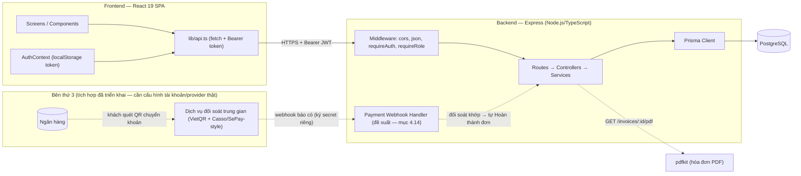
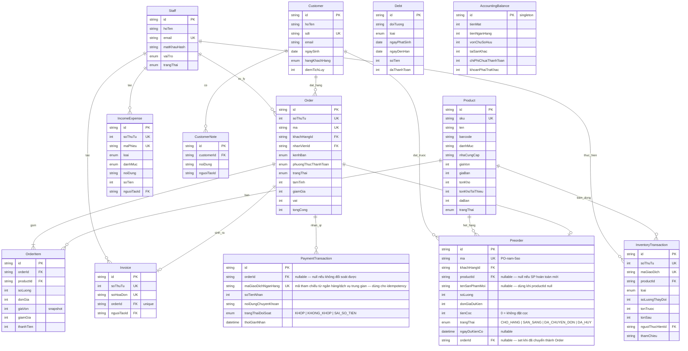
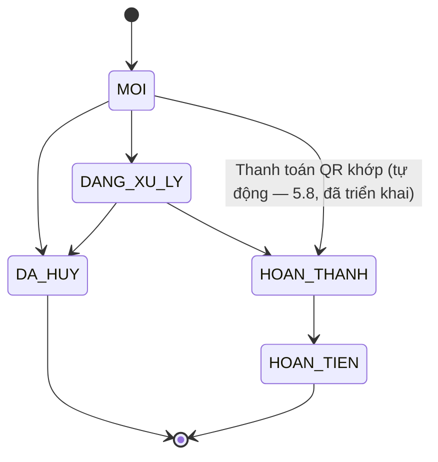
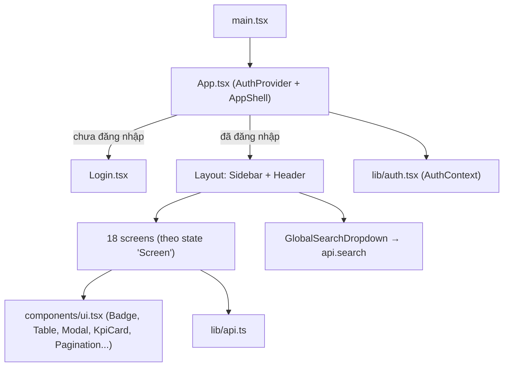
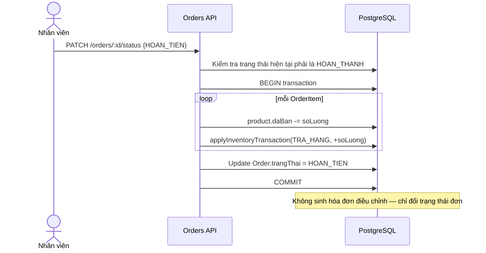
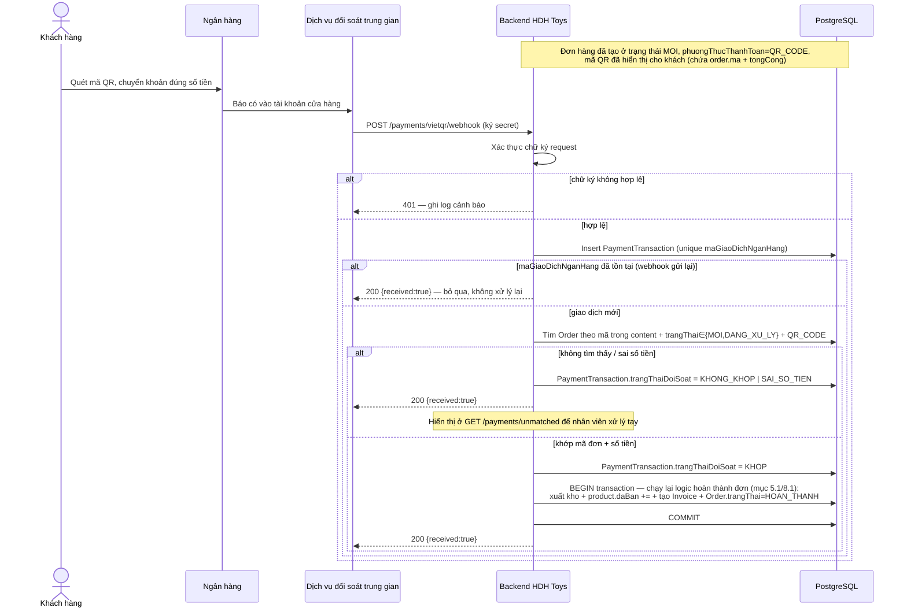
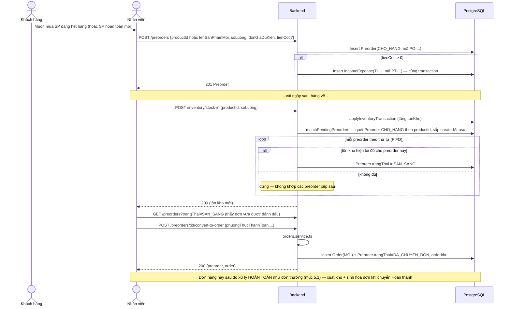

# HDH Toys — Software Design Specification (SDS)

**Phiên bản**: 1.0 (tài liệu hóa hiện trạng hệ thống — reverse-engineered từ mã nguồn)
**Ngày**: 2026-08-21
**Tài liệu liên quan**: [SRS.md](./SRS.md) — yêu cầu chức năng/phi chức năng.

---

## 1. Giới thiệu

Tài liệu này mô tả thiết kế kỹ thuật hiện có của hệ thống HDH Toys: kiến trúc tổng thể, mô hình dữ liệu, thiết kế API, logic nghiệp vụ lõi, thiết kế bảo mật, cấu trúc frontend, và các luồng xử lý chính. Nội dung được trích xuất trực tiếp từ mã nguồn `backend/` và `frontend/`.

---

## 2. Kiến trúc hệ thống

### 2.1 Kiến trúc tổng thể



### 2.2 Ngăn xếp công nghệ

| Lớp | Công nghệ |
|---|---|
| Backend runtime | Node.js + TypeScript, Express, `express-async-errors` |
| ORM / DB | Prisma Client, PostgreSQL (`DATABASE_URL` + `DIRECT_URL`) |
| Xác thực | `jsonwebtoken` (HS256), `bcryptjs` (cost 10) |
| Validation | `zod` (schema validate ở tầng controller) |
| Sinh PDF | `pdfkit` + font Unicode (`dejavu-fonts-ttf`, fallback OS font) |
| Frontend | React 19, Vite 8, TypeScript 5.7, Tailwind CSS v4 |
| State/Router | State nội bộ (`useState` trong `App.tsx`) — không dùng React Router |
| Triển khai | Render.com (Web Service, plan free), build: `npm install && npx prisma migrate deploy && npm run build` |

### 2.3 Cấu trúc thư mục

```
backend/src/
  routes/        # định nghĩa endpoint + middleware theo resource
  controllers/    # parse & validate request (zod), gọi service, format response
  services/       # business logic + truy vấn Prisma
  lib/             # helper: auth, dateRange, mã tự sinh, PDF, trạng thái suy ra
  middleware/      # requireAuth, requireRole, errorHandler
  errors/          # HttpError (400/401/403/404/409/500/503 chuẩn hóa)

frontend/src/
  screens/         # 18 màn hình nghiệp vụ (1 file / màn hình)
  components/       # Layout (Sidebar/Header/Search), ui.tsx (UI kit dùng chung)
  lib/               # api.ts (client), auth.tsx (AuthContext), labels.ts (nhãn VN), responsive.ts
```

### 2.4 Triển khai (`render.yaml`)

Một service `hdhtoys-backend` (Node, `rootDir: backend`), build chạy `prisma migrate deploy` trước khi build TypeScript — đảm bảo schema DB luôn đồng bộ trước khi start. Biến môi trường bắt buộc (không sync, phải cấu hình tay trên Render): `DATABASE_URL`, `DIRECT_URL`, `JWT_SECRET`. Frontend không có trong `render.yaml` — được deploy/host riêng (Figma Make dev server khi phát triển).

---

## 3. Mô hình dữ liệu (Data Model)

### 3.1 ERD



### 3.2 Enum nghiệp vụ

| Enum | Giá trị |
|---|---|
| `StaffRole` | `ADMIN`, `MANAGER`, `ACCOUNTANT`, `INVENTORY_STAFF` |
| `StaffStatus` | `ACTIVE`, `LOCKED` |
| `ProductStatus` | `CON_HANG`, `SAP_HET`, `HET_HANG`, `NGUNG_KINH_DOANH` |
| `CustomerTier` | `NEW`, `MEMBER`, `VIP` |
| `OrderStatus` | `MOI`, `DANG_XU_LY`, `HOAN_THANH`, `DA_HUY`, `HOAN_TIEN` |
| `PaymentMethod` | `TIEN_MAT`, `CHUYEN_KHOAN`, `THE`, `QR_CODE` |
| `SalesChannel` | `TAI_CUA_HANG`, `DIEN_THOAI`, `FACEBOOK`, `KHAC` |
| `InventoryTransactionType` | `NHAP`, `XUAT`, `DIEU_CHINH`, `TRA_HANG` |
| `TransactionKind` | `THU`, `CHI` |
| `IncomeExpenseCategory` | `BAN_HANG`, `NHAP_HANG`, `VAN_CHUYEN`, `LUONG`, `DIEN_NUOC`, `MARKETING`, `KHAC` |
| `DebtType` | `PHAI_THU`, `PHAI_TRA` |
| `DebtStatus` (suy ra, không lưu) | `CHUA_DEN_HAN`, `SAP_DEN_HAN`, `QUA_HAN`, `DA_THANH_TOAN` |
| `PaymentReconciliationStatus` (mục 4.14) | `KHOP`, `KHONG_KHOP`, `SAI_SO_TIEN` |
| `PreorderStatus` (mục 5.9) | `CHO_HANG`, `SAN_SANG`, `DA_CHUYEN_DON`, `DA_HUY` |

### 3.3 Quy tắc sinh mã tự động

Áp dụng chung một mẫu: tạo dòng với mã tạm `TEMP-{timestamp}-{random}` trong `$transaction` để lấy được `soThuTu` (autoincrement) do DB cấp, sau đó `update` mã cuối cùng dựa trên `soThuTu` đó — đảm bảo mã không trùng và tuần tự dù có nhiều request đồng thời.

| Đối tượng | Định dạng | Ví dụ |
|---|---|---|
| Order | `HDH-{năm}-{soThuTu 5 chữ số}` | `HDH-2026-00042` |
| Invoice | `HDH-INV-{năm}-{soThuTu 5 chữ số}` | `HDH-INV-2026-00042` |
| InventoryTransaction | `{PREFIX}-{soThuTu 5 chữ số}` — PREFIX: `NK`=Nhập, `XK`=Xuất, `DC`=Điều chỉnh, `TH`=Trả hàng | `XK-00107` |
| IncomeExpense | `{PREFIX}-{soThuTu 5 chữ số}` — PREFIX: `PT`=Thu, `PC`=Chi | `PT-00031` |
| Preorder | `PO-{năm}-{soThuTu 5 chữ số}` | `PO-2026-00001` |

---

## 4. Thiết kế API

Base path: `/api`. Tất cả endpoint (trừ `/health`, `/auth/login`) yêu cầu header `Authorization: Bearer <JWT>` (middleware `requireAuth`). Cột **Role** ghi vai trò bổ sung bắt buộc qua `requireRole(...)`; "—" nghĩa là chỉ cần đăng nhập.

### 4.1 Auth

| Method & Path | Role | Request | Response |
|---|---|---|---|
| `POST /auth/login` | (public) | `{email, matKhau}` | `{token, staff:{id,hoTen,email,vaiTro}}` |
| `GET /auth/me` | — | | `{id,hoTen,email,vaiTro,trangThai}` |

### 4.2 Staff — `requireRole("ADMIN")` cho toàn bộ

| Method & Path | Request | Response |
|---|---|---|
| `GET /staff` | | `Staff[]` (không có `matKhauHash`) |
| `POST /staff` | `{hoTen,email,matKhau≥6,vaiTro}` | `201 Staff` (409 nếu email trùng) |
| `PATCH /staff/:id` | `Partial<{hoTen,vaiTro,trangThai}>` | `Staff` |
| `POST /staff/:id/reset-password` | `{matKhauMoi≥6}` | `{ok:true}` |

### 4.3 Products — mutation `requireRole("ADMIN","MANAGER","INVENTORY_STAFF")`; discontinue/reactivate `requireRole("ADMIN","MANAGER")`

| Method & Path | Request | Response |
|---|---|---|
| `GET /products` | `q?,danhMuc?,nhaCungCap?,trangThai?,page,pageSize≤100` | `{items,total,page,pageSize}` |
| `GET /products/:id` | | `Product` (404 nếu không có) |
| `POST /products` | `sku,ten,barcode?,danhMuc,nhaCungCap,anhUrl?,giaVon≥0,giaBan≥0,tonKho≥0,tonKhoToiThieu≥0` | `201 Product` (409 SKU trùng) |
| `PATCH /products/:id` | `Partial<{ten,barcode,danhMuc,nhaCungCap,anhUrl,giaVon,giaBan,tonKhoToiThieu}>` | `Product` — `tonKho` **không** sửa ở đây |
| `POST /products/:id/discontinue` | | set `trangThai=NGUNG_KINH_DOANH` |
| `POST /products/:id/reactivate` | | suy lại `trangThai` từ tồn kho hiện tại |

### 4.4 Customers — chỉ cần đăng nhập

| Method & Path | Request | Response |
|---|---|---|
| `GET /customers` | `q?,hangKhachHang?,page,pageSize` | `{items,total,page,pageSize}` |
| `GET /customers/:id` | | `Customer` |
| `POST /customers` | `hoTen,sdt,email?,ngaySinh?,hangKhachHang?` | `201` (409 SĐT trùng) |
| `PATCH /customers/:id` | `Partial<{hoTen,email,ngaySinh,hangKhachHang,diemTichLuy}>` | `Customer` |
| `GET /customers/:id/overview` | | `{customer,kpi,danhMucThuongMua,sanPhamMuaNhieuNhat,lanMuaGanNhat,donDangXuLyHienTai}` |
| `GET /customers/:id/orders` | `trangThai?("active"\|enum),page,pageSize` | `{items,total,page,pageSize}` |
| `GET /customers/:id/products` | | `{items:[{productId,ten,sku,tongSoLuong,soLanMua,lanMuaGanNhat,tongChiTieu}],total}` |
| `GET /customers/:id/invoices` | | `{items,total}` |
| `GET /customers/:id/notes` | | `CustomerNote[]` |
| `POST /customers/:id/notes` | `{noiDung}` | `201 CustomerNote` |

### 4.5 Orders — chỉ cần đăng nhập

| Method & Path | Request | Response |
|---|---|---|
| `GET /orders` | `q?,trangThai?,khachHangId?,nhanVienId?,phuongThucThanhToan?,tuNgay?,denNgay?,page,pageSize` | paginated, kèm `khachHang,nhanVien,items+product` |
| `GET /orders/:id` | | `Order` chi tiết |
| `POST /orders` | `khachHangId,nhanVienId?,kenhBan?,phuongThucThanhToan,vat?,ghiChu?,items:[{productId,soLuong,giaOverride?,giamGia?}]` | `201 Order` |
| `PATCH /orders/:id/status` | `{trangThai}` | `Order` — xem máy trạng thái mục 5.1 |

### 4.6 Inventory — mutation `requireRole("ADMIN","MANAGER","INVENTORY_STAFF")`; đọc chỉ cần đăng nhập

| Method & Path | Request | Response |
|---|---|---|
| `GET /inventory/summary` | | `{tongSku,tongSoLuongTon,giaTriTonKho,sanPhamSapHet,sanPhamHetHang}` |
| `GET /inventory` | như `/products` | mỗi item thêm `coTheBan,giaTriTon` |
| `POST /inventory/stock-in` | `{productId,soLuong≥1,thamChieu?,ghiChu?}` | `InventoryTransaction` (loai NHAP) |
| `POST /inventory/stock-out` | như trên | loai XUAT |
| `POST /inventory/adjust` | `{productId,tonKhoMoi≥0,ghiChu?}` | loai DIEU_CHINH |
| `GET /inventory/history` | `productId?,loai?,nguoiThucHienId?,tuNgay?,denNgay?,page,pageSize` | paginated |

### 4.7 Invoices — chỉ cần đăng nhập (read-only, không có POST tạo trực tiếp)

| Method & Path | Request | Response |
|---|---|---|
| `GET /invoices` | `q?,khachHangId?,phuongThucThanhToan?,nguoiTaoId?,tuNgay?,denNgay?,page,pageSize` | paginated |
| `GET /invoices/:id` | | `Invoice` chi tiết |
| `GET /invoices/:id/pdf` | | `application/pdf` (inline) |

### 4.8 Search — chỉ cần đăng nhập

| Method & Path | Request | Response |
|---|---|---|
| `GET /search` | `q` | `{khachHang[],donHang[],hoaDon[],sanPham[]}` — mỗi nhóm ≤5, `q<2` ký tự → rỗng ngay |

### 4.9 Revenue — chỉ cần đăng nhập

Tất cả nhận `range` (default `7_ngay`) + `tuNgay?/denNgay?` (chỉ dùng khi `range=tuy_chinh`). Chỉ tính từ đơn `HOAN_THANH` trừ khi ghi chú khác.

| Method & Path | Response |
|---|---|
| `GET /revenue/summary` | `{tongDoanhThu,tongSoDon,giaTriDonTrungBinh,loiNhuanGop,tongGiamGia,tongHoanTien}` |
| `GET /revenue/by-time` | `[{ngay,doanhThu,soDon}]` (theo ngày, giờ VN) |
| `GET /revenue/by-category` | `[{danhMuc,doanhThu}]` |
| `GET /revenue/by-product` | `[{ten,sku,soLuong,doanhThu}]` |
| `GET /revenue/by-staff` | `[{hoTen,doanhThu,soDon}]` |
| `GET /revenue/by-payment-method` | `[{phuongThuc,doanhThu,soDon}]` |
| `GET /revenue/detail` | `+page,pageSize` → `[{ngay,soDon,doanhThu,giamGia,hoanTien,giaVon,loiNhuanGop}]` |
| `GET /revenue/export` | CSV (`text/csv`, UTF-8 BOM), cột `Ngay,So don,Doanh thu,Giam gia,Gia von,Loi nhuan gop` |

### 4.10 Income/Expense — chỉ cần đăng nhập

| Method & Path | Request | Response |
|---|---|---|
| `GET /income-expense` | `loai?,danhMuc?,nguoiTaoId?,range?,tuNgay?,denNgay?,page,pageSize` | paginated |
| `GET /income-expense/summary` | cùng filter | `{tongThu,tongChi,dongTienRong}` |
| `POST /income-expense` | `{loai,danhMuc,noiDung,soTien≥1}` | `201` |
| `PATCH /income-expense/:id` | `Partial<{danhMuc,noiDung,soTien}>` | |

### 4.11 Debts — chỉ cần đăng nhập

| Method & Path | Request | Response |
|---|---|---|
| `GET /debts` | `loai?,trangThai?(suy ra),q?,page,pageSize` | paginated, kèm `conLai,trangThai` tính động |
| `GET /debts/summary` | | `{tongPhaiThu,quaHanPhaiThu,tongPhaiTra,quaHanPhaiTra}` |
| `GET /debts/:id` | | |
| `POST /debts` | `{doiTuong,loai,ngayPhatSinh,ngayDenHan,soTien≥1,daThanhToan≥0}` | 400 nếu `daThanhToan>soTien` |
| `PATCH /debts/:id` | `Partial<{doiTuong,ngayDenHan,soTien}>` | |
| `PATCH /debts/:id/payment` | `{soTien≥1}` | 400 nếu vượt số còn lại |

### 4.12 Accounting — `PATCH /balance` yêu cầu `requireRole("ADMIN","ACCOUNTANT")`

| Method & Path | Request | Response |
|---|---|---|
| `GET /accounting/overview` | | `{tienMat,tienNganHang,congNoPhaiThu,congNoPhaiTra,giaTriTonKho,loiNhuanThang,tinhHinhTaiChinh[]}` |
| `GET /accounting/balance` | | `AccountingBalance` (tự tạo nếu chưa có) |
| `PATCH /accounting/balance` | `Partial<{tienMat,tienNganHang,vonChuSoHuu,taiSanKhac,chiPhiChuaThanhToan,khoanPhaiTraKhac}>` (int≥0) | |
| `GET /accounting/balance-sheet` | | xem cấu trúc mục 5.5 |

### 4.13 Health

| Method & Path | Response |
|---|---|
| `GET /health` | `{status:"ok",db:"connected"}` (503 nếu Prisma lỗi kết nối `P1001`/`P1002`) |

### 4.14 Payment Webhook — Đối soát thanh toán QR ngân hàng (**Đã triển khai**)

> Xem yêu cầu tương ứng tại **SRS.md mục 3.16 (FR-PAY.1–9)**. Endpoint dưới đây **không** dùng `requireAuth` (JWT nội bộ) vì bên gọi là hệ thống thứ 3, mà xác thực bằng chữ ký/secret riêng theo hợp đồng của dịch vụ đối soát. Mã nguồn: `routes/payments.ts`, `controllers/payments.controller.ts`, `services/payments.service.ts`, `lib/webhookAuth.ts`. Đã kiểm thử qua HTTP thực tế (sai secret → 401; khớp mã đơn + số tiền → tự hoàn thành đơn, xuất kho, sinh hóa đơn; gửi lại cùng `referenceCode` → idempotent; sai số tiền/không tìm thấy đơn → lưu vết, không đổi trạng thái đơn).

| Method & Path | Role | Request | Response |
|---|---|---|---|
| `POST /payments/vietqr/webhook` | Xác thực bằng header secret/HMAC signature (KHÔNG dùng Bearer JWT) | Theo format của dịch vụ trung gian, ví dụ dạng Casso/SePay: `{gateway, transactionDate, accountNumber, content, transferAmount, referenceCode, description}` | `200 {received:true}` ngay sau khi lưu bản ghi thô (để tránh bên gọi retry do timeout) — xử lý đối soát có thể chạy đồng bộ hoặc hàng đợi ngay sau đó |
| `GET /payments/unmatched` *(đề xuất, hỗ trợ FR-PAY.5)* | requireAuth (nhân viên) | `page,pageSize` | Danh sách `PaymentTransaction` có `trangThaiDoiSoat != KHOP`, để nhân viên xử lý thủ công |

**Thiết kế endpoint webhook**:
1. Xác thực chữ ký request (secret theo cấu hình provider) — sai → `401`, ghi log cảnh báo, **không** xử lý tiếp.
2. Lưu ngay một dòng `PaymentTransaction` thô với `maGiaoDichNganHang` = `referenceCode` (unique constraint) — nếu đã tồn tại (`referenceCode` trùng) → coi là webhook gửi lại, trả `200` ngay, **không** xử lý lần 2 (đảm bảo NFR-10 idempotent).
3. Trích mã đơn hàng từ `content` (regex khớp định dạng `HDH-{năm}-{5 số}`), tìm `Order` có `ma` tương ứng và `trangThai ∈ {MOI, DANG_XU_LY}` và `phuongThucThanhToan = QR_CODE`.
4. So khớp `transferAmount === order.tongCong`: khớp → set `trangThaiDoiSoat = KHOP`, gọi lại logic hoàn thành đơn hàng dùng chung với `PATCH /orders/:id/status` (mục 5.1); không tìm thấy đơn → `KHONG_KHOP`; tìm thấy đơn nhưng sai số tiền → `SAI_SO_TIEN`.
5. Trả `200` cho dịch vụ trung gian trong mọi trường hợp đã nhận được request hợp lệ chữ ký (để tránh bị retry vô hạn); lỗi nghiệp vụ (không khớp) không phải lỗi HTTP.

### 4.15 Preorders — Đặt trước (**Đã triển khai**)

Xem yêu cầu tương ứng tại **SRS.md mục 3.17 (FR-PRE.1–10)**. Mã nguồn: `routes/preorders.ts`, `controllers/preorders.controller.ts`, `services/preorders.service.ts`. Chỉ cần đăng nhập (không role riêng, giống Orders/Customers).

| Method & Path | Request | Response |
|---|---|---|
| `GET /preorders` | `q?,trangThai?,khachHangId?,productId?,page,pageSize` | paginated, kèm `khachHang,nhanVien,product` |
| `GET /preorders/summary` | | `{dangChoHang,sanSangGiao,tongTienCocDangGiu}` |
| `GET /preorders/:id` | | chi tiết |
| `POST /preorders` | `{khachHangId,productId? XOR tenSanPhamMoi,soLuong,donGiaDuKien,tienCoc?,ngayDuKienCo?,ghiChu?}` | `201` — nếu `tienCoc>0` tự tạo kèm 1 `IncomeExpense` (THU) trong cùng transaction |
| `PATCH /preorders/:id` | `Partial<{soLuong,donGiaDuKien,tienCoc,ngayDuKienCo,ghiChu}>` | chỉ khi còn `CHO_HANG`/`SAN_SANG` |
| `POST /preorders/:id/cancel` | | → `DA_HUY`, chỉ khi chưa `DA_CHUYEN_DON`/`DA_HUY` |
| `POST /preorders/:id/convert-to-order` | `{productId?(bắt buộc nếu preorder chưa gắn sản phẩm),phuongThucThanhToan,kenhBan?,vat?}` | tạo 1 `Order` thật (gọi lại `orders.service.ts#create`) + set `DA_CHUYEN_DON` + `orderId` |

### 4.16 Xóa dữ liệu (Delete) — **Đã triển khai**

Xem yêu cầu tại **SRS.md mục 3.18 (FR-DEL.1–9)**. Đây là thay đổi chính sách có chủ đích so với các mục mô tả "sổ ghi bất biến" ở trên — chấp nhận đánh đổi để sửa được lỗi nhập liệu, giới hạn rủi ro bằng: (a) kiểm tra ràng buộc dữ liệu trước khi xóa ở tầng service (không chỉ dựa vào FK constraint của Postgres), và (b) giới hạn `requireRole("ADMIN")` cho các bảng có ảnh hưởng tới số liệu kế toán/tồn kho.

| Method & Path | Role | Điều kiện chặn |
|---|---|---|
| `DELETE /customers/:id` | — | Có Order hoặc Preorder tham chiếu |
| `DELETE /customers/:id/notes/:noteId` | — | Không có |
| `DELETE /products/:id` | `ADMIN,MANAGER,INVENTORY_STAFF` | Có OrderItem, InventoryTransaction, hoặc Preorder tham chiếu |
| `DELETE /income-expense/:id` | — | Không có |
| `DELETE /debts/:id` | — | Không có |
| `DELETE /preorders/:id` | — | `trangThai = DA_CHUYEN_DON` |
| `DELETE /orders/:id` | `ADMIN` | Có Invoice, PaymentTransaction, hoặc Preorder tham chiếu |
| `DELETE /invoices/:id` | `ADMIN` | Không có (order gốc giữ nguyên) |
| `DELETE /inventory/history/:id` | `ADMIN` | Không phải giao dịch **gần nhất** của sản phẩm đó (theo `soThuTu`) |
| `DELETE /staff/:id` | `ADMIN` | Tự xóa chính mình; là tài khoản hệ thống (`system@hdhtoys.internal`); hoặc có Order/Invoice/InventoryTransaction/IncomeExpense/Preorder tham chiếu |

Tất cả trả `204 No Content` khi thành công, `400` kèm thông báo tiếng Việt cụ thể khi bị chặn.

### 4.17 Chuẩn hóa lỗi

Toàn bộ lỗi trả JSON `{error: "<thông báo tiếng Việt>"}` qua `errorHandler`: `400` badRequest, `401` unauthorized, `403` forbidden, `404` notFound, `409` conflict; lỗi không xác định → `500 "Đã xảy ra lỗi hệ thống."`; lỗi kết nối DB → `503`.

---

## 5. Thiết kế logic nghiệp vụ

### 5.1 Máy trạng thái đơn hàng (Order Status State Machine)



- Cạnh `MOI/DANG_XU_LY --> HOAN_THANH` gắn nhãn "tự động" (mục 5.8, `orders.service.ts#completeOrderViaPayment`) do hệ thống kích hoạt khi đối soát thanh toán QR khớp, không phải nhân viên chuyển tay; đây là ngoại lệ có chủ đích so với 4 cạnh còn lại (do nhân viên điều khiển qua `PATCH /orders/:id/status`).
- Chuyển sai cạnh → `400 "Không thể chuyển trạng thái từ X sang Y."`.
- **Side-effect khi → `HOAN_THANH`** (trong 1 `$transaction`): với mỗi `OrderItem` → tăng `product.daBan`, gọi `applyInventoryTransaction(XUAT, -soLuong, thamChieu=order.ma)`; tự tạo `Invoice` mới (mã `HDH-INV-...`, `nguoiTaoId` = người thực hiện chuyển trạng thái). Nếu tồn kho không đủ → toàn bộ transaction rollback (kể cả việc đổi trạng thái).
- **Side-effect khi `HOAN_THANH → HOAN_TIEN`**: với mỗi `OrderItem` → giảm `product.daBan`, gọi `applyInventoryTransaction(TRA_HANG, +soLuong, ghiChu="Hoàn kho do hoàn tiền đơn hàng")` — hoàn tồn kho; **không** sinh hóa đơn điều chỉnh/credit-note.
- Chuyển sang `DA_HUY` (từ `MOI`/`DANG_XU_LY`) không có side-effect kho (vì kho chưa từng bị trừ ở các trạng thái này).

### 5.2 Cỗ máy giao dịch kho (`applyInventoryTransaction`)

Hàm lõi dùng chung bởi Inventory API (nhập/xuất/điều chỉnh thủ công) **và** Orders service (xuất/hoàn kho tự động):

1. `tonSau = tonKho hiện tại + soLuongThayDoi` (delta có thể âm/dương).
2. Nếu `tonSau < 0` → `400 "Tồn kho không đủ cho sản phẩm {ten} (hiện có X, cần Y)."` — hủy toàn bộ transaction cha.
3. Ghi `InventoryTransaction` (mã tạm → cập nhật mã cuối trong transaction) lưu `tonTruoc/tonSau/nguoiThucHien/thamChieu/ghiChu`.
4. Update `product.tonKho = tonSau` và `product.trangThai = resolveStockStatus(tonSau, tonKhoToiThieu, trangThaiHienTai)`.

**`resolveStockStatus(tonKho, tonKhoToiThieu, currentStatus)`**:
- Nếu `currentStatus === NGUNG_KINH_DOANH` → giữ nguyên (sản phẩm ngừng KD không tự "sống lại" qua biến động kho).
- Else nếu `tonKho ≤ 0` → `HET_HANG`; else nếu `tonKho ≤ tonKhoToiThieu` → `SAP_HET`; else → `CON_HANG`.

### 5.3 Suy ra trạng thái công nợ (`resolveDebtStatus`)

```
conLai = soTien - daThanhToan
nếu conLai ≤ 0            → DA_THANH_TOAN
ngayConLai = ceil((ngayDenHan - hiện tại) / 86 400 000 ms)
nếu ngayConLai < 0         → QUA_HAN
nếu ngayConLai ≤ 7         → SAP_DEN_HAN
ngược lại                  → CHUA_DEN_HAN
```
Trạng thái này **không lưu DB**, luôn tính lại tại thời điểm truy vấn — do đó `GET /debts` với filter `trangThai` phải tải toàn bộ bản ghi khớp `loai`/`q`, tính trạng thái từng dòng, rồi mới lọc + phân trang **trong bộ nhớ** (không phải ở tầng SQL) — cần lưu ý về hiệu năng nếu số lượng công nợ lớn.

### 5.4 Công thức doanh thu & lợi nhuận

- `tamTinh = Σ(soLuong × donGia)`; `giamGia (đơn) = Σ(giamGia từng dòng)`; **`tongCong = tamTinh − giamGia + vat`** — VAT là **số tiền cộng thêm cố định**, không phải phần trăm.
- Lợi nhuận gộp mỗi dòng = `thanhTien − soLuong × giaVon`, dùng `giaVon` **snapshot trên `OrderItem` tại thời điểm tạo đơn** (không phải giá vốn hiện tại của sản phẩm) → số liệu lợi nhuận lịch sử ổn định dù giá vốn sản phẩm thay đổi sau đó.
- Mọi báo cáo doanh thu (`/revenue/*`) chỉ tính trên đơn `trangThai = HOAN_THANH`; `tongHoanTien` lấy từ đơn `HOAN_TIEN` trong cùng khoảng ngày, báo cáo **riêng**, không trừ vào `tongDoanhThu`.

### 5.5 Bảng cân đối kế toán (Balance Sheet)

```
Tài sản ngắn hạn (tongTaiSan) =
    tienMat + tienGuiNganHang                     (từ AccountingBalance, nhập tay)
  + congNoPhaiThu                                  (Σ conLai của Debt loại PHAI_THU)
  + hangTonKho                                     (Σ tonKho × giaVon toàn bộ sản phẩm)
  + taiSanKhac                                     (từ AccountingBalance, nhập tay)

Nợ phải trả (tongNoPhaiTra) =
    congNoNhaCungCap                               (Σ conLai của Debt loại PHAI_TRA)
  + chiPhiChuaThanhToan + khoanPhaiTraKhac          (từ AccountingBalance, nhập tay)

Vốn chủ sở hữu:
    loiNhuanGiuLai = tongTaiSan − tongNoPhaiTra − vonChuSoHuu     ⟵ SỐ DƯ CÂN BẰNG (plug figure)
    tongVonChuSoHuu = vonChuSoHuu + loiNhuanGiuLai

tongNguonVon = tongNoPhaiTra + tongVonChuSoHuu   (⟺ luôn bằng tongTaiSan theo cách tính trên)
canDoi = (tongTaiSan === tongNguonVon)            ⟵ luôn true theo xây dựng công thức
```

> **Ghi chú thiết kế quan trọng** (khớp với SRS mục 6.5): vì hệ thống chưa có sổ cái tổng quát để tính lợi nhuận giữ lại một cách độc lập, `loiNhuanGiuLai` hiện được suy ngược ra để buộc bảng luôn cân — do đó cờ `canDoi` là một **đồng nhất thức toán học**, không phải một kiểm tra đối chiếu độc lập giữa hai vế. Nếu cần kiểm tra tính đúng đắn sổ sách thật, cần bổ sung khả năng tính lợi nhuận giữ lại tích lũy từ lịch sử `IncomeExpense`/`Order` độc lập rồi so sánh với vế còn lại.

### 5.6 Sinh PDF hóa đơn có dấu tiếng Việt

`invoicePdf.ts` dùng `pdfkit`, khổ A5, margin 36pt. Font Unicode được nạp theo thứ tự ưu tiên: biến môi trường `INVOICE_FONT_PATH` → font `DejaVuSans.ttf` đóng gói sẵn trong package `dejavu-fonts-ttf` (ưu tiên vì không phụ thuộc OS) → font hệ điều hành (`arial.ttf`/`segoeui.ttf` trên Windows, `DejaVuSans.ttf` trên Linux) → fallback Helvetica (mất dấu nếu không có font nào). Kết quả đường dẫn font được cache trong memory sau lần tìm đầu tiên. Nội dung hóa đơn: tiêu đề cửa hàng, số hóa đơn, ngày giờ (Asia/Ho_Chi_Minh), mã đơn, nhân viên, khách hàng, bảng dòng sản phẩm, các dòng tổng, phương thức thanh toán.

### 5.7 Giải quyết khoảng thời gian (`dateRange.ts`)

| `range` | Khoảng tính |
|---|---|
| `hom_nay` | 00:00–23:59:59.999 hôm nay |
| `hom_qua` | hôm qua |
| `7_ngay` | `hôm nay-6` → hôm nay (bao gồm cả 2 đầu) |
| `30_ngay` | `hôm nay-29` → hôm nay |
| `thang_nay` / `quy_nay` / `nam_nay` | đầu tháng/quý/năm hiện tại → hiện tại |
| `tuy_chinh` | dùng `tuNgay`/`denNgay`; nếu thiếu 1 trong 2 → mặc định về `7_ngay` |

Lưu ý: bộ lọc theo ngày ở `GET /orders` dùng `tuNgay/denNgay` thô (không qua preset `dateRange.ts`), khác với các endpoint `/revenue/*`, `/income-expense`, `/inventory/history` dùng chung cơ chế preset này.

### 5.8 Đối soát thanh toán QR & tự động hoàn thành đơn hàng (**Đã triển khai**)

Tương ứng FR-PAY.1–9 (SRS 3.16) và API webhook (mục 4.14). Các quyết định thiết kế đã chốt khi triển khai:

1. **Sinh mã QR (FR-PAY.1, FR-PAY.7)**: tại thời điểm `POST /orders` với `phuongThucThanhToan=QR_CODE` (`orders.service.ts#create`), tính `qrExpiresAt = createdAt + VIETQR_TTL_MINUTES phút` (mặc định 15) và lưu vào cột `Order.qrExpiresAt`. Chuỗi VietQR (`lib/vietqr.ts#buildVietQrPayload`, theo chuẩn EMVCo/NAPAS 247) được tính **on-the-fly** (không lưu DB) mỗi lần `GET /orders/:id` hoặc `GET /orders/:id/qr.png` bằng `orders.service.ts#getQrPaymentInfo`, nhúng số tài khoản cửa hàng (`VIETQR_BANK_BIN`/`VIETQR_ACCOUNT_NO`) + số tiền `tongCong` + nội dung chứa `order.ma`. Nếu chưa cấu hình tài khoản ngân hàng (env rỗng), trả `{configured:false}` để frontend hiển thị thông báo thay vì lỗi.
2. **Tái sử dụng logic hoàn thành đơn**: `orders.service.ts` tách side-effect hoàn thành đơn (xuất kho + tăng `daBan` + tạo `Invoice`) thành hàm nội bộ `applyOrderCompletion(tx, order, nguoiThucHienId)`, dùng chung bởi `updateStatus` (luồng nhân viên) và `completeOrderViaPayment` (luồng webhook) — đảm bảo hai luồng không lệch hành vi.
3. **Trường "người thực hiện" khi hệ thống tự kích hoạt**: đã chọn hướng (a) — tạo tài khoản `Staff` đại diện hệ thống (`system@hdhtoys.internal`, vai trò `ADMIN`, trạng thái `LOCKED` vĩnh viễn, mật khẩu hash ngẫu nhiên không ai biết — seed tự động qua `prisma/seed.ts#seedPaymentSystemStaff`, idempotent) và gán làm `nguoiTaoId`/`nguoiThucHienId` cho các bản ghi `Invoice`/`InventoryTransaction` do webhook tạo ra. Không cần đổi schema (giữ các cột này `NOT NULL`).
4. **Đối soát (FR-PAY.3)**: `payments.service.ts#recordAndReconcile` match `content` chứa `order.ma` bằng regex `/HDH-\d{4}-\d{5}/`, yêu cầu đơn đang ở `MOI`/`DANG_XU_LY` + `phuongThucThanhToan=QR_CODE`, và `transferAmount === order.tongCong`. Đơn đã hết hạn QR hiển thị (`qrExpiresAt` đã qua) nhưng webhook vẫn đến và khớp đúng thì **vẫn tự hoàn thành bình thường** — hạn QR chỉ là mốc ẩn ảnh QR khỏi giao diện, không chặn đối soát backend (tiền thật đã về thì vẫn xử lý).
5. **Idempotency (FR-PAY.6, NFR-10)**: unique constraint trên `PaymentTransaction.maGiaoDichNganHang` (mã tham chiếu ngân hàng) là chốt chặn chính — webhook gửi lại cùng mã tham chiếu trả `{duplicate:true}` ngay, không xử lý lại. Đã kiểm thử: gửi lại đúng request 2 lần, lần 2 không trừ kho/không sinh hóa đơn lần 2.
6. **Race hiếm gặp** (đơn đổi trạng thái ở nơi khác đúng lúc webhook đang xử lý): `recordAndReconcile` bắt lỗi từ `completeOrderViaPayment`, hạ cấp bản ghi về `KHONG_KHOP` thay vì để webhook trả lỗi HTTP (tránh bên thứ 3 hiểu nhầm lỗi hạ tầng và retry vô hạn) — nhân viên xử lý tiếp ở màn "Đối soát QR".
7. **Lưu ý về thứ tự mount router (phát hiện khi kiểm thử)**: mỗi router "protected" khác gọi `router.use(requireAuth)`, middleware này chặn **toàn bộ** request đi vào router đó (không riêng các route nó khớp) trước khi Express thử router kế tiếp. `paymentsRouter` (chứa endpoint webhook công khai) do đó PHẢI mount **trước** các router protected trong `app.ts` (ngay sau `authRouter`) — mount sau sẽ khiến webhook luôn bị một router khác trả 401 trước khi kịp tới `paymentsRouter`. Đây là một cạm bẫy chung của kiểu tổ chức middleware theo router hiện tại, cần nhớ khi thêm bất kỳ endpoint công khai mới nào sau này.
8. **Frontend phát hiện tự hoàn thành bằng polling**: `OrderDetail.tsx` gọi lại `GET /orders/:id` mỗi 4 giây khi đơn còn ở `MOI`/`DANG_XU_LY` với phương thức QR Code, tự dừng khi trạng thái đổi — không dùng WebSocket/SSE (xem SRS 6.11 về giới hạn này).

### 5.9 Đặt trước & khớp tự động theo FIFO khi nhập kho (**Đã triển khai**)

Tương ứng FR-PRE.1–10 (SRS 3.17). Preorder là một sổ **tách biệt hoàn toàn** khỏi `Order` (không có FK bắt buộc, chỉ liên kết một chiều qua `orderId` sau khi chuyển đổi) — theo cùng triết lý với `Debt`, để không phải sửa/rủi ro máy trạng thái `Order` đang chạy ổn định.

1. **Tạo đặt trước (`preorders.service.ts#create`)**: validate đúng một trong hai — `productId` (SP có sẵn, dù đang `HET_HANG`/`SAP_HET`) hoặc `tenSanPhamMoi` (SP hoàn toàn mới, chưa có `Product` row) — dùng `.refine()` ở tầng zod (`Boolean(productId) !== Boolean(tenSanPhamMoi)`). Nếu `tienCoc > 0`, trong cùng `$transaction` tạo thêm một `IncomeExpense` (loai `THU`, danhMuc `BAN_HANG`, mã `PT-#####` theo đúng pattern sinh mã hiện có) — tiền cọc là tiền thật đã thu, phải lên sổ Thu/Chi ngay, không chỉ nằm trong bản ghi Preorder.
2. **Khớp FIFO khi nhập kho (`inventory.service.ts#matchPendingPreorders`)**: được gọi từ ngay trong `applyInventoryTransaction` — hàm lõi dùng chung bởi mọi đường tăng tồn (nhập kho, điều chỉnh tăng, hoàn kho do hoàn tiền) — bất cứ khi nào `soLuongThayDoi > 0`. Lấy toàn bộ `Preorder` có `productId` khớp và `trangThai=CHO_HANG`, sắp theo `createdAt asc` (đặt trước sớm nhất ưu tiên trước), rồi trừ dần vào tồn kho **hiện tại** (đã cộng thêm số vừa nhập) — đơn nào đủ hàng theo đúng thứ tự thì đánh dấu `SAN_SANG`; gặp đơn không đủ hàng thì **dừng luôn** (không nhảy qua để khớp đơn xếp sau, tôn trọng FIFO).
3. **Không giữ hàng thật** (xem SRS 6.12): việc đánh dấu `SAN_SANG` chỉ là gợi ý dựa trên tồn kho tại thời điểm nhập — hệ thống không trừ trước/khóa số lượng đó khỏi các giao dịch bán hàng thông thường khác. Đây là lựa chọn thiết kế có chủ đích để tránh phải thêm khái niệm "tồn kho khả dụng vs tồn kho giữ chỗ" vào toàn hệ thống (Inventory hiện tại `coTheBan = tonKho`, không có khái niệm giữ hàng — SDS mục 4.6).
4. **Chuyển thành đơn hàng (`preorders.service.ts#convertToOrder`)**: gọi **lại đúng** `orders.service.ts#create` (không viết logic tạo đơn riêng) với 1 dòng `OrderItem` duy nhất (`soLuong`, `giaOverride = donGiaDuKien` của preorder), `ghiChu` tự động nhắc số tiền đã cọc/còn phải thu nếu `tienCoc>0`. Nếu `Preorder.productId` đang `null` (trường hợp SP hoàn toàn mới), bắt buộc truyền `productId` trong body request (SP đó phải đã được tạo thật trong catalog trước) — Preorder được gán `productId` này khi cập nhật `trangThai=DA_CHUYEN_DON`. Việc trừ kho/sinh hóa đơn **không** xảy ra ở bước này — chỉ xảy ra sau đó, khi `Order` vừa tạo được chuyển sang `HOAN_THANH` như một đơn hàng bình thường (tái sử dụng toàn bộ mục 5.1/5.2).
5. **Hủy/sửa**: chỉ cho phép khi `trangThai ∈ {CHO_HANG, SAN_SANG}`; `DA_CHUYEN_DON`/`DA_HUY` là trạng thái kết thúc, không sửa/hủy được nữa.

### 5.10 Từ điển thuật ngữ tích hợp thanh toán

| Thuật ngữ | Ý nghĩa |
|---|---|
| VietQR | Chuẩn mã QR chuyển khoản liên ngân hàng tại Việt Nam (dựa trên EMVCo), cho phép nhúng số tài khoản/số tiền/nội dung vào mã QR để ứng dụng ngân hàng bất kỳ quét và điền sẵn thông tin chuyển khoản. |
| Dịch vụ đối soát trung gian | Dịch vụ thứ 3 (VD Casso, SePay) có kết nối sẵn với các ngân hàng để đọc lịch sử biến động số dư tài khoản doanh nghiệp và chuyển tiếp (webhook) về hệ thống khách hàng khi có tiền vào — giúp HDH Toys không cần tự tích hợp trực tiếp với từng ngân hàng. |
| Đối soát (reconciliation) | Quá trình khớp một giao dịch ngân hàng thực tế với một đơn hàng đang chờ thanh toán trong hệ thống, dựa trên nội dung chuyển khoản và số tiền. |

---

### 5.11 Xóa giao dịch kho — hoàn tác tồn kho & chặn phá vỡ lịch sử (**Đã triển khai**)

Tương ứng FR-DEL.7. `InventoryTransaction` là ledger có cột `tonTruoc`/`tonSau` snapshot tại từng thời điểm — xóa một dòng **ở giữa** lịch sử sẽ làm các dòng sau nó (cùng sản phẩm) có `tonTruoc` không còn khớp với `tonSau` của dòng liền trước, phá vỡ tính đối soát được của cả chuỗi. `inventory.service.ts#removeTransaction` xử lý bằng 2 bước trong 1 `$transaction`:

1. Tìm giao dịch có `soThuTu` lớn nhất cho `productId` đó — nếu giao dịch đang xóa không phải giao dịch này, từ chối với `400`.
2. Nếu đúng là giao dịch gần nhất: tính `tonKhoSauKhiHoanTac = product.tonKho - soLuongThayDoi` (đảo ngược đúng phần đã cộng/trừ khi tạo), cập nhật `Product.tonKho` + `trangThai` (qua `resolveStockStatus`), rồi xóa dòng ledger.

Hệ quả: chỉ có thể "undo" tuần tự từ giao dịch mới nhất trở về, không thể xóa tùy ý một giao dịch cũ — đây là ràng buộc **có chủ đích**, không phải thiếu sót.

**FR-DEL.8 (xóa Staff)** — do hầu hết cột `nhanVienId`/`nguoiTaoId`/`nguoiThucHienId` trên `Order`/`Invoice`/`InventoryTransaction`/`IncomeExpense`/`Preorder` đều là FK bắt buộc không cascade, `staff.service.ts#remove` đếm số dòng ở cả 5 bảng đó trước khi cho xóa — trong thực tế, chỉ tài khoản **chưa từng đăng nhập/sử dụng** mới xóa được; mọi tài khoản đã hoạt động phải dùng "Khóa" (đã có từ trước, không đổi).

---

## 6. Thiết kế bảo mật

- **Hash mật khẩu**: `bcryptjs`, cost factor 10.
- **JWT**: thuật toán `HS256`, payload `{sub: staffId, vaiTro}`, hết hạn sau **8 giờ**. `JWT_SECRET` được validate khi khởi động server: bắt buộc tồn tại, đủ dài (≥32 ký tự), không phải giá trị placeholder mặc định — server **từ chối khởi động** nếu vi phạm (fail-fast, tránh chạy production với secret yếu).
- **`requireAuth`**: đọc header `Authorization: Bearer <token>`; thiếu → `401 "Thiếu token xác thực."`; sai/hết hạn → `401 "Token không hợp lệ hoặc đã hết hạn."`.
- **`requireRole(...roles)`**: so `req.auth.vaiTro` với danh sách cho phép; không khớp → `403 "Bạn không có quyền thực hiện thao tác này."`.
- **Không có refresh token / revoke phía server** — đăng xuất chỉ xóa token phía client (`localStorage`); token cũ vẫn hợp lệ tới khi hết hạn 8h nếu bị đánh cắp.
- **CORS**: mở (`cors()` không giới hạn origin) — phù hợp giai đoạn phát triển, cần thắt lại whitelist origin khi lên production thật.
- **Webhook thanh toán bên thứ 3 (mục 4.14)**: endpoint `POST /payments/vietqr/webhook` **không** dùng JWT nội bộ (bên gọi không phải nhân viên) — PHẢI xác thực bằng secret/HMAC signature riêng theo hợp đồng của dịch vụ đối soát, lưu secret này tách biệt khỏi `JWT_SECRET`, và nên hạn chế theo IP allowlist của bên cung cấp dịch vụ nếu họ công bố dải IP cố định.
- **Khoảng trống đã biết**: RBAC phía frontend không đầy đủ (xem SRS mục 5–6.2) — cần bổ sung để trải nghiệm người dùng nhất quán với thực thi backend, dù backend đã chặn đúng ở tầng API.

---

## 7. Thiết kế Frontend

### 7.1 Kiến trúc thành phần



### 7.2 Điều hướng

Không dùng React Router. `App.tsx` giữ state `{screen: Screen, id?: string}`, hàm `go(screen, id)` được truyền xuống các screen như `onNav`/`onDetail`/`onBack`. **[Đã sửa 2026-08-21]** Đồng bộ 2 chiều với `window.history`: `go()` gọi `pushState({screen,id}, '', '?screen=...&id=...')`; mount effect gọi `replaceState` để URL khớp state ban đầu và lắng nghe `popstate` để phục hồi `nav` khi người dùng bấm Back/Forward (trình duyệt hoặc chuột) — không cần thêm thư viện router vì app chỉ có 1 cấp điều hướng (screen + id tùy chọn), không cần nested routes. Tải lại trang giờ khôi phục đúng màn hình từ URL (`navFromLocation()`), với fallback về Dashboard nếu màn hình chi tiết thiếu `id` (gõ URL tay/link hỏng). Còn 1 điểm chưa tối ưu: các nút "Quay lại" trong UI gọi `go(parentScreen)` (push thêm entry) thay vì `history.back()`, nên có thể dư vài entry trong history stack — không phải lỗi, chỉ chưa gọn nhất (xem SRS 6.1).

### 7.3 API client (`lib/api.ts`)

- Base URL: `VITE_API_URL` (mặc định `http://localhost:4000/api`).
- Mọi request tự đính `Authorization: Bearer <token>` lấy từ `localStorage['hdh_token']`.
- Lỗi chuẩn hóa thành `ApiError{status,message}` (message ưu tiên lấy từ field `error` trong JSON response).
- **`openAuthenticatedPdf`**: do route PDF yêu cầu Bearer token (không thể mở bằng `<a href>`/`window.open` trực tiếp), pattern xử lý là: mở tab trắng ngay (tránh popup blocker) → fetch PDF kèm token dưới dạng blob → gán `blob:` URL vào tab đó → revoke sau 60s. **Lưu ý**: `revenue.exportUrl` (CSV) lại dùng `window.open` trực tiếp — không đồng nhất, có rủi ro 401 nếu endpoint đó cũng được bảo vệ như PDF (xem SRS 6.4).

### 7.4 Quản lý phiên (`lib/auth.tsx`)

`AuthContext` cung cấp `{staff, loading, login, logout}`. Khi mount: nếu có token → gọi `GET /auth/me` để khôi phục `staff`; lỗi → xóa token. `login()` gọi `POST /auth/login`, lưu token, set `staff`. `logout()` chỉ xóa state/token phía client, không gọi API.

### 7.5 UI kit dùng chung (`components/ui.tsx`)

`Badge` (màu theo trạng thái, tra bảng `statusColor`), `KpiCard`, `Table`, `FilterBar`, `SearchInput`, `Select`, `Pagination` (cửa sổ ±2 trang), `Tabs`, `Modal` (div đơn giản, click-outside-to-close, không dùng portal), `Field/Input`, `ErrorBox`, `Spinner`, cùng formatter `formatMoney`/`formatDate`/`formatDateTime` (locale `vi-VN`, tiền tệ hậu tố "VNĐ").

### 7.6 Danh sách 18 màn hình

| Screen key | Màn hình | Vai trò gate ở FE |
|---|---|---|
| `login` | Đăng nhập | — |
| `dashboard` | Tổng quan | không |
| `orders` / `order-detail` / `create-order` | Đơn hàng | không |
| `inventory` / `inventory-history` | Kho hàng | không (dù backend chặn mutation) |
| `products` / `product-detail` | Sản phẩm | không (dù backend chặn mutation) |
| `customers` / `customer-detail` | Khách hàng | không |
| `invoices` / `invoice-detail` | Hóa đơn | không |
| `revenue` | Doanh thu | không |
| `thu-chi` | Thu/Chi | không |
| `ke-toan` | Kế toán (Tổng quan/Công nợ/Cân đối) | không |
| `bao-cao` | Danh mục báo cáo (điều hướng thuần) | không |
| `cai-dat` | Cài đặt (quản lý nhân viên) | **có** — chỉ `ADMIN` thấy/dùng mục quản lý người dùng |
| `preorders` / `preorder-detail` | Đặt trước | không |

---

## 8. Luồng nghiệp vụ chính (Sequence Diagrams)

### 8.1 Tạo đơn hàng → Hoàn thành (tự động xuất kho + sinh hóa đơn)

```mermaid
sequenceDiagram
    actor NV as Nhân viên
    participant FE as Frontend
    participant API as Orders API
    participant DB as PostgreSQL

    NV->>FE: Tạo đơn (chọn KH, SP, SL, PTTT)
    FE->>API: POST /orders
    API->>DB: Validate KH/SP tồn tại; tính tamTinh/giamGia/tongCong
    API->>DB: Insert Order(MOI) + OrderItem[] (transaction, sinh mã HDH-...)
    API-->>FE: 201 Order

    NV->>FE: Chuyển trạng thái → DANG_XU_LY → HOAN_THANH
    FE->>API: PATCH /orders/:id/status {HOAN_THANH}
    API->>DB: BEGIN transaction
    loop mỗi OrderItem
        API->>DB: product.daBan += soLuong
        API->>DB: applyInventoryTransaction(XUAT, -soLuong)
        alt tồn kho không đủ
            API->>DB: ROLLBACK
            API-->>FE: 400 lỗi tồn kho
        end
    end
    API->>DB: Insert Invoice (mã HDH-INV-...)
    API->>DB: Update Order.trangThai = HOAN_THANH
    API->>DB: COMMIT
    API-->>FE: 200 Order (HOAN_THANH)
    FE->>API: GET /invoices?q=<ma đơn> (để bật nút Xuất PDF)
```

### 8.2 Hoàn tiền đơn đã hoàn thành



### 8.3 Thanh toán QR ngân hàng → tự động hoàn thành đơn hàng (**Đã triển khai** — luồng dưới đã kiểm thử qua HTTP thực tế)



### 8.4 Đặt trước → nhập kho tự khớp FIFO → chuyển thành đơn hàng (**Đã triển khai**)



---

## 9. Hạn chế thiết kế hiện tại (tóm tắt kỹ thuật)

Tổng hợp lại các điểm kỹ thuật đã nêu ở SRS mục 6, dưới góc nhìn thiết kế, để làm backlog cải tiến:

1. Thêm client-side routing thực (đồng bộ URL) để hỗ trợ deep-link/back button.
2. Đồng bộ ẩn/khóa UI theo `StaffRole` ở frontend, khớp với các `requireRole` đã có ở backend và ma trận phân quyền hiển thị tại Cài đặt.
3. Chuyển bộ lọc tìm kiếm văn bản ở Lịch sử kho và Thu/Chi thành query param gửi lên server (thay vì lọc trên dữ liệu trang hiện tại).
4. Thống nhất cách gọi các endpoint cần xác thực khi trả file (áp dụng pattern `openAuthenticatedPdf` cho cả export CSV nếu endpoint đó cũng yêu cầu Bearer token).
5. Xem xét bổ sung khả năng tính "lợi nhuận giữ lại" độc lập (từ lịch sử Order/IncomeExpense) để `canDoi` trở thành một kiểm tra đối chiếu thực sự, không chỉ là đồng nhất thức.
6. Tối ưu truy vấn `GET /debts` (hiện lọc `trangThai` suy ra trong bộ nhớ sau khi tải toàn bộ bản ghi khớp `loai`/`q`) khi số lượng công nợ tăng lớn — có thể cần lưu `trangThai` như cột tính toán/denormalized hoặc lọc bằng raw SQL.
7. Bổ sung endpoint/luồng thu hồi token (revoke) nếu yêu cầu bảo mật tăng lên (hiện JWT không thể vô hiệu hóa trước khi hết hạn 8h).
8. **Mục 5.8/4.14 (tích hợp QR ngân hàng) đã triển khai và kiểm thử qua HTTP thực tế** (2026-08-21) — 4 điểm từng cần quyết định đã chốt: (a) hợp đồng webhook tự định nghĩa dạng generic `{referenceCode, transferAmount, content}`, tương thích trực tiếp hoặc cần adapter nhỏ tùy provider thật (Casso/SePay/khác) chọn sau; (b) TTL mã QR mặc định 15 phút, cấu hình qua `VIETQR_TTL_MINUTES`; (c) tài khoản `Staff` đại diện hệ thống (`system@hdhtoys.internal`, LOCKED) đã seed sẵn; (d) giao dịch "Không khớp"/"Sai số tiền" hiển thị ở Kế toán → tab "Đối soát QR" (`GET /payments/unmatched`) để nhân viên xử lý tay — SLA xử lý cụ thể (bao lâu) vẫn là quy trình vận hành cần thống nhất với đội kế toán, không phải vấn đề kỹ thuật.
9. **Trước khi dùng với tiền thật**: thay `VIETQR_BANK_BIN`/`VIETQR_ACCOUNT_NO`/`VIETQR_WEBHOOK_SECRET` (hiện là placeholder ở môi trường dev) bằng tài khoản ngân hàng thật của cửa hàng và secret do dịch vụ đối soát trung gian thật cấp.
10. Phát hiện tự hoàn thành ở frontend hiện dựa vào polling 4 giây/lần (`OrderDetail.tsx`), không phải push — đủ dùng cho quy mô nhỏ, nên nâng cấp WebSocket/SSE nếu cần realtime chặt hơn hoặc số đơn đồng thời tăng cao.
11. **Preorder không giữ hàng thật** (mục 5.9 điểm 3) — trạng thái `SAN_SANG` là gợi ý dựa trên tồn kho tại thời điểm nhập, có thể bị bán mất cho khách vãng lai trước khi nhân viên xác nhận chuyển đổi. Nếu cần chặt hơn, phải thêm khái niệm "tồn kho khả dụng vs giữ chỗ" — ảnh hưởng rộng tới Inventory/Orders, nên cân nhắc kỹ trước khi làm (rủi ro/độ phức tạp cao hơn hẳn tính năng hiện tại).
