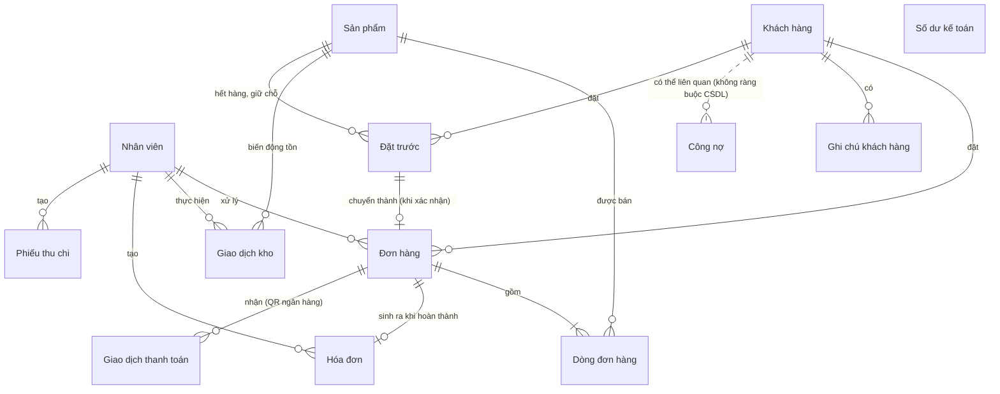

# HDH Toys — Software Requirements Specification (SRS)

**Phiên bản**: 1.0 (tài liệu hóa hiện trạng hệ thống — reverse-engineered từ mã nguồn)
**Ngày**: 2026-08-21
**Nguồn**: `backend/` (Node.js/Express/Prisma/PostgreSQL) + `frontend/` (React/Vite/TypeScript), tham chiếu `BACKEND_FEATURES.md`, `BIZFLOW_DEMO.md`.
**Tài liệu liên quan**: [SDS.md](./SDS.md) — thiết kế kỹ thuật chi tiết (data model, API, luồng nghiệp vụ).

---

## 1. Giới thiệu

### 1.1 Mục đích
Tài liệu này mô tả đầy đủ các yêu cầu chức năng và phi chức năng của **HDH Toys** — hệ thống quản lý bán lẻ đồ chơi theo phong cách iPOS, bao gồm: bán hàng (đơn hàng), kho hàng, hóa đơn, khách hàng (CRM 360), doanh thu, thu/chi, công nợ và kế toán. Tài liệu được viết dựa trên việc đọc trực tiếp mã nguồn hiện có (không phải đặc tả trước khi code), nên phản ánh **hành vi thực tế của hệ thống**, kể cả các hạn chế/khoảng trống đã phát hiện.

### 1.2 Phạm vi
- Backend REST API (`backend/src`) — 13 nhóm resource: Auth, Staff, Products, Customers, Orders, Inventory, Invoices, Search, Revenue, Income/Expense, Debts, Accounting, Health.
- Frontend SPA (`frontend/src`) — 18 màn hình, một ứng dụng single-tenant, single-store (không có khái niệm multi-store/multi-tenant).
- Không thuộc phạm vi: các mục "Cài đặt" còn ở dạng placeholder (Thông tin cửa hàng, Danh mục sản phẩm, Nhà cung cấp, Phương thức thanh toán, Cấu hình hóa đơn, Cảnh báo tồn kho tự động) — hiện chưa triển khai.

### 1.3 Định nghĩa & thuật ngữ

| Thuật ngữ | Ý nghĩa |
|---|---|
| Đơn hàng (Order) | Giao dịch bán hàng, trạng thái: Mới → Đang xử lý → Hoàn thành → (Hoàn tiền); hoặc Đã hủy |
| Hóa đơn (Invoice) | Chứng từ được **tự động sinh** khi đơn hàng chuyển sang Hoàn thành |
| Tồn kho (Inventory/Stock) | Số lượng sản phẩm hiện có, thay đổi qua Nhập/Xuất/Điều chỉnh/Trả hàng |
| Công nợ (Debt) | Khoản phải thu/phải trả, quản lý **độc lập** với Order/Invoice |
| Cân đối kế toán (Balance Sheet) | Bảng tài sản = nợ phải trả + vốn chủ sở hữu, tính tại một thời điểm |
| Khách hàng 360 | Hồ sơ khách hàng tổng hợp: lịch sử mua, đơn đang xử lý, sản phẩm đã mua, hóa đơn |
| VAT | Trong hệ thống này là **số tiền cộng thêm cố định** (không phải %) |
| RBAC | Role-Based Access Control — kiểm soát truy cập theo vai trò nhân viên |

### 1.4 Vai trò người dùng (Staff Role)
`ADMIN`, `MANAGER`, `ACCOUNTANT`, `INVENTORY_STAFF` — xem chi tiết ma trận phân quyền tại mục 5.

### 1.5 Tổng quan tài liệu
Mục 2 mô tả tổng quan sản phẩm; Mục 3 là các yêu cầu chức năng theo từng module (định dạng FR-x.y); Mục 4 là yêu cầu phi chức năng; Mục 5 là ma trận phân quyền (dự kiến vs. thực tế); Mục 6 là các hạn chế/vấn đề đã biết; Mục 7 là từ điển dữ liệu tóm tắt.

---

## 2. Tổng quan sản phẩm

### 2.1 Bối cảnh
HDH Toys là hệ thống quản lý vận hành cho **một cửa hàng bán lẻ đồ chơi**, hỗ trợ nhân viên bán hàng tạo đơn, thủ kho theo dõi tồn kho, kế toán theo dõi dòng tiền/công nợ/cân đối kế toán, và quản lý xem báo cáo doanh thu tổng thể. Toàn bộ số tiền lưu dạng **số nguyên VNĐ** (không có phần thập phân).

### 2.2 Kiến trúc tổng quan
Ứng dụng web 2 tầng: **React SPA** (client) gọi **REST API** (Express + Prisma ORM) qua HTTP, xác thực bằng JWT Bearer token; dữ liệu lưu trong **PostgreSQL**. Chi tiết kiến trúc, data model và API tại [SDS.md](./SDS.md).

### 2.3 Đối tượng sử dụng
Nhân viên nội bộ cửa hàng (không có giao diện khách hàng tự phục vụ), gồm 4 vai trò: Quản trị viên (Admin), Quản lý (Manager), Kế toán (Accountant), Nhân viên kho (Inventory Staff). Không phân biệt "nhân viên bán hàng" riêng — mọi nhân viên đã đăng nhập đều có thể tạo/quản lý đơn hàng.

### 2.4 Giả định & ràng buộc
- Một cửa hàng, một múi giờ vận hành (Asia/Ho_Chi_Minh dùng cho hiển thị ngày/giờ hóa đơn và báo cáo theo ngày).
- Phương thức thanh toán Tiền mặt/Chuyển khoản/Thẻ vẫn chỉ là nhãn phân loại tự chọn (không xác thực với ngân hàng/cổng thanh toán). Riêng **QR Code** đã có xác thực giao dịch thực qua tích hợp ngân hàng (mục 3.16) — với điều kiện đã cấu hình tài khoản ngân hàng thật và dịch vụ đối soát trung gian thật ở môi trường production.
- Không có module quản lý nhà cung cấp/đơn nhập hàng (PO) riêng — "nhà cung cấp" chỉ là một trường text tự do trên sản phẩm.
- Đăng nhập bằng email/mật khẩu nội bộ; không có SSO/OAuth.

### 2.5 Mô hình dữ liệu khái niệm (Conceptual Data Model — CDM)

Sơ đồ dưới đây thể hiện các đối tượng nghiệp vụ chính và quan hệ giữa chúng ở mức khái niệm (không có thuộc tính/kiểu dữ liệu kỹ thuật — xem mô hình logic đầy đủ tại **SDS.md mục 3**). Đường nét đứt biểu thị quan hệ không ràng buộc khóa ngoại trong CSDL (mang tính nghiệp vụ, độc lập dữ liệu).

**Ghi chú đọc sơ đồ**:
- *Công nợ* và *Số dư kế toán* là hai sổ **độc lập hoàn toàn** về dữ liệu (không có khóa ngoại tới Khách hàng/Đơn hàng) — xem FR-DEBT.5, FR-ACC.1.
- *Giao dịch thanh toán* (`PaymentTransaction`) ghi nhận các lượt báo có từ ngân hàng qua QR, phục vụ đối soát tự động (mục 3.16 — đã triển khai).
- *Nhà cung cấp* không phải một entity riêng — chỉ là một trường text tự do trên *Sản phẩm* (xem 2.4).
- *Đặt trước* (mục 3.17) là một sổ riêng, tách biệt khỏi *Đơn hàng* — chỉ "chuyển thành" một Đơn hàng thật khi nhân viên xác nhận đã có hàng, tương tự cách *Công nợ* độc lập với *Đơn hàng*/*Hóa đơn*.

---

## 3. Yêu cầu chức năng

Ký hiệu: **FR-<module>.<số>**. Mỗi yêu cầu có Input/Output/Quy tắc nghiệp vụ tóm tắt; chi tiết API tương ứng ở SDS.md mục 4.

### 3.1 Đăng nhập & Phiên làm việc (Auth)

- **FR-AUTH.1** Hệ thống PHẢI cho phép nhân viên đăng nhập bằng email + mật khẩu. Sai thông tin hoặc tài khoản bị khóa (`LOCKED`) → từ chối với thông báo chung (không tiết lộ email tồn tại hay không).
- **FR-AUTH.2** Đăng nhập thành công PHẢI trả về token phiên (JWT) có thời hạn hữu hạn (8 giờ) và thông tin nhân viên (họ tên, email, vai trò).
- **FR-AUTH.3** Mọi API (trừ đăng nhập và health-check) PHẢI yêu cầu token hợp lệ; token thiếu/sai/hết hạn → từ chối truy cập.
- **FR-AUTH.4** Người dùng PHẢI có thể đăng xuất (xóa phiên phía client); hệ thống không cần thu hồi token phía server (không có blacklist).
- **FR-AUTH.5** Ứng dụng PHẢI khôi phục phiên đăng nhập khi tải lại trang nếu còn token hợp lệ trong bộ nhớ trình duyệt.

### 3.2 Quản lý nhân viên (Staff)

- **FR-STAFF.1** Chỉ vai trò **Admin** được xem danh sách toàn bộ nhân viên.
- **FR-STAFF.2** Chỉ Admin được tạo nhân viên mới (họ tên, email duy nhất, mật khẩu ≥ 6 ký tự, vai trò).
- **FR-STAFF.3** Chỉ Admin được sửa thông tin nhân viên (họ tên, vai trò, trạng thái Kích hoạt/Khóa).
- **FR-STAFF.4** Admin không được tự khóa chính tài khoản của mình (ràng buộc thực thi ở giao diện, xem mục 6).
- **FR-STAFF.5** Chỉ Admin được đặt lại mật khẩu cho nhân viên khác.

### 3.3 Quản lý sản phẩm (Products)

- **FR-PROD.1** Hệ thống PHẢI cho phép xem danh sách sản phẩm, lọc theo danh mục/nhà cung cấp/trạng thái, tìm theo tên/SKU/barcode, có phân trang.
- **FR-PROD.2** Chỉ Admin/Manager/Nhân viên kho được tạo sản phẩm mới (SKU duy nhất, tên, danh mục, nhà cung cấp, giá vốn ≥ 0, giá bán ≥ 0, tồn kho ban đầu, ngưỡng tồn tối thiểu).
- **FR-PROD.3** Trạng thái tồn kho của sản phẩm (Còn hàng/Sắp hết/Hết hàng) PHẢI được **tự động suy ra** từ tồn kho hiện tại so với ngưỡng tối thiểu — không được set tay, trừ trạng thái Ngừng kinh doanh (thiết lập rõ ràng qua hành động riêng và được giữ nguyên cho tới khi mở bán lại).
- **FR-PROD.4** Chỉ Admin/Manager/Nhân viên kho được sửa thông tin sản phẩm (không sửa trực tiếp số lượng tồn kho tại đây — phải qua nghiệp vụ Kho hàng).
- **FR-PROD.5** Chỉ Admin/Manager được ngừng kinh doanh hoặc mở bán lại một sản phẩm.
- **FR-PROD.6** Hệ thống PHẢI hiển thị chi tiết một sản phẩm gồm thông tin chung và lịch sử giao dịch kho liên quan.

### 3.4 Quản lý kho hàng (Inventory)

- **FR-INV.1** Hệ thống PHẢI cung cấp KPI tổng quan tồn kho: tổng SKU, tổng số lượng tồn, tổng giá trị tồn kho (tồn × giá vốn), số sản phẩm sắp hết/hết hàng.
- **FR-INV.2** Chỉ Admin/Manager/Nhân viên kho được thực hiện: **Nhập kho** (tăng tồn), **Xuất kho thủ công** (giảm tồn, không qua đơn hàng), **Điều chỉnh tồn** (đặt lại số tồn thực tế sau kiểm kho).
- **FR-INV.3** Mọi thay đổi tồn kho (thủ công hoặc tự động từ đơn hàng) PHẢI được ghi lại thành một **giao dịch kho** có mã riêng, ghi nhận tồn trước/tồn sau/người thực hiện/tham chiếu/ghi chú, không thể sửa/xóa sau khi tạo (chỉ đọc — ledger bất biến).
- **FR-INV.4** Hệ thống PHẢI từ chối giao dịch xuất/điều chỉnh khiến tồn kho âm, kèm thông báo rõ số hiện có và số cần.
- **FR-INV.5** Hệ thống PHẢI cho phép xem lịch sử giao dịch kho, lọc theo sản phẩm/loại giao dịch/người thực hiện/khoảng ngày.
- **FR-INV.6** Khi đơn hàng chuyển trạng thái **Hoàn thành**, hệ thống PHẢI tự động xuất kho đúng số lượng từng sản phẩm trong đơn (ghi nhận giao dịch loại Xuất, tham chiếu = mã đơn) và tăng số lượng "đã bán" của sản phẩm.
- **FR-INV.7** Khi đơn hàng đã Hoàn thành chuyển sang **Hoàn tiền**, hệ thống PHẢI tự động hoàn lại tồn kho đúng số lượng đã xuất (ghi nhận giao dịch loại Trả hàng) và giảm số lượng "đã bán" tương ứng.
- **FR-INV.8** Việc tạo mới hoặc hủy đơn hàng (ở trạng thái Mới/Đang xử lý) KHÔNG được làm thay đổi tồn kho.

### 3.5 Quản lý khách hàng & Customer 360 (Customers)

- **FR-CUST.1** Hệ thống PHẢI cho phép mọi nhân viên đã đăng nhập xem/tạo/sửa hồ sơ khách hàng (họ tên, số điện thoại duy nhất, email, ngày sinh, hạng: New/Member/VIP, điểm tích lũy).
- **FR-CUST.2** Hệ thống PHẢI cho phép tìm kiếm khách hàng theo tên/SĐT/email, lọc theo hạng, có phân trang.
- **FR-CUST.3** Hồ sơ 360 của một khách hàng PHẢI tổng hợp: tổng chi tiêu (chỉ tính đơn Hoàn thành), tổng số đơn (mọi trạng thái), giá trị đơn trung bình, tổng sản phẩm đã mua, số đơn đang xử lý, danh mục thường mua (top 3), sản phẩm mua nhiều nhất, lần mua gần nhất.
- **FR-CUST.4** Hệ thống PHẢI cho phép xem: lịch sử đơn hàng (lọc theo trạng thái/đang xử lý), danh sách sản phẩm đã mua (tổng số lượng, số lần mua, chi tiêu), danh sách hóa đơn liên quan.
- **FR-CUST.5** Hệ thống PHẢI cho phép nhân viên thêm ghi chú nội bộ (không giới hạn số lượng) vào hồ sơ khách hàng, ghi nhận người tạo và thời gian.

### 3.6 Quản lý đơn hàng (Orders)

- **FR-ORD.1** Hệ thống PHẢI cho phép tạo đơn hàng mới với: khách hàng (bắt buộc, phải tồn tại), nhân viên xử lý (mặc định là người tạo), kênh bán (Tại cửa hàng/Điện thoại/Facebook/Khác), phương thức thanh toán, danh sách sản phẩm (≥1 dòng, mỗi dòng gồm sản phẩm, số lượng ≥1, đơn giá có thể override giá bán mặc định, giảm giá theo dòng), VAT (số tiền cộng thêm cố định), ghi chú.
- **FR-ORD.2** Hệ thống PHẢI tính: tạm tính = Σ(số lượng × đơn giá), giảm giá tổng = Σ(giảm giá từng dòng), tổng cộng = tạm tính − giảm giá + VAT. Giá vốn từng dòng PHẢI được lưu lại (snapshot) tại thời điểm tạo đơn để không bị ảnh hưởng nếu giá vốn sản phẩm thay đổi sau này.
- **FR-ORD.3** Đơn hàng mới PHẢI KHÔNG kiểm tra tồn kho khả dụng tại thời điểm tạo (chỉ kiểm tra khi Hoàn thành).
- **FR-ORD.4** Trạng thái đơn hàng PHẢI tuân theo máy trạng thái: Mới → {Đang xử lý, Đã hủy}; Đang xử lý → {Hoàn thành, Đã hủy}; Hoàn thành → {Hoàn tiền}. Đã hủy và Hoàn tiền là trạng thái kết thúc (không chuyển tiếp được nữa). Mọi lượt chuyển trạng thái sai quy tắc PHẢI bị từ chối. Việc chuyển trạng thái có thể do **nhân viên** thực hiện thủ công, hoặc do **hệ thống** thực hiện tự động khi nhận xác nhận thanh toán QR ngân hàng hợp lệ (xem FR-PAY.4, mục 3.16) — trường hợp tự động này được phép chuyển thẳng từ Mới **hoặc** Đang xử lý sang Hoàn thành, là một ngoại lệ có chủ đích của máy trạng thái nói trên.
- **FR-ORD.5** Hệ thống PHẢI cho phép tìm/lọc đơn hàng theo mã đơn/tên-SĐT khách hàng, trạng thái, khách hàng, nhân viên, phương thức thanh toán, khoảng ngày tạo.
- **FR-ORD.6** Mỗi đơn hàng PHẢI có mã hiển thị định dạng `HDH-{năm}-{số thứ tự 5 chữ số}`, duy nhất, sinh tự động.

### 3.7 Hóa đơn (Invoices)

- **FR-INVO.1** Hệ thống PHẢI tự động sinh hóa đơn (mã `HDH-INV-{năm}-{số thứ tự 5 chữ số}`) ngay khi đơn hàng chuyển sang Hoàn thành — không có cách tạo hóa đơn thủ công độc lập với đơn hàng.
- **FR-INVO.2** Hóa đơn PHẢI ghi rõ ngày và giờ phát hành (theo giờ Việt Nam), không được sửa nội dung sau khi phát hành.
- **FR-INVO.3** Hệ thống PHẢI cho phép xem danh sách hóa đơn (lọc theo khoảng ngày/khách hàng/phương thức thanh toán/người tạo, tìm theo số hóa đơn/mã đơn/tên khách hàng) và xem chi tiết từng hóa đơn.
- **FR-INVO.4** Hệ thống PHẢI cho phép xuất hóa đơn dạng PDF (khổ A5) hiển thị đúng dấu tiếng Việt, có đầy đủ: thông tin cửa hàng, số hóa đơn, ngày giờ, mã đơn, nhân viên, khách hàng, danh sách sản phẩm, các dòng tổng (tạm tính/giảm giá/VAT/tổng cộng), phương thức thanh toán.
- **FR-INVO.5** Hoàn tiền một đơn Hoàn thành KHÔNG sinh ra hóa đơn điều chỉnh/hóa đơn âm — chỉ trạng thái đơn hàng thay đổi.

### 3.8 Tìm kiếm toàn cục (Search)

- **FR-SEARCH.1** Hệ thống PHẢI cung cấp một ô tìm kiếm toàn cục (trên header) trả về đồng thời kết quả khớp ở 4 nhóm: khách hàng, đơn hàng, hóa đơn, sản phẩm (tối đa 5 kết quả/nhóm).
- **FR-SEARCH.2** Từ khóa dưới 2 ký tự PHẢI không kích hoạt truy vấn (trả về rỗng ngay, tránh quét toàn bảng với từ khóa quá ngắn).
- **FR-SEARCH.3** Mỗi kết quả tìm kiếm PHẢI cho phép điều hướng thẳng tới trang chi tiết tương ứng.

### 3.9 Báo cáo doanh thu (Revenue)

- **FR-REV.1** Hệ thống PHẢI tính doanh thu/số đơn/giá trị đơn trung bình/lợi nhuận gộp/tổng giảm giá **chỉ từ các đơn Hoàn thành**; tổng hoàn tiền được báo cáo riêng (không trừ vào doanh thu).
- **FR-REV.2** Hệ thống PHẢI hỗ trợ các khoảng thời gian: Hôm nay, Hôm qua, 7 ngày, 30 ngày, Tháng này, Quý này, Năm nay, Tùy chỉnh (khoảng ngày tự chọn).
- **FR-REV.3** Hệ thống PHẢI cung cấp báo cáo doanh thu theo: thời gian (biểu đồ theo ngày), danh mục sản phẩm, sản phẩm, nhân viên, phương thức thanh toán.
- **FR-REV.4** Hệ thống PHẢI cung cấp bảng chi tiết doanh thu theo ngày (số đơn, doanh thu, giảm giá, hoàn tiền, giá vốn, lợi nhuận gộp), có phân trang.
- **FR-REV.5** Hệ thống PHẢI cho phép xuất báo cáo chi tiết doanh thu ra file CSV (mã hóa UTF-8, hiển thị đúng tiếng Việt).

### 3.10 Thu / Chi (Income & Expense)

- **FR-TC.1** Hệ thống PHẢI cho phép ghi nhận phiếu Thu hoặc Chi (danh mục: Bán hàng/Nhập hàng/Vận chuyển/Lương/Điện nước/Marketing/Khác; nội dung; số tiền ≥ 1), sinh mã tự động (`PT-#####`/`PC-#####`).
- **FR-TC.2** Hệ thống PHẢI cho phép xem danh sách và KPI (tổng thu, tổng chi, dòng tiền ròng) theo bộ lọc: loại, danh mục, người tạo, khoảng thời gian.
- **FR-TC.3** Hệ thống PHẢI cho phép sửa nội dung/danh mục/số tiền của một phiếu đã tạo (không sửa được loại Thu/Chi sau khi tạo).

### 3.11 Công nợ (Debts)

- **FR-DEBT.1** Hệ thống PHẢI cho phép ghi nhận khoản công nợ (đối tượng, loại Phải thu/Phải trả, ngày phát sinh, ngày đến hạn, số tiền, số đã thanh toán ban đầu ≤ số tiền).
- **FR-DEBT.2** Trạng thái công nợ (Chưa đến hạn/Sắp đến hạn ≤7 ngày/Quá hạn/Đã thanh toán) PHẢI được **tự động suy ra** từ số còn lại và ngày đến hạn — không lưu trực tiếp trong CSDL.
- **FR-DEBT.3** Hệ thống PHẢI cho phép ghi nhận thanh toán từng phần/toàn bộ cho một khoản công nợ; tổng đã thanh toán không được vượt số tiền của khoản nợ.
- **FR-DEBT.4** Hệ thống PHẢI cung cấp KPI: tổng phải thu, phải thu quá hạn, tổng phải trả, phải trả quá hạn.
- **FR-DEBT.5** Công nợ là một sổ theo dõi **độc lập**, không tự động sinh ra từ đơn hàng/hóa đơn chưa thanh toán.

### 3.12 Kế toán & Cân đối kế toán (Accounting / Balance Sheet)

- **FR-ACC.1** Hệ thống PHẢI cho phép Admin/Accountant nhập/sửa các số liệu tài chính thủ công: tiền mặt, tiền ngân hàng, vốn chủ sở hữu, tài sản khác, chi phí chưa thanh toán, khoản phải trả khác.
- **FR-ACC.2** Màn hình Tổng quan kế toán PHẢI hiển thị: tiền mặt, tiền ngân hàng, tổng công nợ phải thu/phải trả (từ module Công nợ), giá trị tồn kho (từ module Kho hàng), lợi nhuận gộp tháng hiện tại (từ đơn Hoàn thành), biểu đồ Thu/Chi/Lợi nhuận 3 tháng gần nhất.
- **FR-ACC.3** Hệ thống PHẢI tạo được Bảng cân đối kế toán tại một thời điểm, gồm: Tài sản ngắn hạn (tiền mặt + tiền gửi ngân hàng + công nợ phải thu + hàng tồn kho + tài sản khác), Nợ phải trả (công nợ nhà cung cấp + chi phí chưa thanh toán + khoản phải trả khác), Vốn chủ sở hữu (vốn chủ sở hữu nhập tay + lợi nhuận giữ lại tính toán), và xác nhận Tổng tài sản = Tổng nguồn vốn.
- **FR-ACC.4** *(Lưu ý thiết kế — xem mục 6.5)*: "Lợi nhuận giữ lại" hiện được tính như một **số dư cân bằng** (Tổng tài sản − Tổng nợ phải trả − Vốn chủ sở hữu nhập tay) để đảm bảo bảng luôn cân, nên chỉ báo "Cân đối" hiện tại là một phép tính đồng nhất thức, chưa phải kiểm tra độc lập dựa trên sổ cái tổng.

### 3.13 Dashboard tổng quan

- **FR-DASH.1** Trang chủ sau đăng nhập PHẢI hiển thị 8 KPI: doanh thu hôm nay (kèm % so với hôm qua), đơn hàng hôm nay (kèm %), tổng khách hàng, tổng sản phẩm, giá trị tồn kho, sản phẩm sắp hết, công nợ phải thu, lợi nhuận tháng.
- **FR-DASH.2** Dashboard PHẢI hiển thị biểu đồ doanh thu theo thời gian (đổi được khoảng: Hôm nay/7 ngày/30 ngày/Tháng này/Quý này) và biểu đồ tròn doanh thu theo danh mục.
- **FR-DASH.3** Dashboard PHẢI hiển thị: cảnh báo sản phẩm sắp hết/hết hàng (tối đa 4), top 5 sản phẩm bán chạy, 5 đơn hàng gần nhất — mỗi mục cho phép điều hướng tới trang chi tiết/danh sách liên quan.

### 3.14 Trung tâm báo cáo (Báo cáo)

- **FR-RPT.1** Hệ thống PHẢI cung cấp một trang danh mục báo cáo (10 loại: Doanh thu, Lợi nhuận, Đơn hàng, Tồn kho, Nhập/xuất kho, Sản phẩm, Khách hàng, Thu/chi, Công nợ, Kế toán), mỗi loại điều hướng tới màn hình dữ liệu tương ứng đã có sẵn (không có màn hình báo cáo riêng biệt).

### 3.15 Cài đặt hệ thống (Settings)

- **FR-SET.1** Chỉ Admin được xem và quản lý danh sách nhân viên (tạo, khóa/mở khóa, đổi vai trò) tại đây — xem chi tiết FR-STAFF.
- **FR-SET.2** Trang Cài đặt PHẢI hiển thị ma trận phân quyền dự kiến theo vai trò × màn hình, ở dạng thông tin tham khảo.
- **FR-SET.3** *(Chưa triển khai — placeholder)*: Thông tin cửa hàng, Danh mục sản phẩm (quản lý danh mục dạng danh sách), Nhà cung cấp (quản lý danh sách nhà cung cấp), Phương thức thanh toán (cấu hình), Cấu hình hóa đơn, Cảnh báo tồn kho tự động.

### 3.16 Tích hợp thanh toán QR ngân hàng (**Đã triển khai** — 2026-08-21)

> Đã cài đặt đầy đủ FR-PAY.1–9 dưới đây trong mã nguồn (backend: `lib/vietqr.ts`, `lib/paymentConfig.ts`, `lib/webhookAuth.ts`, `services/payments.service.ts`, `controllers/payments.controller.ts`, `routes/payments.ts`, cộng các thay đổi trong `orders.service.ts`/`schema.prisma`; frontend: panel QR trong `OrderDetail.tsx`, tab "Đối soát QR" trong `KeToan.tsx`). Chi tiết kỹ thuật đầy đủ tại **SDS.md mục 4.14/5.8/8.3**.
>
> **Cần làm thêm trước khi dùng với tiền thật**: (1) cấu hình `VIETQR_BANK_BIN`/`VIETQR_ACCOUNT_NO` bằng tài khoản ngân hàng thật của cửa hàng (hiện đang để giá trị placeholder trong môi trường phát triển); (2) đăng ký một dịch vụ đối soát trung gian thật (Casso/SePay/tương đương), lấy `VIETQR_WEBHOOK_SECRET` do dịch vụ đó cấp, và có thể cần viết một adapter nhỏ nếu tên trường JSON của họ khác với hợp đồng `{referenceCode, transferAmount, content}` đã định nghĩa ở đây.

- **FR-PAY.1** Khi tạo đơn hàng với phương thức thanh toán **QR Code**, hệ thống PHẢI sinh một mã QR chuẩn VietQR gắn với đơn hàng đó, mã hóa: số tài khoản/ngân hàng nhận tiền của cửa hàng, số tiền = `tongCong` của đơn, và nội dung chuyển khoản **chứa mã đơn hàng** (`ma`, ví dụ `HDH-2026-00042`) để phục vụ đối soát tự động.
- **FR-PAY.2** Hệ thống PHẢI cung cấp một endpoint webhook để nhận thông báo "báo có" từ dịch vụ đối soát trung gian; mọi request tới endpoint này PHẢI được xác thực bằng chữ ký/secret riêng (không dùng cơ chế JWT nội bộ, vì bên gọi là hệ thống thứ 3) — request không xác thực được PHẢI bị từ chối và ghi log.
- **FR-PAY.3** Với mỗi giao dịch báo có nhận được, hệ thống PHẢI tự đối soát với các đơn hàng đang chờ thanh toán QR (trạng thái Mới/Đang xử lý, phương thức QR Code) dựa trên **nội dung chuyển khoản chứa đúng mã đơn** VÀ **số tiền khớp đúng** `tongCong`; kết quả đối soát (khớp/không khớp/số tiền sai) PHẢI được lưu thành một **giao dịch thanh toán** gắn với đơn hàng (hoặc gắn cờ "chưa xác định" nếu không tìm được đơn phù hợp).
- **FR-PAY.4** Khi đối soát khớp, hệ thống PHẢI **tự động chuyển đơn hàng sang trạng thái Hoàn thành** — kích hoạt đầy đủ các side-effect hiện có của việc hoàn thành đơn (xuất kho theo FR-INV.6, sinh hóa đơn theo FR-INVO.1) — **không** cần nhân viên xác nhận thêm bước nào.
- **FR-PAY.5** Khi đối soát **không khớp** (sai số tiền, không tìm thấy mã đơn, hoặc đơn đã ở trạng thái kết thúc như Đã hủy/Hoàn tiền), hệ thống PHẢI **không** tự đổi trạng thái đơn — giao dịch được đưa vào danh sách "Chưa đối soát" để nhân viên kế toán/quản lý xử lý thủ công.
- **FR-PAY.6** Hệ thống PHẢI xử lý webhook theo nguyên tắc **idempotent**: một giao dịch ngân hàng (nhận diện qua mã tham chiếu do ngân hàng/dịch vụ trung gian cấp) chỉ được đối soát và kích hoạt hoàn thành đơn **đúng một lần**, dù webhook có thể được gửi lại nhiều lần bởi bên thứ 3.
- **FR-PAY.7** Mã QR sinh cho một đơn hàng PHẢI có thời hạn hiệu lực (mặc định gợi ý 15 phút, có thể cấu hình); hết hạn mà chưa nhận được thanh toán khớp, đơn hàng vẫn giữ nguyên trạng thái hiện tại (không tự hủy), nhân viên có thể sinh lại mã QR mới hoặc chuyển sang phương thức thanh toán khác.
- **FR-PAY.8** Hệ thống PHẢI lưu vết **toàn bộ** giao dịch thanh toán nhận được qua webhook — kể cả các giao dịch không đối soát được — để phục vụ tra soát/kiểm toán sau này (không xóa dữ liệu "rác"/không khớp).
- **FR-PAY.9** Nhân viên PHẢI vẫn có thể chuyển trạng thái đơn hàng thủ công như hiện nay đối với các phương thức thanh toán khác (Tiền mặt/Chuyển khoản thường/Thẻ) — luồng tự động ở mục này chỉ áp dụng cho đơn chọn phương thức QR Code.

### 3.17 Đặt trước (Preorder) — **Đã triển khai** (2026-08-21)

> Cho phép ghi nhận nhu cầu mua hàng của khách khi cửa hàng chưa đủ hàng để bán ngay — áp dụng cho cả sản phẩm đã có trong catalog nhưng hết/sắp hết hàng, **và** sản phẩm hoàn toàn mới chưa từng nhập. Đặt trước là một **sổ riêng, tách biệt khỏi Đơn hàng** (không đụng vào máy trạng thái Order đang chạy) — khi hàng về và nhân viên xác nhận, một Đơn hàng thật mới được tạo ra.

- **FR-PRE.1** Hệ thống PHẢI cho phép tạo một đơn đặt trước gồm: khách hàng, **một trong hai** — sản phẩm có sẵn trong catalog (dù đang hết/sắp hết hàng) **hoặc** tên sản phẩm hoàn toàn mới (chưa có SKU) — không cho phép chọn cả hai hoặc không chọn cái nào, số lượng, giá dự kiến/đã thỏa thuận, tiền cọc (tùy chọn — mặc định 0, không bắt buộc), ngày dự kiến có hàng (tùy chọn), ghi chú.
- **FR-PRE.2** Nếu tiền cọc > 0, hệ thống PHẢI tự động ghi nhận một phiếu Thu (danh mục Bán hàng) tương ứng vào sổ Thu/Chi — vì đây là tiền thật đã nhận, phải phản ánh đúng dòng tiền, không chỉ nằm im trong bản ghi đặt trước.
- **FR-PRE.3** Hệ thống PHẢI từ chối tạo/sửa đơn đặt trước nếu tiền cọc vượt quá tổng giá trị dự kiến (số lượng × giá dự kiến).
- **FR-PRE.4** Mỗi đơn đặt trước PHẢI có mã hiển thị định dạng `PO-{năm}-{5 chữ số}`, sinh tự động, duy nhất.
- **FR-PRE.5** Trạng thái đơn đặt trước PHẢI theo máy trạng thái: Chờ hàng → {Sẵn sàng giao (tự động), Đã hủy}; Sẵn sàng giao → {Đã chuyển đơn, Đã hủy}; Chờ hàng → Đã chuyển đơn (nhân viên có thể chuyển thẳng nếu tự xác định đã có hàng, không cần chờ hệ thống tự khớp). Đã chuyển đơn và Đã hủy là trạng thái kết thúc.
- **FR-PRE.6** Khi nhập kho (hoặc điều chỉnh tăng tồn, hoặc hoàn kho do hoàn tiền) làm tồn kho một sản phẩm tăng lên, hệ thống PHẢI tự động kiểm tra các đơn đặt trước đang **Chờ hàng** cho sản phẩm đó, khớp theo **thứ tự đặt trước** (đặt sớm nhất được ưu tiên trước — FIFO) dựa trên tồn kho hiện có, và đánh dấu **Sẵn sàng giao** cho các đơn đủ điều kiện — đây là một gợi ý/thông báo để nhân viên xác nhận, **không** giữ/trừ tồn kho hộ (hệ thống chưa có khái niệm giữ hàng — xem hạn chế 6.12).
- **FR-PRE.7** Nhân viên PHẢI có thể xác nhận chuyển một đơn đặt trước (ở trạng thái Chờ hàng hoặc Sẵn sàng giao) thành một **Đơn hàng thật**, chọn phương thức thanh toán/kênh bán/VAT tại thời điểm chuyển; đơn hàng tạo ra dùng đúng số lượng và giá đã thỏa thuận ở đơn đặt trước, tự động ghi chú số tiền cọc đã thu và số tiền cần thu thêm (nếu có). Việc trừ kho/sinh hóa đơn diễn ra như đơn hàng thông thường, **chỉ** khi đơn đó sau này được chuyển sang Hoàn thành — không diễn ra ngay tại bước xác nhận chuyển đổi.
- **FR-PRE.8** Nếu đơn đặt trước dành cho sản phẩm hoàn toàn mới (chưa có trong catalog), hệ thống PHẢI yêu cầu gắn một sản phẩm thật (đã được tạo trong màn Sản phẩm) vào thời điểm chuyển đổi thành đơn hàng — không cho chuyển đổi nếu chưa xác định được sản phẩm.
- **FR-PRE.9** Hệ thống PHẢI cho phép hủy một đơn đặt trước đang Chờ hàng/Sẵn sàng giao (không hủy được đơn đã chuyển thành đơn hàng), và cho phép sửa số lượng/giá dự kiến/tiền cọc/ngày dự kiến/ghi chú khi đơn còn ở 2 trạng thái này.
- **FR-PRE.10** Hệ thống PHẢI cung cấp KPI tổng quan: số đơn đang chờ hàng, số đơn sẵn sàng giao, tổng tiền cọc đang giữ (của các đơn chưa chuyển/chưa hủy), và danh sách có tìm/lọc theo mã, khách hàng, sản phẩm, trạng thái.

### 3.18 Xóa dữ liệu (Delete) — **Đã triển khai** (2026-08-21)

> **Thay đổi chính sách so với thiết kế ban đầu**: các mục 3.1–3.17 ở trên (và SDS) mô tả nhiều bảng là "sổ ghi bất biến, không sửa/xóa sau khi tạo" (đơn hàng, hóa đơn, lịch sử kho). Theo yêu cầu bổ sung, hệ thống nay CÓ hỗ trợ xóa — chia làm 2 nhóm theo mức rủi ro.

**Nhóm an toàn** (mọi nhân viên đã đăng nhập, giống quyền hiện có của module đó — không thêm role riêng cho việc xóa):
- **FR-DEL.1** Khách hàng — chỉ xóa được nếu **chưa có** đơn hàng hoặc đơn đặt trước nào (giữ lịch sử giao dịch).
- **FR-DEL.2** Sản phẩm — chỉ xóa được nếu **chưa từng** xuất hiện trong đơn hàng, lịch sử kho, hoặc đơn đặt trước nào; sản phẩm đã có giao dịch phải dùng "Ngừng kinh doanh" (đã có từ trước) thay vì xóa.
- **FR-DEL.3** Phiếu Thu/Chi, khoản Công nợ, Ghi chú khách hàng — xóa tự do (không có dữ liệu nào phụ thuộc vào các bảng này).
- **FR-DEL.4** Đơn đặt trước — xóa tự do trừ khi đã ở trạng thái **Đã chuyển đơn** (đã có Đơn hàng thật liên kết — giữ lại để không mất truy vết).

**Nhóm nhạy cảm — chỉ vai trò Admin** (đây là điểm đánh đổi có chủ đích, chấp nhận rủi ro sai số liệu để đổi lấy khả năng sửa lỗi nhập liệu):
- **FR-DEL.5** Đơn hàng — chỉ Admin xóa được, và chỉ khi đơn đó **chưa từng có hóa đơn** (nghĩa là chưa từng Hoàn thành) — đơn đã tính vào doanh thu/kế toán thì không xóa được dù là Admin.
- **FR-DEL.6** Hóa đơn — chỉ Admin xóa được; đơn hàng gốc vẫn giữ nguyên, chỉ mất liên kết hóa đơn (đơn hàng có thể ở trạng thái Hoàn thành mà không còn hóa đơn sau hành động này).
- **FR-DEL.7** Giao dịch lịch sử kho — chỉ Admin xóa được, và **chỉ được xóa giao dịch gần nhất** của một sản phẩm (để không làm sai số liệu tồn trước/tồn sau của các giao dịch xếp sau); khi xóa, tồn kho sản phẩm được hoàn tác lại đúng phần đã ghi nhận.
- **FR-DEL.8** Nhân viên — chỉ Admin xóa được, không tự xóa được chính mình, không xóa được tài khoản hệ thống dùng cho thanh toán tự động (mục 3.16), và chỉ xóa được nếu tài khoản đó **chưa từng** tạo/xử lý đơn hàng/hóa đơn/giao dịch kho/phiếu thu chi/đơn đặt trước nào — nhân viên đã dùng hệ thống phải dùng "Khóa tài khoản" (đã có từ trước) thay vì xóa.

**FR-DEL.9** Mọi hành động xóa PHẢI yêu cầu xác nhận trước khi thực hiện (không xóa ngay khi bấm 1 lần) và không thể hoàn tác.

---

## 4. Yêu cầu phi chức năng

| # | Yêu cầu | Mô tả |
|---|---|---|
| NFR-1 | Bảo mật xác thực | Mật khẩu PHẢI được hash (không lưu plaintext); token JWT PHẢI có thời hạn hữu hạn; secret ký token PHẢI đủ độ dài và không dùng giá trị mặc định trong môi trường thật. |
| NFR-2 | Toàn vẹn dữ liệu tài chính | Mọi thay đổi tồn kho/tiền PHẢI để lại vết (ledger) không thể sửa xóa; số tiền PHẢI luôn là số nguyên VNĐ, không âm ngoài các trường hợp nghiệp vụ hợp lệ (VD: giảm giá). |
| NFR-3 | Ngôn ngữ & định dạng | Toàn bộ giao diện, thông báo lỗi, dữ liệu hiển thị PHẢI bằng tiếng Việt; ngày/giờ/tiền tệ định dạng theo chuẩn `vi-VN`; hóa đơn PDF PHẢI hiển thị đúng dấu tiếng Việt. |
| NFR-4 | Hiệu năng truy vấn | Các danh sách (sản phẩm, đơn hàng, khách hàng, hóa đơn, kho...) PHẢI hỗ trợ phân trang phía server để tránh tải toàn bộ dữ liệu về client. |
| NFR-5 | Tính nhất quán giao dịch | Các thao tác có nhiều bước phụ thuộc nhau (VD: hoàn thành đơn → xuất kho + sinh hóa đơn; tạo phiếu → sinh mã) PHẢI được thực hiện trong một transaction CSDL để tránh trạng thái dữ liệu nửa vời. |
| NFR-6 | Phân quyền | Hệ thống PHẢI kiểm soát theo vai trò nhân viên (Admin/Manager/Accountant/Inventory Staff) cho các thao tác nhạy cảm (quản lý nhân viên, sửa/ngừng kinh doanh sản phẩm, xuất/điều chỉnh kho, sửa số liệu kế toán) — *hiện trạng thực thi xem mục 5*. |
| NFR-7 | Khả dụng trên di động | Giao diện PHẢI dùng được trên màn hình di động (menu dạng drawer thay cho sidebar cố định). |
| NFR-8 | Khả năng mở rộng dữ liệu | Thiết kế CSDL PHẢI cho phép tăng trưởng số lượng đơn hàng/giao dịch kho theo thời gian mà không phá vỡ tính duy nhất của mã tự sinh (đơn hàng, hóa đơn, giao dịch kho, phiếu thu/chi). |
| NFR-9 | Bảo mật tích hợp bên thứ 3 | Endpoint webhook nhận dữ liệu từ dịch vụ đối soát ngân hàng (FR-PAY.2) PHẢI xác thực nguồn gọi (chữ ký/secret riêng biệt với JWT nội bộ) trước khi xử lý; request không hợp lệ PHẢI bị từ chối và ghi log để phát hiện tấn công giả mạo giao dịch. |
| NFR-10 | Độ tin cậy đối soát thanh toán | Xử lý webhook thanh toán PHẢI idempotent (không hoàn thành đơn hai lần / không tính trùng tiền khi bên thứ 3 gửi lại cùng một giao dịch) và PHẢI có khả năng phục hồi khi webhook đến trễ hoặc mất kết nối tạm thời (không làm mất giao dịch, không tự động sai lệch trạng thái đơn). |

---

## 5. Ma trận phân quyền — Dự kiến vs. Hiện trạng triển khai

Cột "Backend" = có middleware `requireRole` chặn ở API. Cột "Frontend" = có ẩn/chặn hành động tương ứng trên UI theo vai trò.

| Chức năng | Vai trò được phép (dự kiến) | Backend thực thi? | Frontend thực thi? |
|---|---|---|---|
| Quản lý nhân viên (Staff) | Admin | ✅ Có | ✅ Có (duy nhất màn hình có gate) |
| Tạo/sửa sản phẩm, nhập/xuất/điều chỉnh kho | Admin, Manager, Inventory Staff | ✅ Có | ❌ Không (mọi vai trò đều thấy nút) |
| Ngừng KD / mở bán lại sản phẩm | Admin, Manager | ✅ Có | ❌ Không |
| Sửa số liệu bảng cân đối (tiền mặt/ngân hàng...) | Admin, Accountant | ✅ Có | — (chưa có UI gọi API này) |
| Tạo/quản lý đơn hàng, hóa đơn, khách hàng, công nợ, thu/chi | Mọi nhân viên đã đăng nhập | (không giới hạn theo thiết kế) | (không giới hạn) |
| Ẩn/hiện các mục menu theo vai trò (theo ma trận trong Cài đặt) | Theo bảng ma trận hiển thị ở Cài đặt | ❌ Không | ❌ Không |

**Kết luận**: Backend đã thực thi đúng các ràng buộc quan trọng nhất (nhân viên, sản phẩm, kho, số liệu kế toán). Điểm hở là **frontend không ẩn/khóa hành động theo vai trò** ngoài màn hình quản lý nhân viên — nghĩa là một nhân viên không đủ quyền vẫn thấy nút bấm nhưng khi submit sẽ nhận lỗi 403 từ server, thay vì bị ẩn nút từ đầu. Xem thêm khuyến nghị tại mục 6.2.

---

## 6. Hạn chế & vấn đề đã biết (Known Issues)

Các điểm dưới đây được phát hiện khi đọc mã nguồn hiện tại — cần cân nhắc khi lên kế hoạch cải tiến:

1. **6.1 — [ĐÃ SỬA 2026-08-21] Không có URL routing thực**: đã tích hợp `window.history` (push/replaceState + lắng nghe `popstate`) — nút Back/Forward của trình duyệt (và nút back trên chuột) hoạt động đúng, URL phản ánh màn hình hiện tại (`?screen=...&id=...`) nên tải lại trang cũng khôi phục đúng màn hình đang xem. Còn lại 1 điểm nhỏ chưa tối ưu: bấm nút "Quay lại" *trong* giao diện (không phải nút back trình duyệt) vẫn tạo thêm 1 lịch sử mới thay vì dùng `history.back()`, nên có thể tạo vài entry dư trong stack — không gây lỗi, chỉ là chưa gọn nhất.
2. **6.2 — Khoảng trống RBAC ở frontend**: xem mục 5. Ma trận phân quyền hiển thị ở Cài đặt chỉ mang tính tài liệu, chưa được lập trình để ẩn menu/nút theo vai trò.
3. **6.3 — Tìm kiếm lọc phía client trên dữ liệu đã phân trang**: 2 màn hình (Lịch sử kho, Thu/Chi) áp dụng ô tìm kiếm văn bản **sau khi** đã nhận trang dữ liệu từ server, nên có thể bỏ lọt kết quả nằm ở trang khác — cần chuyển bộ lọc này lên server.
4. **6.4 — Xuất CSV doanh thu dùng `window.open` trực tiếp**: khác với cách xử lý PDF hóa đơn (phải fetch kèm token rồi mở blob vì API yêu cầu xác thực), xuất CSV mở thẳng URL — nếu endpoint này cũng yêu cầu Bearer token thì thao tác này sẽ lỗi 401 (cần xác nhận và đồng bộ cách xử lý).
5. **6.5 — "Cân đối kế toán" hiện là đồng nhất thức, không phải kiểm tra độc lập**: vì hệ thống chưa có sổ cái tổng để tính lợi nhuận giữ lại độc lập, giá trị này đang được suy ra ngược để luôn khớp — cờ báo "Bảng cân đối kế toán cân bằng" hiện luôn đúng theo cách tính, không phản ánh việc phát hiện sai lệch sổ sách thực tế.
6. **6.6 — "In hóa đơn" chưa gọi lệnh in thực sự**: nút "In hóa đơn" hiện hành xử giống nút "Xuất PDF" (chỉ mở file PDF ở tab mới), việc in do người dùng tự thực hiện từ trình xem PDF của trình duyệt.
7. **6.7 — Không có xác nhận (confirm dialog) trước các hành động không thể hoàn tác** như chuyển trạng thái đơn hàng, ngừng kinh doanh sản phẩm, khóa nhân viên — nên bổ sung nếu muốn giảm rủi ro thao tác nhầm.
8. **6.8 — Các mục Cài đặt còn là placeholder** (Thông tin cửa hàng, Danh mục sản phẩm, Nhà cung cấp, Phương thức thanh toán, Cấu hình hóa đơn, Cảnh báo tồn kho tự động) — chưa có yêu cầu chức năng chi tiết, cần thu thập thêm khi triển khai.
9. **6.9 — Không có dữ liệu mẫu ngoài 1 tài khoản Admin**: seed script chỉ tạo `admin@hdhtoys.vn`/`admin123`, không có sản phẩm/khách hàng/đơn hàng mẫu.
10. **6.10 — Tích hợp QR ngân hàng (mục 3.16) cần cấu hình thật trước khi dùng với tiền thật**: mã nguồn đã chạy đầy đủ (kiểm thử qua HTTP thực tế thành công), nhưng môi trường phát triển hiện chỉ có tài khoản ngân hàng/`VIETQR_WEBHOOK_SECRET` dạng placeholder — cần thay bằng tài khoản thật + đăng ký dịch vụ đối soát trung gian thật trước khi triển khai production.
11. **6.11 — Frontend phát hiện thanh toán QR khớp bằng polling (4 giây/lần)**, không phải push/WebSocket — độ trễ hiển thị cho nhân viên tối đa vài giây sau khi hệ thống đã tự hoàn thành đơn ở backend; chấp nhận được cho quy mô cửa hàng nhỏ nhưng nên nâng cấp lên WebSocket/SSE nếu số đơn đồng thời tăng cao.
12. **6.12 — Khớp đặt trước (FR-PRE.6) là gợi ý, không phải giữ hàng chắc chắn**: hệ thống không "khóa"/trừ trước số lượng tồn kho cho các đơn đặt trước đã Sẵn sàng giao — nếu nhân viên bán hết số hàng đó cho khách vãng lai trước khi xác nhận chuyển đơn đặt trước, đơn đặt trước sẽ vẫn hiển thị Sẵn sàng giao dù thực tế không còn đủ hàng. Cần quy trình vận hành (nhân viên kiểm tra lại trước khi xác nhận) hoặc nâng cấp thêm cơ chế giữ hàng thật nếu cần chặt hơn.

---

## 7. Từ điển dữ liệu tóm tắt

Danh sách thực thể chính (chi tiết đầy đủ trường dữ liệu, kiểu, ràng buộc tại **SDS.md mục 3**):

`Staff`, `Product`, `Customer`, `CustomerNote`, `Order`, `OrderItem`, `Invoice`, `InventoryTransaction`, `IncomeExpense`, `Debt`, `AccountingBalance`, `PaymentTransaction` *(mục 3.16)*, `Preorder` *(mục 3.17)*.

Các enum nghiệp vụ chính: `StaffRole`, `StaffStatus`, `ProductStatus`, `CustomerTier`, `OrderStatus`, `PaymentMethod`, `SalesChannel`, `InventoryTransactionType`, `TransactionKind`, `IncomeExpenseCategory`, `DebtType`, `DebtStatus` (suy ra, không lưu trữ), `PaymentReconciliationStatus` (mục 3.16), `PreorderStatus` (mục 3.17).
